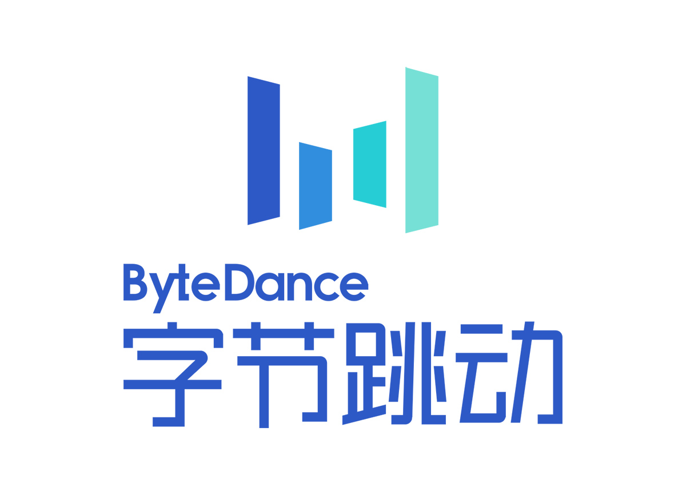
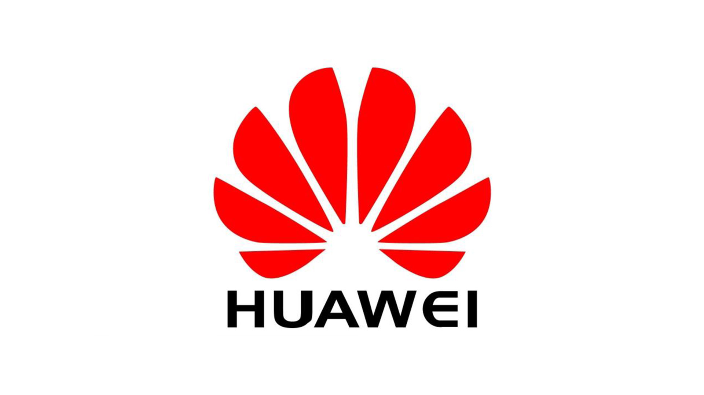

<h1 align="center">🔥  2026 Computer Spring Recruitment ob Compilation</h1>

<h3 align="center">🎓 2026年计算机春招，每日更新，含投递链接、面经合集，助力春招上岸！</h3>

  💼 收录 <b>1000+</b> 计算机工作岗位，涵盖腾讯、字节、美团、百度、华为、小米、英伟达、微软、米哈游等百家企业    

  🚀 如果对您有帮助，欢迎 Star 收藏，持续更新～

  📈 每个岗位都配有 <b>官网链接 or 内推码</b>，持续更新中，助力同学们拿下 Dream Offer！

 
---

<h3 align="center">🚀 本项目收录以下企业春招岗位（展示部分大厂）</h3>

<table align="center">
  <tr>
    <td align="center">
       <b>腾讯</b>
    </td>
    <td align="center">
       <b>阿里巴巴</b>
    </td>
    <td align="center">
       <b>字节跳动</b>
    </td>
    <td align="center">
       <b>网易</b>
    </td>
  </tr>
  <tr>
    <td align="center">
       <b>美团</b>
    </td>
    <td align="center">
       <b>360</b>
    </td>
    <td align="center">
       <b>快手</b>
    </td>
    <td align="center">
       <b>京东</b>
    </td>
  </tr>
  <tr>
    <td align="center">
       <b>华为</b>
    </td>
    <td align="center">
       <b>百度</b>
    </td>
    <td align="center">
       <b>小米</b>
    </td>
    <td align="center">
       <b>拼多多</b>
    </td>
  </tr>
</table>
 

## 📂 目录导航

[**26春招岗**](#26春招岗)

- [大厂岗](#大厂岗)
   * [阿里巴巴](#5)
   * [腾讯](#1)
   * [字节](#2)
   * [美团](#3)
   * [华为](#6)
   * [百度](#7)
   * [小米](#8)
   * [网易](#10)
   * [京东](#11)
   * [饿了么](#13)
   * [拼多多](#18)
   * [拓竹科技](#拓竹科技)
   * [大疆创新](#大疆创新)

- [独角兽](#独角兽)
   * [MiniMax](#4)
   * [滴滴打车](#9)
   * [小红书](#12)
   * [贝壳找房](#14)
   * [4399游戏](#17)
   * [携程](#19)
   * [影石Insta360](#25)
   * [星星充电](#26)
   * [虹软科技](#29)
   * [同花顺](#32)
   * [商汤科技](#33)
   * [合合信息](#合合信息)
   * [磐沄科技](#磐沄科技)
   * [墨泊可士](#墨泊可士)
   * [元戎启行](#元戎启行)
   * [小马智行](#小马智行)
   * [轻舟智航](#轻舟智航)
   * [第四范式](#第四范式)
   * [依图科技](#依图科技)
   * [智臾科技](#智臾科技)
   * [非凸科技](#非凸科技)

   
 

- [中厂](#中厂)
   * [智联招聘](#28)
   * [小宇宙](#21)
   * [掌阅科技](#15)
   * [好未来](#16)
   * [新凯来](#新凯来)
   * [经纬恒润](#经纬恒润)

 - [国企](#国企)
   * [海尔集团](#22)
   * [金航数码](#23)
   * [数慧时空](#数慧时空)

- [优质潜力企业](#优质潜力企业)
   * [无端科技](#24)
   * [昆仑万维](#27)
   * [智元机器人](#30)
   * [足下科技](#足下科技)

  
 - [外企](#外企)
   * [中国三星](#20)
   * [英伟达](#31)

 - [开发岗](#开发岗)
    * [前端岗位](#前端岗位)
    * [后端岗位](#后端岗位)
    * [客户端](#客户端)
    * [嵌入式](#嵌入式)
    * [大数据](#大数据)
    * [云计算](#云计算)  

 - [算法岗](#算法岗)
    * [AI大模型](#AI大模型)
    * [机器学习](#机器学习)
    * [计算机视觉](#计算机视觉)
    * [NLP](#NLP)
    * [数据分析](#数据分析)

 - [测试/运维/安全岗](#测试/运维/安全岗)
    * [测试开发](#测试开发)
    * [运维工程师](#运维工程师)
    * [网络安全](#网络安全)
    * [渗透测试](#渗透测试)

 - [泛IT岗](#泛IT岗)
    * [产品经理](#产品经理)
    * [运营](#运营)
    * [数据分析师](#数据分析师)
    * [UI/UE设计](#UI/UE设计)
    * [项目管理](#项目管理)

 - [硬件/芯片/通信相关技术岗](#硬件/芯片/通信相关技术岗)

[**零基础救命**](#零基础救命)
 - [软件测试](#软件测试)
 - [前端](#前端)
 - [运维/技术支持](#运维/技术支持)
 - [数据分析](#数据分析)
 - [简单后端](#简单后端)

 
[**面试经验**](#面试经验)

- [春招攻略](#春招攻略)

- [高频面题](#高频面题)
-  [百度（含文字讲解）](#百度（含文字讲解）)
-  [腾讯（含文字讲解）](#腾讯（含文字讲解）)
-  [阿里（含文字讲解）](#阿里（含文字讲解）)
-  [网易（含文字讲解）](#网易（含文字讲解）)
-  [搜狐（含文字讲解）](#搜狐（含文字讲解）)

- [面经合集](#面经合集)

---
## 26春招岗

## 大厂岗

## <h3 id="5">阿里巴巴</h3> 
|NO.|工作岗位|详细内容|
|--------|--------|------|
|1|研发工程师C/C++|[点击查看](https://mp.weixin.qq.com/s?__biz=Mzk0MzY5NjI3MA==&mid=2247496603&idx=7&sn=1266cc9e91b710c4843a4f8eb72ec674&scene=21&poc_token=HKoDwWmjTQwQfULnKS4K6-h8bVfFFMs1d9PQ7kPG)|
|2|基础平台研发工程师|[点击查看](https://mp.weixin.qq.com/s?__biz=Mzk0MzY5NjI3MA==&mid=2247496603&idx=7&sn=1266cc9e91b710c4843a4f8eb72ec674&scene=21&poc_token=HKoDwWmjTQwQfULnKS4K6-h8bVfFFMs1d9PQ7kPG)|
|3|研发工程师JAVA|[点击查看](https://mp.weixin.qq.com/s?__biz=Mzk0MzY5NjI3MA==&mid=2247496603&idx=7&sn=1266cc9e91b710c4843a4f8eb72ec674&scene=21&poc_token=HKoDwWmjTQwQfULnKS4K6-h8bVfFFMs1d9PQ7kPG)|
|4|IT服务工程师|[点击查看](https://mp.weixin.qq.com/s?__biz=Mzk0MzY5NjI3MA==&mid=2247496603&idx=7&sn=1266cc9e91b710c4843a4f8eb72ec674&scene=21&poc_token=HKoDwWmjTQwQfULnKS4K6-h8bVfFFMs1d9PQ7kPG)|
|5|算法工程师-大模型评测|[点击查看](https://mp.weixin.qq.com/s?__biz=Mzk0MzY5NjI3MA==&mid=2247496603&idx=7&sn=1266cc9e91b710c4843a4f8eb72ec674&scene=21&poc_token=HKoDwWmjTQwQfULnKS4K6-h8bVfFFMs1d9PQ7kPG)|
|6|AI Agent系统开发工程师|[点击查看](https://mp.weixin.qq.com/s?__biz=Mzk0MzY5NjI3MA==&mid=2247496603&idx=7&sn=1266cc9e91b710c4843a4f8eb72ec674&scene=21&poc_token=HKoDwWmjTQwQfULnKS4K6-h8bVfFFMs1d9PQ7kPG)|
|7|机器学习系统工程师|[点击查看](https://mp.weixin.qq.com/s?__biz=Mzk0MzY5NjI3MA==&mid=2247496603&idx=7&sn=1266cc9e91b710c4843a4f8eb72ec674&scene=21&poc_token=HKoDwWmjTQwQfULnKS4K6-h8bVfFFMs1d9PQ7kPG)|
|8|AI应用算法工程师|[点击查看](https://campus-talent.alibaba.com/campus/position/199903540003?deptCodes=)|
|9|Agent Infra工程师|[点击查看](https://campus-talent.alibaba.com/campus/position/199903480006?deptCodes=)|
|10|AI Infra工程师|[点击查看](https://campus-talent.alibaba.com/campus/position/199903540007?deptCodes=)|
|11|AI SRE|[点击查看](https://campus-talent.alibaba.com/campus/position/199903480002?deptCodes=)|
|12|AI数据工程师|[点击查看](https://campus-talent.alibaba.com/campus/position/199903220056?deptCodes=)|
|13|AI Agent优化工程师-训练/数据/评测|[点击查看](https://campus-talent.alibaba.com/campus/position/199903500011?deptCodes=)|
|14|AI应用研发工程师|[点击查看](https://campus-talent.alibaba.com/campus/position/199903220038?deptCodes=)|
|15|AI Agent CPU 架构探索-阿里星|[点击查看](https://campus-talent.alibaba.com/campus/position/199904000013?deptCodes=)|
|16|RISC-V矩阵扩展架构研究与实现-阿里星|[点击查看](https://campus-talent.alibaba.com/campus/position/199904040005?deptCodes=)|
|17|高性能处理器执行子系统架构研究和实现-阿里星|[点击查看](https://campus-talent.alibaba.com/campus/position/199904020007?deptCodes=)|
|18|面向AI原生应用的安全智能体关键技术与算法研究-A Star|[点击查看](https://campus-talent.alibaba.com/campus/position/199904140003?deptCodes=)|
|19|前沿安全工具能力预研-阿里星|[点击查看](https://campus-talent.alibaba.com/campus/position/199904000003?deptCodes=)|
|20|安全智能研发工程师|[点击查看](https://campus-talent.alibaba.com/campus/position/199904060006?deptCodes=)|
|21|算法工程师-语音多模态大模型|[点击查看](https://campus-talent.alibaba.com/campus/position/199903280011?deptCodes=YKCNU1%2CO1BGLD%2C2OAHS3%2CR4NF3G%2CUXLZSO)|
|22|算法工程师-大模型应用|[点击查看](https://campus-talent.alibaba.com/campus/position/199903240038?deptCodes=YKCNU1%2CO1BGLD%2C2OAHS3%2CR4NF3G%2CUXLZSO)|
|23|算法工程师-VLM训练|[点击查看](https://campus-talent.alibaba.com/campus/position/199903180017?deptCodes=YKCNU1%2CO1BGLD%2C2OAHS3%2CR4NF3G%2CUXLZSO)|
|24|算法工程师-大模型后训练 (Post-training)|[点击查看](https://campus-talent.alibaba.com/campus/position/199903240031?deptCodes=YKCNU1%2CO1BGLD%2C2OAHS3%2CR4NF3G%2CUXLZSO)|
|25|算法工程师-强化学习|[点击查看](https://campus-talent.alibaba.com/campus/position/199903180013?deptCodes=YKCNU1%2CO1BGLD%2C2OAHS3%2CR4NF3G%2CUXLZSO)|
|26|处理器AI架构师|[点击查看](https://campus-talent.alibaba.com/campus/position/199903420006?deptCodes=YKCNU1%2CO1BGLD%2C2OAHS3%2CR4NF3G%2CUXLZSO)|
|27|AI芯片硬件系统设计工程师|[点击查看](https://campus-talent.alibaba.com/campus/position/199903420005?deptCodes=YKCNU1%2CO1BGLD%2C2OAHS3%2CR4NF3G%2CUXLZSO)|
|28|AI芯片DFX设计工程师|[点击查看](https://campus-talent.alibaba.com/campus/position/199903420004?deptCodes=YKCNU1%2CO1BGLD%2C2OAHS3%2CR4NF3G%2CUXLZSO)|
|29|AI SOC芯片设计工程师|[点击查看](https://campus-talent.alibaba.com/campus/position/199903400002?deptCodes=YKCNU1%2CO1BGLD%2C2OAHS3%2CR4NF3G%2CUXLZSO)|
|30|AI芯片物理设计工程师|[点击查看](https://campus-talent.alibaba.com/campus/position/199903380002?deptCodes=YKCNU1%2CO1BGLD%2C2OAHS3%2CR4NF3G%2CUXLZSO)|
|31|芯片框架开发工程师|[点击查看](https://campus-talent.alibaba.com/campus/position/199903360008?deptCodes=YKCNU1%2CO1BGLD%2C2OAHS3%2CR4NF3G%2CUXLZSO)|
|32|AI SoC芯片技术科学家|[点击查看](https://campus-talent.alibaba.com/campus/position/199903360005?deptCodes=YKCNU1%2CO1BGLD%2C2OAHS3%2CR4NF3G%2CUXLZSO)|
|33|大语言模型量化方法研发-阿里星|[点击查看](https://campus-talent.alibaba.com/campus/position/199903240074?deptCodes=YKCNU1%2CO1BGLD%2C2OAHS3%2CR4NF3G%2CUXLZSO)|
|34|推理引擎设计研发-阿里星|[点击查看](https://campus-talent.alibaba.com/campus/position/199903280049?deptCodes=YKCNU1%2CO1BGLD%2C2OAHS3%2CR4NF3G%2CUXLZSO)|
|35|芯片软件工程师|[点击查看](https://campus-talent.alibaba.com/campus/position/199903700006?deptCodes=YKCNU1%2CO1BGLD%2C2OAHS3%2CR4NF3G%2CUXLZSO)|
|36|算法工程师-大语言模型|[点击查看](https://campus-talent.alibaba.com/campus/position/199903220023?deptCodes=YKCNU1%2CO1BGLD%2C2OAHS3%2CR4NF3G%2CUXLZSO)|
|37|算法工程师-规划控制|[点击查看](https://campus-talent.alibaba.com/campus/position/199903200015?deptCodes=YKCNU1%2CO1BGLD%2C2OAHS3%2CR4NF3G%2CUXLZSO)|
|38|算法工程师-医学影像|[点击查看](https://campus-talent.alibaba.com/campus/position/199903240036?deptCodes=YKCNU1%2CO1BGLD%2C2OAHS3%2CR4NF3G%2CUXLZSO)|
|39|算法工程师-大数据处理|[点击查看](https://campus-talent.alibaba.com/campus/position/199903280012?deptCodes=YKCNU1%2CO1BGLD%2C2OAHS3%2CR4NF3G%2CUXLZSO)|
|40|算法工程师-机器人感知|[点击查看](https://campus-talent.alibaba.com/campus/position/199903260016?deptCodes=YKCNU1%2CO1BGLD%2C2OAHS3%2CR4NF3G%2CUXLZSO)|
|41|存算一体架构研究-阿里星|[点击查看](https://campus-talent.alibaba.com/campus/position/199903280048?deptCodes=YKCNU1%2CO1BGLD%2C2OAHS3%2CR4NF3G%2CUXLZSO)|
|42|AI Agent 内核代码生成研究-阿里星|[点击查看](https://campus-talent.alibaba.com/campus/position/199903220051?deptCodes=YKCNU1%2CO1BGLD%2C2OAHS3%2CR4NF3G%2CUXLZSO)|
|43|AI SoC先进架构研究科学家-阿里星|[点击查看](https://campus-talent.alibaba.com/campus/position/199903460024?deptCodes=YKCNU1%2CO1BGLD%2C2OAHS3%2CR4NF3G%2CUXLZSO)|
|44|具身智能仿真平台研发工程师|[点击查看](https://campus-talent.alibaba.com/campus/position/199903500009?deptCodes=YKCNU1%2CO1BGLD%2C2OAHS3%2CR4NF3G%2CUXLZSO)|
|45|研发工程师JAVA|[点击查看](https://campus-talent.alibaba.com/campus/position/199903180003?deptCodes=YKCNU1%2CO1BGLD%2C2OAHS3%2CR4NF3G%2CUXLZSO)|

### 淘天集团
淘天集团（淘天有限公司）是阿里巴巴集团旗下核心业务集团，成立于2023年4月23日，总部位于杭州，注册资本10亿元人民币，由淘宝（中国）软件有限公司全资控股。
|NO.|工作岗位|详细内容|
|--------|--------|------|
|1|高级数据开发工程师|[点击查看](https://mp.weixin.qq.com/s?__biz=Mzk0MzY5NjI3MA==&mid=2247496383&idx=1&sn=c8fdf4d70bfaa738b73cf568562c127f&scene=21&poc_token=HIYFwWmjGc3xOvIF170oty8F5DEVZ6r29Eh4W5K6)|
|2|java工程师|[点击查看](https://mp.weixin.qq.com/s?__biz=Mzk0MzY5NjI3MA==&mid=2247496383&idx=1&sn=c8fdf4d70bfaa738b73cf568562c127f&scene=21&poc_token=HIYFwWmjGc3xOvIF170oty8F5DEVZ6r29Eh4W5K6)|
|3|大语言模型（LLM）算法工程师|[点击查看](https://mp.weixin.qq.com/s?__biz=Mzk0MzY5NjI3MA==&mid=2247496383&idx=1&sn=c8fdf4d70bfaa738b73cf568562c127f&scene=21&poc_token=HIYFwWmjGc3xOvIF170oty8F5DEVZ6r29Eh4W5K6)|
|4|终端工程师（iOS/Android/鸿蒙）|[点击查看](https://mp.weixin.qq.com/s?__biz=Mzk0MzY5NjI3MA==&mid=2247496383&idx=1&sn=c8fdf4d70bfaa738b73cf568562c127f&scene=21&poc_token=HIYFwWmjGc3xOvIF170oty8F5DEVZ6r29Eh4W5K6)|
|5|前端开发工程师|[点击查看](https://mp.weixin.qq.com/s?__biz=Mzk0MzY5NjI3MA==&mid=2247496383&idx=1&sn=c8fdf4d70bfaa738b73cf568562c127f&scene=21&poc_token=HIYFwWmjGc3xOvIF170oty8F5DEVZ6r29Eh4W5K6)|
|6|搜索算法专家|[点击查看](https://mp.weixin.qq.com/s?__biz=Mzk0MzY5NjI3MA==&mid=2247496383&idx=1&sn=c8fdf4d70bfaa738b73cf568562c127f&scene=21&poc_token=HIYFwWmjGc3xOvIF170oty8F5DEVZ6r29Eh4W5K6)|
|7|大模型Agent算法专家|[点击查看](https://mp.weixin.qq.com/s?__biz=Mzk0MzY5NjI3MA==&mid=2247496383&idx=1&sn=c8fdf4d70bfaa738b73cf568562c127f&scene=21&poc_token=HIYFwWmjGc3xOvIF170oty8F5DEVZ6r29Eh4W5K6)|
|8|AI Infra开发工程师|[点击查看](https://mp.weixin.qq.com/s?__biz=Mzk0MzY5NjI3MA==&mid=2247496383&idx=1&sn=c8fdf4d70bfaa738b73cf568562c127f&scene=21&poc_token=HIYFwWmjGc3xOvIF170oty8F5DEVZ6r29Eh4W5K6)|
|9|测试开发工程师|[点击查看](https://mp.weixin.qq.com/s?__biz=Mzk0MzY5NjI3MA==&mid=2247496383&idx=1&sn=c8fdf4d70bfaa738b73cf568562c127f&scene=21&poc_token=HIYFwWmjGc3xOvIF170oty8F5DEVZ6r29Eh4W5K6)|
|10|广告引擎研发工程师|[点击查看](https://mp.weixin.qq.com/s?__biz=Mzk0MzY5NjI3MA==&mid=2247496383&idx=1&sn=c8fdf4d70bfaa738b73cf568562c127f&scene=21&poc_token=HIYFwWmjGc3xOvIF170oty8F5DEVZ6r29Eh4W5K6)|

### 阿里健康
阿里健康是阿里巴巴集团在大健康领域的旗舰平台，2014年在香港上市。主要业务包括医药电商、互联网医疗、智慧医疗等，年服务用户超3亿。医药电商业务覆盖全国200多个城市，合作药店超10万家，药品SKU超10万。互联网医疗平台注册医生超20万，日均问诊量超50万次。2022年营收达200亿元，持续优化AI辅助诊疗、电子处方等创新服务。在杭州、北京设有研发中心，技术团队专注于医疗大数据、AI算法等领域的研发应用。新员工将接受医疗健康行业知识培训，参与实际项目开发。
|NO.|工作岗位|详细内容|
|--------|--------|------|
|1|搜索算法资深工程师|[点击查看](https://mp.weixin.qq.com/s?__biz=Mzk0MzY5NjI3MA==&mid=2247496399&idx=5&sn=6043bc1af41ab4a10edb32a5f92c9428&scene=21&poc_token=HG4HwWmjuTzArglOKkeIB5EUbhCMpGyOuBQBI_8c)|
|2|数据研发资深工程师|[点击查看](https://mp.weixin.qq.com/s?__biz=Mzk0MzY5NjI3MA==&mid=2247496399&idx=5&sn=6043bc1af41ab4a10edb32a5f92c9428&scene=21&poc_token=HG4HwWmjuTzArglOKkeIB5EUbhCMpGyOuBQBI_8c)|
|3|AI导购大模型算法|[点击查看](https://mp.weixin.qq.com/s?__biz=Mzk0MzY5NjI3MA==&mid=2247496399&idx=5&sn=6043bc1af41ab4a10edb32a5f92c9428&scene=21&poc_token=HG4HwWmjuTzArglOKkeIB5EUbhCMpGyOuBQBI_8c)|
|4|向量/搜索引擎|[点击查看](https://mp.weixin.qq.com/s?__biz=Mzk0MzY5NjI3MA==&mid=2247496399&idx=5&sn=6043bc1af41ab4a10edb32a5f92c9428&scene=21&poc_token=HG4HwWmjuTzArglOKkeIB5EUbhCMpGyOuBQBI_8c)|
|5|资深测试工程师|[点击查看](https://mp.weixin.qq.com/s?__biz=Mzk0MzY5NjI3MA==&mid=2247496399&idx=5&sn=6043bc1af41ab4a10edb32a5f92c9428&scene=21&poc_token=HG4HwWmjuTzArglOKkeIB5EUbhCMpGyOuBQBI_8c)|
|6|Java开发|[点击查看](https://mp.weixin.qq.com/s?__biz=Mzk0MzY5NjI3MA==&mid=2247496399&idx=5&sn=6043bc1af41ab4a10edb32a5f92c9428&scene=21&poc_token=HG4HwWmjuTzArglOKkeIB5EUbhCMpGyOuBQBI_8c)|
|7|iOS高级开发工程师|[点击查看](https://mp.weixin.qq.com/s?__biz=Mzk0MzY5NjI3MA==&mid=2247496399&idx=5&sn=6043bc1af41ab4a10edb32a5f92c9428&scene=21&poc_token=HG4HwWmjuTzArglOKkeIB5EUbhCMpGyOuBQBI_8c)|

### 阿里国际
阿里巴巴国际数字商业集团是阿里巴巴旗下跨境电商业务板块，包含速卖通、Lazada、Trendyol等平台，服务全球200多个国家和地区消费者。拥有超过1亿年度活跃消费者，20多万商家入驻，商品种类超5000万。在杭州、新加坡、伦敦等地设有办公室，员工总数5000余人，具备多语言服务能力。2022年GMV达600亿美元，持续优化物流、支付等跨境基础设施。建立了完善的数据分析和AI技术应用体系，提升跨境交易效率。新员工将接受跨境电商运营、国际物流等专业培训，并有机会参与全球化项目。
|NO.|工作岗位|详细内容|
|--------|--------|------|
|1|JAVA研发工程师|[点击查看](https://mp.weixin.qq.com/s?__biz=Mzk0MzY5NjI3MA==&mid=2247496399&idx=3&sn=a608c915e9f59d6e88123d17aa5fb264&scene=21&poc_token=HEwIwWmjtR53lLh3msSfwZJdsVKKsi4a6p6Q1U0L)|
|2|AI算法工程师|[点击查看](https://mp.weixin.qq.com/s?__biz=Mzk0MzY5NjI3MA==&mid=2247496399&idx=3&sn=a608c915e9f59d6e88123d17aa5fb264&scene=21&poc_token=HEwIwWmjtR53lLh3msSfwZJdsVKKsi4a6p6Q1U0L)|
|3|数据研发工程师|[点击查看](https://mp.weixin.qq.com/s?__biz=Mzk0MzY5NjI3MA==&mid=2247496399&idx=3&sn=a608c915e9f59d6e88123d17aa5fb264&scene=21&poc_token=HEwIwWmjtR53lLh3msSfwZJdsVKKsi4a6p6Q1U0L)|
|4|高级算法工程师|[点击查看](https://mp.weixin.qq.com/s?__biz=Mzk0MzY5NjI3MA==&mid=2247496399&idx=3&sn=a608c915e9f59d6e88123d17aa5fb264&scene=21&poc_token=HEwIwWmjtR53lLh3msSfwZJdsVKKsi4a6p6Q1U0L)|
|5|Agent研发专家|[点击查看](https://mp.weixin.qq.com/s?__biz=Mzk0MzY5NjI3MA==&mid=2247496399&idx=3&sn=a608c915e9f59d6e88123d17aa5fb264&scene=21&poc_token=HEwIwWmjtR53lLh3msSfwZJdsVKKsi4a6p6Q1U0L)|
|6|高级开发工程师（中间件）|[点击查看](https://mp.weixin.qq.com/s?__biz=Mzk0MzY5NjI3MA==&mid=2247496399&idx=3&sn=a608c915e9f59d6e88123d17aa5fb264&scene=21&poc_token=HEwIwWmjtR53lLh3msSfwZJdsVKKsi4a6p6Q1U0L)|

### 菜鸟集团
菜鸟成立于2013年，是电商物流行业的全球领导者。孵化于阿里巴巴全球最大的电子商务生态系统中，构建起了一张全球智慧物流网络，通过不断创新，以满足高速增长的复杂电商物流需求。菜鸟是全球第一的跨境电商物流公司，业务涵盖国际快递、国际供应链、海外本地服务。通过“全球10日达”、“全球5日达”等颠覆性解决方案帮助中小企业开展跨境贸易。菜鸟在全球战略位置运营关键物流设施，服务范围覆盖200多个国家和地区，并将“科技基因”运用于物流运营的每一个环节，更建立了全球最大的数字化驿站网络。展望未来，菜鸟将努力为全球商家和消费者提供时效更快、成本更优、更绿色环保的服务。
|NO.|工作岗位|详细内容|
|--------|--------|------|
|1|自动驾驶仿真算法工程师|[点击查看](https://mp.weixin.qq.com/s?__biz=Mzk0MzY5NjI3MA==&mid=2247496611&idx=6&sn=ac1fa5c59ab5a4ecf3ac0db92f14f4fc&scene=21&poc_token=HMEJwWmjWNijpYtqv948kZAxmlnOeNlR3js0Y2JQ)|
|2|大模型算法工程师|[点击查看](https://mp.weixin.qq.com/s?__biz=Mzk0MzY5NjI3MA==&mid=2247496611&idx=6&sn=ac1fa5c59ab5a4ecf3ac0db92f14f4fc&scene=21&poc_token=HMEJwWmjWNijpYtqv948kZAxmlnOeNlR3js0Y2JQ)|
|3|决策规划算法工程师|[点击查看](https://mp.weixin.qq.com/s?__biz=Mzk0MzY5NjI3MA==&mid=2247496611&idx=6&sn=ac1fa5c59ab5a4ecf3ac0db92f14f4fc&scene=21&poc_token=HMEJwWmjWNijpYtqv948kZAxmlnOeNlR3js0Y2JQ)|
|4|感知算法专家|[点击查看](https://mp.weixin.qq.com/s?__biz=Mzk0MzY5NjI3MA==&mid=2247496611&idx=6&sn=ac1fa5c59ab5a4ecf3ac0db92f14f4fc&scene=21&poc_token=HMEJwWmjWNijpYtqv948kZAxmlnOeNlR3js0Y2JQ)|
|5|java工程师|[点击查看](https://mp.weixin.qq.com/s?__biz=Mzk0MzY5NjI3MA==&mid=2247496611&idx=6&sn=ac1fa5c59ab5a4ecf3ac0db92f14f4fc&scene=21&poc_token=HMEJwWmjWNijpYtqv948kZAxmlnOeNlR3js0Y2JQ)|
|6|端到端算法专家|[点击查看](https://mp.weixin.qq.com/s?__biz=Mzk0MzY5NjI3MA==&mid=2247496611&idx=6&sn=ac1fa5c59ab5a4ecf3ac0db92f14f4fc&scene=21&poc_token=HMEJwWmjWNijpYtqv948kZAxmlnOeNlR3js0Y2JQ)|
|7|开发工程师|[点击查看](https://mp.weixin.qq.com/s?__biz=Mzk0MzY5NjI3MA==&mid=2247496611&idx=6&sn=ac1fa5c59ab5a4ecf3ac0db92f14f4fc&scene=21&poc_token=HMEJwWmjWNijpYtqv948kZAxmlnOeNlR3js0Y2JQ)|
|8|服务端开发工程师|[点击查看](https://mp.weixin.qq.com/s?__biz=Mzk0MzY5NjI3MA==&mid=2247496611&idx=6&sn=ac1fa5c59ab5a4ecf3ac0db92f14f4fc&scene=21&poc_token=HMEJwWmjWNijpYtqv948kZAxmlnOeNlR3js0Y2JQ)|

### 蚂蚁集团
蚂蚁集团是阿里巴巴旗下金融科技公司，运营支付宝等核心产品，服务全球超10亿用户。
|NO.|工作岗位|详细内容|
|--------|--------|------|
|1|测试开发|[点击查看](https://mp.weixin.qq.com/s?__biz=Mzk0MzY5NjI3MA==&mid=2247496611&idx=1&sn=e0357d6ac8a268fe7011807679098fa4&scene=21&poc_token=HOAKwWmjC826wguuHJIZ2_bCjPpkVx96L68Lm66V)|
|2|应用研发工程师|[点击查看](https://mp.weixin.qq.com/s?__biz=Mzk0MzY5NjI3MA==&mid=2247496611&idx=1&sn=e0357d6ac8a268fe7011807679098fa4&scene=21&poc_token=HOAKwWmjC826wguuHJIZ2_bCjPpkVx96L68Lm66V)|
|3|C/C++开发工程师|[点击查看](https://mp.weixin.qq.com/s?__biz=Mzk0MzY5NjI3MA==&mid=2247496611&idx=1&sn=e0357d6ac8a268fe7011807679098fa4&scene=21&poc_token=HOAKwWmjC826wguuHJIZ2_bCjPpkVx96L68Lm66V)|
|4|初级研发工程师|[点击查看](https://mp.weixin.qq.com/s?__biz=Mzk0MzY5NjI3MA==&mid=2247496611&idx=1&sn=e0357d6ac8a268fe7011807679098fa4&scene=21&poc_token=HOAKwWmjC826wguuHJIZ2_bCjPpkVx96L68Lm66V)|
|5|大模型算法工程师|[点击查看](https://mp.weixin.qq.com/s?__biz=Mzk0MzY5NjI3MA==&mid=2247496611&idx=1&sn=e0357d6ac8a268fe7011807679098fa4&scene=21&poc_token=HOAKwWmjC826wguuHJIZ2_bCjPpkVx96L68Lm66V)|

## <h3 id="1">腾讯</h3> 
|NO.|工作岗位|详细内容|
|--------|--------|------|
|1|软件开发-后台开发方向|[点击查看](https://mp.weixin.qq.com/s?__biz=Mzk0MzY5NjI3MA==&mid=2247496603&idx=1&sn=5f8a07d1e0bce7225176f95f38b3786a&scene=21&poc_token=HFrtwGmjZFwSA0rQ7EPfBS28_Uw8wY4IazqRSgkB)|
|2|软件开发-游戏引擎开发方向|[点击查看](https://mp.weixin.qq.com/s?__biz=Mzk0MzY5NjI3MA==&mid=2247496603&idx=1&sn=5f8a07d1e0bce7225176f95f38b3786a&scene=21&poc_token=HFrtwGmjZFwSA0rQ7EPfBS28_Uw8wY4IazqRSgkB)|
|3|软件开发-PC客户端开发方向|[点击查看](https://mp.weixin.qq.com/s?__biz=Mzk0MzY5NjI3MA==&mid=2247496603&idx=1&sn=5f8a07d1e0bce7225176f95f38b3786a&scene=21&poc_token=HFrtwGmjZFwSA0rQ7EPfBS28_Uw8wY4IazqRSgkB)|
|4|软件开发-移动客户端开发方向|[点击查看](https://mp.weixin.qq.com/s?__biz=Mzk0MzY5NjI3MA==&mid=2247496603&idx=1&sn=5f8a07d1e0bce7225176f95f38b3786a&scene=21&poc_token=HFrtwGmjZFwSA0rQ7EPfBS28_Uw8wY4IazqRSgkB)|
|5|技术研究-多模态方向|[点击查看](https://mp.weixin.qq.com/s?__biz=Mzk0MzY5NjI3MA==&mid=2247496603&idx=1&sn=5f8a07d1e0bce7225176f95f38b3786a&scene=21&poc_token=HFrtwGmjZFwSA0rQ7EPfBS28_Uw8wY4IazqRSgkB)|
|6|技术研究-自然语言处理方向|[点击查看](https://mp.weixin.qq.com/s?__biz=Mzk0MzY5NjI3MA==&mid=2247496603&idx=1&sn=5f8a07d1e0bce7225176f95f38b3786a&scene=21&poc_token=HFrtwGmjZFwSA0rQ7EPfBS28_Uw8wY4IazqRSgkB)|
|7|技术研究-高性能计算方向|[点击查看](https://mp.weixin.qq.com/s?__biz=Mzk0MzY5NjI3MA==&mid=2247496603&idx=1&sn=5f8a07d1e0bce7225176f95f38b3786a&scene=21&poc_token=HFrtwGmjZFwSA0rQ7EPfBS28_Uw8wY4IazqRSgkB)|
|8|产品经理(技术背景)|[点击查看](https://join.qq.com/post_detail.html?postid=1149822276057976832)|
|9|项目管理|[点击查看](https://join.qq.com/post_detail.html?postid=1148729203219561472)|
|10|游戏发行/运营培训生|[点击查看](https://join.qq.com/post_detail.html?postid=1149741170872876032)|
|11|产品运营|[点击查看](https://join.qq.com/post_detail.html?postid=1149741188627320832)|
|12|算法-计算机视觉方向|[点击查看](https://join.qq.com/post_detail.html?postid=1149822242398687232)|
|13|算法-机器学习方向|[点击查看](https://join.qq.com/post_detail.html?postid=1149822244424536064)|
|14|算法-数据科学方向|[点击查看](https://join.qq.com/post_detail.html?postid=1149822247624790016)|
|15|软件开发-测试开发方向|[点击查看](https://join.qq.com/post_detail.html?postid=1149822252481794048)|
|16|测试与质量管理|[点击查看](https://join.qq.com/post_detail.html?postid=1149822254222430208)|
|17|软件开发-前端开发方向|[点击查看](https://join.qq.com/post_detail.html?postid=1149822283779690496)|
|18|安全技术|[点击查看](https://join.qq.com/post_detail.html?postid=1149967273352821760)|
|19|软件开发-运营开发方向|[点击查看](https://join.qq.com/post_detail.html?postid=1149967284501281792)|
|20|算法-其他方向|[点击查看](https://join.qq.com/post_detail.html?postid=1150119850803526656)|
|21|算法-推荐算法方向|[点击查看](https://join.qq.com/post_detail.html?postid=1150119851554307072)|
|22|解决方案-技术咨询方向|[点击查看](https://join.qq.com/post_detail.html?postid=1150119856117709824)|
|23|软件开发-全栈开发方向|[点击查看](https://join.qq.com/post_detail.html?postid=1150120260595372032)|
|24|算法-多媒体处理方向|[点击查看](https://join.qq.com/post_detail.html?postid=1150120262226956288)|
|25|软件开发-数据工程|[点击查看](https://join.qq.com/post_detail.html?postid=1150120262839324672)|
|26|软件开发-游戏客户端开发方向|[点击查看](https://join.qq.com/post_detail.html?postid=1150133702182108160)|
|27|技术运营|[点击查看](https://join.qq.com/post_detail.html?postid=1150134394124783616)|
|28|硬件开发-芯片验证方向|[点击查看](https://join.qq.com/post_detail.html?postid=1150161895786041346)|
|29|技术研究-基础架构方向|[点击查看](https://join.qq.com/post_detail.html?postid=1150161895786041347)|
|30|软件开发-渲染引擎开发|[点击查看](https://join.qq.com/post_detail.html?postid=1150222486500342784)|
|31|硬件开发-系统设计和验证方向|[点击查看](https://join.qq.com/post_detail.html?postid=1153452718590085120)|
|32|安全技术-风控算法方向|[点击查看](https://join.qq.com/post_detail.html?postid=1154876866054932480)|
|33|技术研究-高性能计算方向（青云计划）|[点击查看](https://join.qq.com/post_detail.html?postid=1200791472472059904)|
|34|混元AIGC算法研究员（世界模型基金会方向）|[点击查看](https://tencent.wd1.myworkdayjobs.com/zh-CN/Tencent_Careers/job/US-California-Palo-Alto/Hunyuan-AIGC-Algorithm-Researcher--World-Model-Foundation-Direction-_R106368)|
|35|AI Principal Research Scientist|[点击查看](https://tencent.wd1.myworkdayjobs.com/zh-CN/Tencent_Careers/job/Singapore-CapitaSky/AI-Principal-Research-Scientist_R106820)|
|36|AI Senior Research Scientist|[点击查看](https://tencent.wd1.myworkdayjobs.com/zh-CN/Tencent_Careers/job/Singapore-CapitaSky/AI-Senior-Research-Scientist_R106716)|
|37|Associate Quality Assurance Tester|[点击查看](https://tencent.wd1.myworkdayjobs.com/zh-CN/Tencent_Careers/job/Japan-Tokyo-Business-Tower/-Associate-Quality-Assurance-Tester_R104655-3)|
|38|AI Senior Research Scientist|[点击查看](https://tencent.wd1.myworkdayjobs.com/zh-CN/Tencent_Careers/job/Singapore-CapitaSky/AI-Senior-Research-Scientist_R106715)|
|39|Cloud Engineer|[点击查看](https://tencent.wd1.myworkdayjobs.com/zh-CN/Tencent_Careers/job/Singapore-CapitaSky/Cloud-Engineer_R106644)|
|40|后台开发|[点击查看](https://tencent.wd1.myworkdayjobs.com/zh-CN/Tencent_Careers/job/Netherlands-Amsterdam/_R106516)|
|41|Site Reliability Engineer|[点击查看](https://tencent.wd1.myworkdayjobs.com/zh-CN/Tencent_Careers/job/Singapore-CapitaSky/Site-Reliability-Engineer_R106600)|
|42|Backend Engineering Associate|[点击查看](https://tencent.wd1.myworkdayjobs.com/zh-CN/Tencent_Careers/job/Singapore-CapitaSky/Backend-engineering-associat_R106407)|
|43|AI IT Engineer|[点击查看](https://tencent.wd1.myworkdayjobs.com/zh-CN/Tencent_Careers/job/Singapore-CapitaSky/Sr-IT-Operation-Engineer_R106076)|
|44|3D Model and Scene Generation Algorithm Researcher|[点击查看](https://tencent.wd1.myworkdayjobs.com/zh-CN/Tencent_Careers/job/UK-London/XMLNAME-3D-Model-and-Scene-Generation-Algorithm-Researcher_R105920-1)|
|45|Multimodal Large Model Algorithm Engineer|[点击查看](https://tencent.wd1.myworkdayjobs.com/zh-CN/Tencent_Careers/job/Singapore-CapitaSky/Multimodal-Large-Model-Algorithm-Engineer_R106501)|
|46|Senior Research Engineer|[点击查看](https://tencent.wd1.myworkdayjobs.com/zh-CN/Tencent_Careers/job/Singapore-CapitaSky/Senior-Research-Engineer_R106523)|
|47|Generative AI Researcher (3D, Video, and Agentic Intelligence)|[点击查看](https://tencent.wd1.myworkdayjobs.com/zh-CN/Tencent_Careers/job/Singapore-CapitaSky/Generative-AI-Researcher--3D--Video--and-Agentic-Intelligence-_R106420-1)|

## <h3 id="2">字节</h3> 
|NO.|工作岗位|详细内容|
|--------|--------|------|
|1|Agent应用技术资深工程师|[点击查看](https://mp.weixin.qq.com/s?__biz=Mzk0MzY5NjI3MA==&mid=2247496925&idx=1&sn=7358063dd46b73225d2a3338f6ab96e2&scene=21&poc_token=HFP3wGmjbfzsiBtZpw2nZml0LwozH6C7iyQnTiVm)|
|2|多模态大模型算法工程师|[点击查看](https://mp.weixin.qq.com/s?__biz=Mzk0MzY5NjI3MA==&mid=2247496925&idx=1&sn=7358063dd46b73225d2a3338f6ab96e2&scene=21&poc_token=HFP3wGmjbfzsiBtZpw2nZml0LwozH6C7iyQnTiVm)|
|3|AI Agent高级研发工程师|[点击查看](https://mp.weixin.qq.com/s?__biz=Mzk0MzY5NjI3MA==&mid=2247496925&idx=1&sn=7358063dd46b73225d2a3338f6ab96e2&scene=21&poc_token=HFP3wGmjbfzsiBtZpw2nZml0LwozH6C7iyQnTiVm)|
|4|资深客户端开发工程师/架构师|[点击查看](https://mp.weixin.qq.com/s?__biz=Mzk0MzY5NjI3MA==&mid=2247496925&idx=1&sn=7358063dd46b73225d2a3338f6ab96e2&scene=21&poc_token=HFP3wGmjbfzsiBtZpw2nZml0LwozH6C7iyQnTiVm)|
|5|微服务治理研发专家/工程师|[点击查看](https://mp.weixin.qq.com/s?__biz=Mzk0MzY5NjI3MA==&mid=2247496925&idx=1&sn=7358063dd46b73225d2a3338f6ab96e2&scene=21&poc_token=HFP3wGmjbfzsiBtZpw2nZml0LwozH6C7iyQnTiVm)|
|6|全栈研发工程师|[点击查看](https://mp.weixin.qq.com/s?__biz=Mzk0MzY5NjI3MA==&mid=2247496925&idx=1&sn=7358063dd46b73225d2a3338f6ab96e2&scene=21&poc_token=HFP3wGmjbfzsiBtZpw2nZml0LwozH6C7iyQnTiVm)|
|7|SRE运维工程师-游戏技术|[点击查看](https://mp.weixin.qq.com/s?__biz=Mzk0MzY5NjI3MA==&mid=2247496925&idx=1&sn=7358063dd46b73225d2a3338f6ab96e2&scene=21&poc_token=HFP3wGmjbfzsiBtZpw2nZml0LwozH6C7iyQnTiVm)|
|8|推荐算法工程师|[点击查看](https://mp.weixin.qq.com/s?__biz=Mzk0MzY5NjI3MA==&mid=2247496925&idx=1&sn=7358063dd46b73225d2a3338f6ab96e2&scene=21&poc_token=HFP3wGmjbfzsiBtZpw2nZml0LwozH6C7iyQnTiVm)|
|9|DCN网络建设交付工程师|[点击查看](https://mp.weixin.qq.com/s?__biz=Mzk0MzY5NjI3MA==&mid=2247496925&idx=1&sn=7358063dd46b73225d2a3338f6ab96e2&scene=21&poc_token=HFP3wGmjbfzsiBtZpw2nZml0LwozH6C7iyQnTiVm)|
|10|Web端开发工程师/专家|[点击查看](https://mp.weixin.qq.com/s?__biz=Mzk0MzY5NjI3MA==&mid=2247496925&idx=1&sn=7358063dd46b73225d2a3338f6ab96e2&scene=21&poc_token=HFP3wGmjbfzsiBtZpw2nZml0LwozH6C7iyQnTiVm)|
|11|大模型应用后端工程师|[点击查看](https://mp.weixin.qq.com/s?__biz=Mzk0MzY5NjI3MA==&mid=2247496925&idx=1&sn=7358063dd46b73225d2a3338f6ab96e2&scene=21&poc_token=HFP3wGmjbfzsiBtZpw2nZml0LwozH6C7iyQnTiVm)|
|12|Web端开发工程师/专家|[点击查看](https://mp.weixin.qq.com/s?__biz=Mzk0MzY5NjI3MA==&mid=2247496925&idx=1&sn=7358063dd46b73225d2a3338f6ab96e2&scene=21&poc_token=HFP3wGmjbfzsiBtZpw2nZml0LwozH6C7iyQnTiVm)|
|13|iOS开发工程师-猫箱|[点击查看](https://mp.weixin.qq.com/s?__biz=Mzk0MzY5NjI3MA==&mid=2247496603&idx=8&sn=bc950471704dcb7ad8355bdd5b0e16cc&scene=21&poc_token=HNsBwWmjkoPNhT_sjFWB4YfE9L8Nlg87mZoXzNCU)|
|14|大模型算法工程师-技术风险|[点击查看](https://mp.weixin.qq.com/s?__biz=Mzk0MzY5NjI3MA==&mid=2247496603&idx=8&sn=bc950471704dcb7ad8355bdd5b0e16cc&scene=21&poc_token=HNsBwWmjkoPNhT_sjFWB4YfE9L8Nlg87mZoXzNCU)|
|15|推荐算法工程师-抖音电商|[点击查看](https://mp.weixin.qq.com/s?__biz=Mzk0MzY5NjI3MA==&mid=2247496603&idx=8&sn=bc950471704dcb7ad8355bdd5b0e16cc&scene=21&poc_token=HNsBwWmjkoPNhT_sjFWB4YfE9L8Nlg87mZoXzNCU)|
|16|客户端开发工程师-火山引擎|[点击查看](https://mp.weixin.qq.com/s?__biz=Mzk0MzY5NjI3MA==&mid=2247496603&idx=8&sn=bc950471704dcb7ad8355bdd5b0e16cc&scene=21&poc_token=HNsBwWmjkoPNhT_sjFWB4YfE9L8Nlg87mZoXzNCU)|
|17|广告算法工程师-Data AML|[点击查看](https://mp.weixin.qq.com/s?__biz=Mzk0MzY5NjI3MA==&mid=2247496603&idx=8&sn=bc950471704dcb7ad8355bdd5b0e16cc&scene=21&poc_token=HNsBwWmjkoPNhT_sjFWB4YfE9L8Nlg87mZoXzNCU)|
|18|客户端开发工程师-开发者服务|[点击查看](https://mp.weixin.qq.com/s?__biz=Mzk0MzY5NjI3MA==&mid=2247496603&idx=8&sn=bc950471704dcb7ad8355bdd5b0e16cc&scene=21&poc_token=HNsBwWmjkoPNhT_sjFWB4YfE9L8Nlg87mZoXzNCU)|
|19|多模态算法工程师-抖音|[点击查看](https://mp.weixin.qq.com/s?__biz=Mzk0MzY5NjI3MA==&mid=2247496603&idx=8&sn=bc950471704dcb7ad8355bdd5b0e16cc&scene=21&poc_token=HNsBwWmjkoPNhT_sjFWB4YfE9L8Nlg87mZoXzNCU)|

## <h3 id="3">美团</h3> 
|NO.|工作岗位|详细内容|
|--------|--------|------|
|1|数据挖掘算法工程师|[点击查看](https://mp.weixin.qq.com/s?__biz=Mzk0MzY5NjI3MA==&mid=2247496921&idx=1&sn=870dbeb7238a27929f05eaea8b3f20ba&scene=21&poc_token=HMn7wGmjStr7npKX6u0zkNOSNdn8tHxUdNiD5_1Q)|
|2|AI应用基建研发|[点击查看](https://mp.weixin.qq.com/s?__biz=Mzk0MzY5NjI3MA==&mid=2247496921&idx=1&sn=870dbeb7238a27929f05eaea8b3f20ba&scene=21&poc_token=HMn7wGmjStr7npKX6u0zkNOSNdn8tHxUdNiD5_1Q)|
|3|AI应用中间件|[点击查看](https://mp.weixin.qq.com/s?__biz=Mzk0MzY5NjI3MA==&mid=2247496921&idx=1&sn=870dbeb7238a27929f05eaea8b3f20ba&scene=21&poc_token=HMn7wGmjStr7npKX6u0zkNOSNdn8tHxUdNiD5_1Q)|
|4|软件开发工程师（数据开发方向）|[点击查看](https://mp.weixin.qq.com/s?__biz=Mzk0MzY5NjI3MA==&mid=2247496921&idx=1&sn=870dbeb7238a27929f05eaea8b3f20ba&scene=21&poc_token=HMn7wGmjStr7npKX6u0zkNOSNdn8tHxUdNiD5_1Q)|
|5|全栈工程师|[点击查看](https://mp.weixin.qq.com/s?__biz=Mzk0MzY5NjI3MA==&mid=2247496921&idx=1&sn=870dbeb7238a27929f05eaea8b3f20ba&scene=21&poc_token=HMn7wGmjStr7npKX6u0zkNOSNdn8tHxUdNiD5_1Q)|
|6|软件开发工程师（后端方向）|[点击查看](https://mp.weixin.qq.com/s?__biz=Mzk0MzY5NjI3MA==&mid=2247496921&idx=1&sn=870dbeb7238a27929f05eaea8b3f20ba&scene=21&poc_token=HMn7wGmjStr7npKX6u0zkNOSNdn8tHxUdNiD5_1Q)|
|7|大模型应用前端开发实习生|[点击查看](https://mp.weixin.qq.com/s?__biz=Mzk0MzY5NjI3MA==&mid=2247496921&idx=1&sn=870dbeb7238a27929f05eaea8b3f20ba&scene=21&poc_token=HMn7wGmjStr7npKX6u0zkNOSNdn8tHxUdNiD5_1Q)|
|8|大数据开发实习生|[点击查看](https://mp.weixin.qq.com/s?__biz=Mzk0MzY5NjI3MA==&mid=2247496921&idx=1&sn=870dbeb7238a27929f05eaea8b3f20ba&scene=21&poc_token=HMn7wGmjStr7npKX6u0zkNOSNdn8tHxUdNiD5_1Q)|

## <h3 id="6">华为</h3> 
|NO.|工作岗位|详细内容|
|--------|--------|------|
|1|AI算法工程师|[点击查看](https://mp.weixin.qq.com/s?__biz=Mzk0MzY5NjI3MA==&mid=2247496898&idx=2&sn=fa8e1f73fc3c7b940c1fb90ab09b51df&scene=21&poc_token=HCL_wGmjUBlAXgJau-Qprt4juyIeqQ0U0F92fakE)|
|2|软件开发工程师|[点击查看](https://mp.weixin.qq.com/s?__biz=Mzk0MzY5NjI3MA==&mid=2247496898&idx=2&sn=fa8e1f73fc3c7b940c1fb90ab09b51df&scene=21&poc_token=HCL_wGmjUBlAXgJau-Qprt4juyIeqQ0U0F92fakE)|
|3|AI Infra工程师|[点击查看](https://mp.weixin.qq.com/s?__biz=Mzk0MzY5NjI3MA==&mid=2247496898&idx=2&sn=fa8e1f73fc3c7b940c1fb90ab09b51df&scene=21&poc_token=HCL_wGmjUBlAXgJau-Qprt4juyIeqQ0U0F92fakE)|
|4|AI应用工程师|[点击查看](https://mp.weixin.qq.com/s?__biz=Mzk0MzY5NjI3MA==&mid=2247496898&idx=2&sn=fa8e1f73fc3c7b940c1fb90ab09b51df&scene=21&poc_token=HCL_wGmjUBlAXgJau-Qprt4juyIeqQ0U0F92fakE)|
|5|算法工程师|[点击查看](https://mp.weixin.qq.com/s?__biz=Mzk0MzY5NjI3MA==&mid=2247496898&idx=2&sn=fa8e1f73fc3c7b940c1fb90ab09b51df&scene=21&poc_token=HCL_wGmjUBlAXgJau-Qprt4juyIeqQ0U0F92fakE)|
|6|芯片与器件设计工程师|[点击查看](https://mp.weixin.qq.com/s?__biz=Mzk0MzY5NjI3MA==&mid=2247496898&idx=2&sn=fa8e1f73fc3c7b940c1fb90ab09b51df&scene=21&poc_token=HCL_wGmjUBlAXgJau-Qprt4juyIeqQ0U0F92fakE)|
|7|云计算开发工程师|[点击查看](https://mp.weixin.qq.com/s?__biz=Mzk0MzY5NjI3MA==&mid=2247496898&idx=2&sn=fa8e1f73fc3c7b940c1fb90ab09b51df&scene=21&poc_token=HCL_wGmjUBlAXgJau-Qprt4juyIeqQ0U0F92fakE)|

## <h3 id="7">百度</h3> 
|NO.|工作岗位|详细内容|
|--------|--------|------|
|1|北京-决策规划算法工程师|[点击查看](https://mp.weixin.qq.com/s?__biz=Mzk0MzY5NjI3MA==&mid=2247496603&idx=5&sn=11ec9a41ec9791de5bcd6151fb8f30b6&scene=21&poc_token=HN8AwWmjqyfcJSbnkHuzomODZFUMNKQCjsbRN4pB)|
|2|北京-数据中台研发工程师|[点击查看](https://mp.weixin.qq.com/s?__biz=Mzk0MzY5NjI3MA==&mid=2247496603&idx=5&sn=11ec9a41ec9791de5bcd6151fb8f30b6&scene=21&poc_token=HN8AwWmjqyfcJSbnkHuzomODZFUMNKQCjsbRN4pB)|
|3|北京-Agent架构研发工程师|[点击查看](https://mp.weixin.qq.com/s?__biz=Mzk0MzY5NjI3MA==&mid=2247496603&idx=5&sn=11ec9a41ec9791de5bcd6151fb8f30b6&scene=21&poc_token=HN8AwWmjqyfcJSbnkHuzomODZFUMNKQCjsbRN4pB)|
|4|成都-开发测试工程师|[点击查看](https://mp.weixin.qq.com/s?__biz=Mzk0MzY5NjI3MA==&mid=2247496603&idx=5&sn=11ec9a41ec9791de5bcd6151fb8f30b6&scene=21&poc_token=HN8AwWmjqyfcJSbnkHuzomODZFUMNKQCjsbRN4pB)|
|5|北京-C++/PHP/GO研发工程师|[点击查看](https://mp.weixin.qq.com/s?__biz=Mzk0MzY5NjI3MA==&mid=2247496603&idx=5&sn=11ec9a41ec9791de5bcd6151fb8f30b6&scene=21&poc_token=HN8AwWmjqyfcJSbnkHuzomODZFUMNKQCjsbRN4pB)|
|6|上海-AI推理框架研发工程师（昆仑芯）|[点击查看](https://mp.weixin.qq.com/s?__biz=Mzk0MzY5NjI3MA==&mid=2247496603&idx=5&sn=11ec9a41ec9791de5bcd6151fb8f30b6&scene=21&poc_token=HN8AwWmjqyfcJSbnkHuzomODZFUMNKQCjsbRN4pB)|
|7|上海-AI芯片驱动工程师（昆仑芯）|[点击查看](https://mp.weixin.qq.com/s?__biz=Mzk0MzY5NjI3MA==&mid=2247496603&idx=5&sn=11ec9a41ec9791de5bcd6151fb8f30b6&scene=21&poc_token=HN8AwWmjqyfcJSbnkHuzomODZFUMNKQCjsbRN4pB)|
|8|上海-AI训练框架研发工程师（昆仑芯）|[点击查看](https://mp.weixin.qq.com/s?__biz=Mzk0MzY5NjI3MA==&mid=2247496603&idx=5&sn=11ec9a41ec9791de5bcd6151fb8f30b6&scene=21&poc_token=HN8AwWmjqyfcJSbnkHuzomODZFUMNKQCjsbRN4pB)|
|9|上海-AI训练框架研发工程师（昆仑芯）|[点击查看](https://mp.weixin.qq.com/s?__biz=Mzk0MzY5NjI3MA==&mid=2247496603&idx=5&sn=11ec9a41ec9791de5bcd6151fb8f30b6&scene=21&poc_token=HN8AwWmjqyfcJSbnkHuzomODZFUMNKQCjsbRN4pB)|

## <h3 id="8">小米</h3> 
|NO.|工作岗位|详细内容|
|--------|--------|------|
|1|系统内核软件研发工程师|[点击查看](https://mp.weixin.qq.com/s?__biz=Mzk0MzY5NjI3MA==&mid=2247496303&idx=4&sn=accf127d67ccc9fb95d4cacc1e572687&scene=21&poc_token=HJkNwWmjypUjUOF0PpXYItrvpNrR0ZzwZAO1XhXU)|
|2|计算机视觉算法工程师|[点击查看](https://mp.weixin.qq.com/s?__biz=Mzk0MzY5NjI3MA==&mid=2247496303&idx=4&sn=accf127d67ccc9fb95d4cacc1e572687&scene=21&poc_token=HJkNwWmjypUjUOF0PpXYItrvpNrR0ZzwZAO1XhXU)|
|3|大数据研发工程师|[点击查看](https://mp.weixin.qq.com/s?__biz=Mzk0MzY5NjI3MA==&mid=2247496303&idx=4&sn=accf127d67ccc9fb95d4cacc1e572687&scene=21&poc_token=HJkNwWmjypUjUOF0PpXYItrvpNrR0ZzwZAO1XhXU)|
|4|电路工程师-手机|[点击查看](https://mp.weixin.qq.com/s?__biz=Mzk0MzY5NjI3MA==&mid=2247496303&idx=4&sn=accf127d67ccc9fb95d4cacc1e572687&scene=21&poc_token=HJkNwWmjypUjUOF0PpXYItrvpNrR0ZzwZAO1XhXU)|
|5|质量工程师-手机|[点击查看](https://mp.weixin.qq.com/s?__biz=Mzk0MzY5NjI3MA==&mid=2247496303&idx=4&sn=accf127d67ccc9fb95d4cacc1e572687&scene=21&poc_token=HJkNwWmjypUjUOF0PpXYItrvpNrR0ZzwZAO1XhXU)|
|6|音频工程师-手机|[点击查看](https://mp.weixin.qq.com/s?__biz=Mzk0MzY5NjI3MA==&mid=2247496303&idx=4&sn=accf127d67ccc9fb95d4cacc1e572687&scene=21&poc_token=HJkNwWmjypUjUOF0PpXYItrvpNrR0ZzwZAO1XhXU)|
|7|硬件研发工程师|[点击查看](https://mp.weixin.qq.com/s?__biz=Mzk0MzY5NjI3MA==&mid=2247496303&idx=4&sn=accf127d67ccc9fb95d4cacc1e572687&scene=21&poc_token=HJkNwWmjypUjUOF0PpXYItrvpNrR0ZzwZAO1XhXU)|
|8|射频工程师-手机|[点击查看](https://mp.weixin.qq.com/s?__biz=Mzk0MzY5NjI3MA==&mid=2247496303&idx=4&sn=accf127d67ccc9fb95d4cacc1e572687&scene=21&poc_token=HJkNwWmjypUjUOF0PpXYItrvpNrR0ZzwZAO1XhXU)|
|9|天线工程师-手机|[点击查看](https://mp.weixin.qq.com/s?__biz=Mzk0MzY5NjI3MA==&mid=2247496303&idx=4&sn=accf127d67ccc9fb95d4cacc1e572687&scene=21&poc_token=HJkNwWmjypUjUOF0PpXYItrvpNrR0ZzwZAO1XhXU)|

## <h3 id="10">网易</h3> 
|NO.|工作岗位|详细内容|
|--------|--------|------|
|1|前端开发工程师（海外交易平台）|[点击查看](https://mp.weixin.qq.com/s?__biz=Mzk0MzY5NjI3MA==&mid=2247496603&idx=2&sn=3ab33850356bfc84014648ac0cfaf092&scene=21&poc_token=HCYlwWmjXgEDU7WN_5OHZ24hoOg0zyw49mf9AltR)|
|2|大数据组件运维工程师（ES）|[点击查看](https://mp.weixin.qq.com/s?__biz=Mzk0MzY5NjI3MA==&mid=2247496603&idx=2&sn=3ab33850356bfc84014648ac0cfaf092&scene=21&poc_token=HCYlwWmjXgEDU7WN_5OHZ24hoOg0zyw49mf9AltR)|
|3|后端开发工程师（AI项目）|[点击查看](https://mp.weixin.qq.com/s?__biz=Mzk0MzY5NjI3MA==&mid=2247496603&idx=2&sn=3ab33850356bfc84014648ac0cfaf092&scene=21&poc_token=HCYlwWmjXgEDU7WN_5OHZ24hoOg0zyw49mf9AltR)|
|4|数据库运维研发工程师（杭州）|[点击查看](https://mp.weixin.qq.com/s?__biz=Mzk0MzY5NjI3MA==&mid=2247496603&idx=2&sn=3ab33850356bfc84014648ac0cfaf092&scene=21&poc_token=HCYlwWmjXgEDU7WN_5OHZ24hoOg0zyw49mf9AltR)|
|5|PC端高级开发工程师（C++开发工程师）|[点击查看](https://mp.weixin.qq.com/s?__biz=Mzk0MzY5NjI3MA==&mid=2247496603&idx=2&sn=3ab33850356bfc84014648ac0cfaf092&scene=21&poc_token=HCYlwWmjXgEDU7WN_5OHZ24hoOg0zyw49mf9AltR)|
|6|游戏AI-Agent研发工程师|[点击查看](https://mp.weixin.qq.com/s?__biz=Mzk0MzY5NjI3MA==&mid=2247496603&idx=2&sn=3ab33850356bfc84014648ac0cfaf092&scene=21&poc_token=HCYlwWmjXgEDU7WN_5OHZ24hoOg0zyw49mf9AltR)|

### 网易有道
网易有道是中国领先的智能学习公司，致力于通过技术创新为用户提供优质的学习产品和服务。公司业务涵盖在线课程、学习工具、智能硬件等多个领域，通过有道词典、有道精品课等产品为亿万用户提供学习服务。
|NO.|工作岗位|详细内容|
|--------|--------|------|
|1|游戏引擎研发工程师|[点击查看](https://mp.weixin.qq.com/s?__biz=Mzk0MzY5NjI3MA==&mid=2247496514&idx=3&sn=64aa461a0b6392e738f2228fc4ebc5af&scene=21&poc_token=HAkswWmj0klgilT3QtZowlfx-laWJiuw9M1LI455)|
|2|高性能计算（C++）实习生|[点击查看](https://mp.weixin.qq.com/s?__biz=Mzk0MzY5NjI3MA==&mid=2247496560&idx=6&sn=9cdafdf982416dadf2d0a638e38dc963&scene=21&poc_token=HBMPwWmjj8u9Jh8zRbBjIFNqvhPBVhyuVyjXpjgt)|
|3|高性能计算（C++）实习生|[点击查看](https://mp.weixin.qq.com/s?__biz=Mzk0MzY5NjI3MA==&mid=2247496560&idx=6&sn=9cdafdf982416dadf2d0a638e38dc963&scene=21&poc_token=HBMPwWmjj8u9Jh8zRbBjIFNqvhPBVhyuVyjXpjgt)|
|4|大数据开发实习生|[点击查看](https://mp.weixin.qq.com/s?__biz=Mzk0MzY5NjI3MA==&mid=2247496560&idx=6&sn=9cdafdf982416dadf2d0a638e38dc963&scene=21&poc_token=HBMPwWmjj8u9Jh8zRbBjIFNqvhPBVhyuVyjXpjgt)|
|5|人工智能算法工程师实习生|[点击查看](https://mp.weixin.qq.com/s?__biz=Mzk0MzY5NjI3MA==&mid=2247496560&idx=6&sn=9cdafdf982416dadf2d0a638e38dc963&scene=21&poc_token=HBMPwWmjj8u9Jh8zRbBjIFNqvhPBVhyuVyjXpjgt)|
|6|自动驾驶-激光雷达产品开发工程师|[点击查看](https://mp.weixin.qq.com/s?__biz=Mzk0MzY5NjI3MA==&mid=2247496560&idx=6&sn=9cdafdf982416dadf2d0a638e38dc963&scene=21&poc_token=HBMPwWmjj8u9Jh8zRbBjIFNqvhPBVhyuVyjXpjgt)|
|7|软件测试开发工程师（实习）|[点击查看](https://mp.weixin.qq.com/s?__biz=Mzk0MzY5NjI3MA==&mid=2247496560&idx=6&sn=9cdafdf982416dadf2d0a638e38dc963&scene=21&poc_token=HBMPwWmjj8u9Jh8zRbBjIFNqvhPBVhyuVyjXpjgt)|
|8|大模型算法实习生|[点击查看](https://mp.weixin.qq.com/s?__biz=Mzk0MzY5NjI3MA==&mid=2247496560&idx=6&sn=9cdafdf982416dadf2d0a638e38dc963&scene=21&poc_token=HBMPwWmjj8u9Jh8zRbBjIFNqvhPBVhyuVyjXpjgt)|
|9|前端开发实习生|[点击查看](https://mp.weixin.qq.com/s?__biz=Mzk0MzY5NjI3MA==&mid=2247496560&idx=6&sn=9cdafdf982416dadf2d0a638e38dc963&scene=21&poc_token=HBMPwWmjj8u9Jh8zRbBjIFNqvhPBVhyuVyjXpjgt)|

## <h3 id="11">京东</h3> 
|NO.|工作岗位|详细内容|
|--------|--------|------|
|1|后端开发工程师|[点击查看](https://mp.weixin.qq.com/s?__biz=Mzk0MzY5NjI3MA==&mid=2247496603&idx=4&sn=9d7d53adb0bc01cc47ef0c38180bf081&scene=21&poc_token=HFYtwWmj5ceiMguiMKWlAhArLuWgtNy25S5fW2SM)|
|2|算法工程师-具身智能|[点击查看](https://mp.weixin.qq.com/s?__biz=Mzk0MzY5NjI3MA==&mid=2247496603&idx=4&sn=9d7d53adb0bc01cc47ef0c38180bf081&scene=21&poc_token=HFYtwWmj5ceiMguiMKWlAhArLuWgtNy25S5fW2SM)|
|3|技术运维工程师|[点击查看](https://mp.weixin.qq.com/s?__biz=Mzk0MzY5NjI3MA==&mid=2247496603&idx=4&sn=9d7d53adb0bc01cc47ef0c38180bf081&scene=21&poc_token=HFYtwWmj5ceiMguiMKWlAhArLuWgtNy25S5fW2SM)|
|4|测试开发工程师|[点击查看](https://mp.weixin.qq.com/s?__biz=Mzk0MzY5NjI3MA==&mid=2247496603&idx=4&sn=9d7d53adb0bc01cc47ef0c38180bf081&scene=21&poc_token=HFYtwWmj5ceiMguiMKWlAhArLuWgtNy25S5fW2SM)|
|5|安全工程师|[点击查看](https://mp.weixin.qq.com/s?__biz=Mzk0MzY5NjI3MA==&mid=2247496603&idx=4&sn=9d7d53adb0bc01cc47ef0c38180bf081&scene=21&poc_token=HFYtwWmj5ceiMguiMKWlAhArLuWgtNy25S5fW2SM)|
|6|算法工程师-大模型|[点击查看](https://mp.weixin.qq.com/s?__biz=Mzk0MzY5NjI3MA==&mid=2247496603&idx=4&sn=9d7d53adb0bc01cc47ef0c38180bf081&scene=21&poc_token=HFYtwWmj5ceiMguiMKWlAhArLuWgtNy25S5fW2SM)|
|7|数据应用工程师|[点击查看](https://mp.weixin.qq.com/s?__biz=Mzk0MzY5NjI3MA==&mid=2247496603&idx=4&sn=9d7d53adb0bc01cc47ef0c38180bf081&scene=21&poc_token=HFYtwWmj5ceiMguiMKWlAhArLuWgtNy25S5fW2SM)|

## <h3 id="13">饿了么</h3> 
|NO.|工作岗位|详细内容|
|--------|--------|------|
|1|移动端逆向工程师|[点击查看](https://mp.weixin.qq.com/s?__biz=Mzk0MzY5NjI3MA==&mid=2247496340&idx=2&sn=00b1b7f03a3fcc416ecee7e4984daef9&scene=21&poc_token=HMUvwWmji4Pk7md9TDH1NsF-7kas6tO71OrDvneh)|
|2|算法工程师|[点击查看](https://mp.weixin.qq.com/s?__biz=Mzk0MzY5NjI3MA==&mid=2247496340&idx=2&sn=00b1b7f03a3fcc416ecee7e4984daef9&scene=21&poc_token=HMUvwWmji4Pk7md9TDH1NsF-7kas6tO71OrDvneh)|
|3|客户端开发工程师|[点击查看](https://mp.weixin.qq.com/s?__biz=Mzk0MzY5NjI3MA==&mid=2247496340&idx=2&sn=00b1b7f03a3fcc416ecee7e4984daef9&scene=21&poc_token=HMUvwWmji4Pk7md9TDH1NsF-7kas6tO71OrDvneh)|
|4|测试开发工程师|[点击查看](https://mp.weixin.qq.com/s?__biz=Mzk0MzY5NjI3MA==&mid=2247496340&idx=2&sn=00b1b7f03a3fcc416ecee7e4984daef9&scene=21&poc_token=HMUvwWmji4Pk7md9TDH1NsF-7kas6tO71OrDvneh)|
|5|算法工程师-机器学习|[点击查看](https://mp.weixin.qq.com/s?__biz=Mzk0MzY5NjI3MA==&mid=2247496340&idx=2&sn=00b1b7f03a3fcc416ecee7e4984daef9&scene=21&poc_token=HMUvwWmji4Pk7md9TDH1NsF-7kas6tO71OrDvneh)|
|6|研发工程师JAVA|[点击查看](https://mp.weixin.qq.com/s?__biz=Mzk0MzY5NjI3MA==&mid=2247496340&idx=2&sn=00b1b7f03a3fcc416ecee7e4984daef9&scene=21&poc_token=HMUvwWmji4Pk7md9TDH1NsF-7kas6tO71OrDvneh)|
|7|前端开发工程师|[点击查看](https://mp.weixin.qq.com/s?__biz=Mzk0MzY5NjI3MA==&mid=2247496340&idx=2&sn=00b1b7f03a3fcc416ecee7e4984daef9&scene=21&poc_token=HMUvwWmji4Pk7md9TDH1NsF-7kas6tO71OrDvneh)|
|8|安全工程师|[点击查看](https://mp.weixin.qq.com/s?__biz=Mzk0MzY5NjI3MA==&mid=2247496340&idx=2&sn=00b1b7f03a3fcc416ecee7e4984daef9&scene=21&poc_token=HMUvwWmji4Pk7md9TDH1NsF-7kas6tO71OrDvneh)|
|9|数据研发工程师|[点击查看](https://mp.weixin.qq.com/s?__biz=Mzk0MzY5NjI3MA==&mid=2247496340&idx=2&sn=00b1b7f03a3fcc416ecee7e4984daef9&scene=21&poc_token=HMUvwWmji4Pk7md9TDH1NsF-7kas6tO71OrDvneh)|

## <h3 id="18">拼多多</h3> 
27届实习
|NO.|工作岗位|详细内容|
|--------|--------|------|
|1|大模型算法实习生|[点击查看](https://careers.pddglobalhr.com/campus/intern/detail?positionId=899256d5-e11c-4249-9625-0bfc03263ead)|
|2|服务端研发实习生|[点击查看](https://careers.pddglobalhr.com/campus/intern/detail?positionId=9b7a2544-8afc-4be6-ac65-52bca027bebd)|
|3|算法实习生|[点击查看](https://careers.pddglobalhr.com/campus/intern/detail?positionId=c6c27f0d-b122-45b2-bc75-443483fea3b8)|
|4|客户端研发实习生|[点击查看](https://careers.pddglobalhr.com/campus/intern/detail?positionId=093ddc5f-6a57-437d-83ee-fe7a84a1a848)|
|5|web前端研发实习生|[点击查看](https://careers.pddglobalhr.com/campus/intern/detail?positionId=92293e99-ed07-4eb5-b9c9-62bcf856f3d8)|
|6|安全实习生|[点击查看](https://careers.pddglobalhr.com/campus/intern/detail?positionId=c5fde32e-8c7d-4292-930c-cae367127fea)|

26届应届生
|NO.|工作岗位|详细内容|
|--------|--------|------|
|1|大模型算法工程师|[点击查看](https://careers.pddglobalhr.com/campus/grad/detail?positionId=a3acf9a4-fe4f-4168-b799-d9431dc9fdac)|
|2|服务端研发工程师|[点击查看](https://careers.pddglobalhr.com/campus/grad/detail?positionId=69928e37-1ea6-4cd6-bed3-e7a9d3d433a4)|
|3|算法工程师|[点击查看](https://careers.pddglobalhr.com/campus/grad/detail?positionId=76df91da-24c1-4552-baa5-d5db15e6ecbf)|
|4|客户端研发工程师|[点击查看](https://careers.pddglobalhr.com/campus/grad/detail?positionId=661f457a-06dd-4c83-8146-7d98f9172f40)|
|5|web前端研发工程师|[点击查看](https://careers.pddglobalhr.com/campus/grad/detail?positionId=7aa48452-fc75-4ed8-b183-2a56f5b6fe69)|
|6|数据分析师|[点击查看](https://careers.pddglobalhr.com/campus/grad/detail?positionId=87537c10-b450-4658-8310-6e4f134e29ef)|

## 大疆
|NO.|工作岗位|详细内容|
|--------|--------|------|
|持续更新中……|

## 拓竹科技
|NO.|工作岗位|详细内容|
|--------|--------|------|
|持续更新中……|

## 独角兽

## <h3 id="4">MiniMax</h3> 
MiniMax（上海稀宇科技）是2021年12月成立的中国大模型初创公司，总部位于上海，专注于研发文本、语音、视觉多模态融合的通用人工智能技术，推出ABAB系列大模型及Glow、海螺AI等应用产品。公司由前商汤科技高管闫俊杰创立，获腾讯、阿里巴巴等投资，2024年估值达25亿美元。
|NO.|工作岗位|详细内容|
|--------|--------|------|
|1|AI评测开发工程师|[点击查看](https://mp.weixin.qq.com/s?__biz=Mzk0MzY5NjI3MA==&mid=2247496927&idx=1&sn=34b997b220d9e9f8af8c6577d173ff28&scene=21&poc_token=HAP-wGmjxBRZsywe285C5rqksRnKLNwHROSdl-qt)|
|2|Agent测试开发工程师|[点击查看](https://mp.weixin.qq.com/s?__biz=Mzk0MzY5NjI3MA==&mid=2247496927&idx=1&sn=34b997b220d9e9f8af8c6577d173ff28&scene=21&poc_token=HAP-wGmjxBRZsywe285C5rqksRnKLNwHROSdl-qt)|
|3|SRE工程师|[点击查看](https://mp.weixin.qq.com/s?__biz=Mzk0MzY5NjI3MA==&mid=2247496927&idx=1&sn=34b997b220d9e9f8af8c6577d173ff28&scene=21&poc_token=HAP-wGmjxBRZsywe285C5rqksRnKLNwHROSdl-qt)|
|4|DBA数据库研发工程师|[点击查看](https://mp.weixin.qq.com/s?__biz=Mzk0MzY5NjI3MA==&mid=2247496927&idx=1&sn=34b997b220d9e9f8af8c6577d173ff28&scene=21&poc_token=HAP-wGmjxBRZsywe285C5rqksRnKLNwHROSdl-qt)|
|5|高性能服务研发|[点击查看](https://mp.weixin.qq.com/s?__biz=Mzk0MzY5NjI3MA==&mid=2247496927&idx=1&sn=34b997b220d9e9f8af8c6577d173ff28&scene=21&poc_token=HAP-wGmjxBRZsywe285C5rqksRnKLNwHROSdl-qt)|
|6|编排调度研发|[点击查看](https://mp.weixin.qq.com/s?__biz=Mzk0MzY5NjI3MA==&mid=2247496927&idx=1&sn=34b997b220d9e9f8af8c6577d173ff28&scene=21&poc_token=HAP-wGmjxBRZsywe285C5rqksRnKLNwHROSdl-qt)|
|7|机器学习系统研发工程师|[点击查看](https://mp.weixin.qq.com/s?__biz=Mzk0MzY5NjI3MA==&mid=2247496927&idx=1&sn=34b997b220d9e9f8af8c6577d173ff28&scene=21&poc_token=HAP-wGmjxBRZsywe285C5rqksRnKLNwHROSdl-qt)|
|8|训练框架研发工程师|[点击查看](https://mp.weixin.qq.com/s?__biz=Mzk0MzY5NjI3MA==&mid=2247496927&idx=1&sn=34b997b220d9e9f8af8c6577d173ff28&scene=21&poc_token=HAP-wGmjxBRZsywe285C5rqksRnKLNwHROSdl-qt)|

## <h3 id="9">滴滴打车</h3> 
|NO.|工作岗位|详细内容|
|--------|--------|------|
|1|视觉算法工程师|[点击查看](https://mp.weixin.qq.com/s?__biz=Mzk0MzY5NjI3MA==&mid=2247496560&idx=6&sn=9cdafdf982416dadf2d0a638e38dc963&scene=21&poc_token=HBMPwWmjj8u9Jh8zRbBjIFNqvhPBVhyuVyjXpjgt)|
|2|语音算法工程师|[点击查看](https://mp.weixin.qq.com/s?__biz=Mzk0MzY5NjI3MA==&mid=2247496560&idx=6&sn=9cdafdf982416dadf2d0a638e38dc963&scene=21&poc_token=HBMPwWmjj8u9Jh8zRbBjIFNqvhPBVhyuVyjXpjgt)|
|3|NLP算法工程师|[点击查看](https://mp.weixin.qq.com/s?__biz=Mzk0MzY5NjI3MA==&mid=2247496560&idx=6&sn=9cdafdf982416dadf2d0a638e38dc963&scene=21&poc_token=HBMPwWmjj8u9Jh8zRbBjIFNqvhPBVhyuVyjXpjgt)|
|4|策略算法工程师|[点击查看](https://mp.weixin.qq.com/s?__biz=Mzk0MzY5NjI3MA==&mid=2247496560&idx=6&sn=9cdafdf982416dadf2d0a638e38dc963&scene=21&poc_token=HBMPwWmjj8u9Jh8zRbBjIFNqvhPBVhyuVyjXpjgt)|
|5|自动驾驶算法工程师|[点击查看](https://mp.weixin.qq.com/s?__biz=Mzk0MzY5NjI3MA==&mid=2247496560&idx=6&sn=9cdafdf982416dadf2d0a638e38dc963&scene=21&poc_token=HBMPwWmjj8u9Jh8zRbBjIFNqvhPBVhyuVyjXpjgt)|
|6|C++/go开发工程师|[点击查看](https://mp.weixin.qq.com/s?__biz=Mzk0MzY5NjI3MA==&mid=2247496560&idx=6&sn=9cdafdf982416dadf2d0a638e38dc963&scene=21&poc_token=HBMPwWmjj8u9Jh8zRbBjIFNqvhPBVhyuVyjXpjgt)|
|7|Java开发工程师|[点击查看](https://mp.weixin.qq.com/s?__biz=Mzk0MzY5NjI3MA==&mid=2247496560&idx=6&sn=9cdafdf982416dadf2d0a638e38dc963&scene=21&poc_token=HBMPwWmjj8u9Jh8zRbBjIFNqvhPBVhyuVyjXpjgt)|
|8|前端开发工程师|[点击查看](https://mp.weixin.qq.com/s?__biz=Mzk0MzY5NjI3MA==&mid=2247496560&idx=6&sn=9cdafdf982416dadf2d0a638e38dc963&scene=21&poc_token=HBMPwWmjj8u9Jh8zRbBjIFNqvhPBVhyuVyjXpjgt)|
|9|iOS开发工程师|[点击查看](https://mp.weixin.qq.com/s?__biz=Mzk0MzY5NjI3MA==&mid=2247496560&idx=6&sn=9cdafdf982416dadf2d0a638e38dc963&scene=21&poc_token=HBMPwWmjj8u9Jh8zRbBjIFNqvhPBVhyuVyjXpjgt)|
|10|Android开发工程师|[点击查看](https://mp.weixin.qq.com/s?__biz=Mzk0MzY5NjI3MA==&mid=2247496560&idx=6&sn=9cdafdf982416dadf2d0a638e38dc963&scene=21&poc_token=HBMPwWmjj8u9Jh8zRbBjIFNqvhPBVhyuVyjXpjgt)|

## <h3 id="12"> 小红书</h3> 
|NO.|工作岗位|详细内容|
|--------|--------|------|
|1|算法工程师|[点击查看](https://mp.weixin.qq.com/s?__biz=Mzk0MzY5NjI3MA==&mid=2247496479&idx=1&sn=bfd34552569316f3c5b0d4d7a62c4d84&scene=21&poc_token=HJEuwWmjWf4iAYACxantPeD02gB43t5CmqBmFQkz)|
|2|音视频策略算法工程师|[点击查看](https://mp.weixin.qq.com/s?__biz=Mzk0MzY5NjI3MA==&mid=2247496479&idx=1&sn=bfd34552569316f3c5b0d4d7a62c4d84&scene=21&poc_token=HJEuwWmjWf4iAYACxantPeD02gB43t5CmqBmFQkz)|
|3|搜广推引擎开发工程师|[点击查看](https://mp.weixin.qq.com/s?__biz=Mzk0MzY5NjI3MA==&mid=2247496479&idx=1&sn=bfd34552569316f3c5b0d4d7a62c4d84&scene=21&poc_token=HJEuwWmjWf4iAYACxantPeD02gB43t5CmqBmFQkz)|
|4|音视频开发工程师|[点击查看](https://mp.weixin.qq.com/s?__biz=Mzk0MzY5NjI3MA==&mid=2247496479&idx=1&sn=bfd34552569316f3c5b0d4d7a62c4d84&scene=21&poc_token=HJEuwWmjWf4iAYACxantPeD02gB43t5CmqBmFQkz)|
|5|IT支持技术工程师|[点击查看](https://mp.weixin.qq.com/s?__biz=Mzk0MzY5NjI3MA==&mid=2247496479&idx=1&sn=bfd34552569316f3c5b0d4d7a62c4d84&scene=21&poc_token=HJEuwWmjWf4iAYACxantPeD02gB43t5CmqBmFQkz)|
|6|iOS开发工程师|[点击查看](https://mp.weixin.qq.com/s?__biz=Mzk0MzY5NjI3MA==&mid=2247496479&idx=1&sn=bfd34552569316f3c5b0d4d7a62c4d84&scene=21&poc_token=HJEuwWmjWf4iAYACxantPeD02gB43t5CmqBmFQkz)|
|7|Android开发工程师|[点击查看](https://mp.weixin.qq.com/s?__biz=Mzk0MzY5NjI3MA==&mid=2247496479&idx=1&sn=bfd34552569316f3c5b0d4d7a62c4d84&scene=21&poc_token=HJEuwWmjWf4iAYACxantPeD02gB43t5CmqBmFQkz)|

## <h3 id="14">贝壳找房</h3> 
|NO.|工作岗位|详细内容|
|--------|--------|------|
|1|搜索/推荐算法工程师|[点击查看](https://mp.weixin.qq.com/s?__biz=Mzk0MzY5NjI3MA==&mid=2247496451&idx=1&sn=1c74e49033a66ba318a3971c4cd92428&scene=21&poc_token=HIEwwWmjWuYj8rhv__phS-K3TmpCkjchxM9D8XqN)|
|2|大模型算法工程师|[点击查看](https://mp.weixin.qq.com/s?__biz=Mzk0MzY5NjI3MA==&mid=2247496451&idx=1&sn=1c74e49033a66ba318a3971c4cd92428&scene=21&poc_token=HIEwwWmjWuYj8rhv__phS-K3TmpCkjchxM9D8XqN)|
|3|机器学习算法工程师|[点击查看](https://mp.weixin.qq.com/s?__biz=Mzk0MzY5NjI3MA==&mid=2247496451&idx=1&sn=1c74e49033a66ba318a3971c4cd92428&scene=21&poc_token=HIEwwWmjWuYj8rhv__phS-K3TmpCkjchxM9D8XqN)|
|4|MR交互开发工程师|[点击查看](https://mp.weixin.qq.com/s?__biz=Mzk0MzY5NjI3MA==&mid=2247496451&idx=1&sn=1c74e49033a66ba318a3971c4cd92428&scene=21&poc_token=HIEwwWmjWuYj8rhv__phS-K3TmpCkjchxM9D8XqN)|
|5|视觉多模态算法工程师|[点击查看](https://mp.weixin.qq.com/s?__biz=Mzk0MzY5NjI3MA==&mid=2247496451&idx=1&sn=1c74e49033a66ba318a3971c4cd92428&scene=21&poc_token=HIEwwWmjWuYj8rhv__phS-K3TmpCkjchxM9D8XqN)|
|6|软件工程师（AI4SE方向）|[点击查看](https://mp.weixin.qq.com/s?__biz=Mzk0MzY5NjI3MA==&mid=2247496451&idx=1&sn=1c74e49033a66ba318a3971c4cd92428&scene=21&poc_token=HIEwwWmjWuYj8rhv__phS-K3TmpCkjchxM9D8XqN)|
|7|C++开发工程师（三维技术）|[点击查看](https://mp.weixin.qq.com/s?__biz=Mzk0MzY5NjI3MA==&mid=2247496451&idx=1&sn=1c74e49033a66ba318a3971c4cd92428&scene=21&poc_token=HIEwwWmjWuYj8rhv__phS-K3TmpCkjchxM9D8XqN)|
|8|AI工具开发工程师|[点击查看](https://mp.weixin.qq.com/s?__biz=Mzk0MzY5NjI3MA==&mid=2247496451&idx=1&sn=1c74e49033a66ba318a3971c4cd92428&scene=21&poc_token=HIEwwWmjWuYj8rhv__phS-K3TmpCkjchxM9D8XqN)|

## <h3 id="17">4399游戏</h3> 
|NO.|工作岗位|详细内容|
|--------|--------|------|
|1|Java开发|[点击查看](https://mp.weixin.qq.com/s?__biz=Mzk0MzY5NjI3MA==&mid=2247496326&idx=2&sn=d289a054c08c6fac72c35b1cbe9c0481&scene=21&poc_token=HMQywWmjiBJc5YFUqb8H1O2rBNwxGZ3RO6wVUG9K)|
|2|U3D前端开发工程师|[点击查看](https://mp.weixin.qq.com/s?__biz=Mzk0MzY5NjI3MA==&mid=2247496326&idx=2&sn=d289a054c08c6fac72c35b1cbe9c0481&scene=21&poc_token=HMQywWmjiBJc5YFUqb8H1O2rBNwxGZ3RO6wVUG9K)|
|3|游戏客户端开发工程师|[点击查看](https://mp.weixin.qq.com/s?__biz=Mzk0MzY5NjI3MA==&mid=2247496326&idx=2&sn=d289a054c08c6fac72c35b1cbe9c0481&scene=21&poc_token=HMQywWmjiBJc5YFUqb8H1O2rBNwxGZ3RO6wVUG9K)|
|4|C++游戏开发工程师|[点击查看](https://mp.weixin.qq.com/s?__biz=Mzk0MzY5NjI3MA==&mid=2247496326&idx=2&sn=d289a054c08c6fac72c35b1cbe9c0481&scene=21&poc_token=HMQywWmjiBJc5YFUqb8H1O2rBNwxGZ3RO6wVUG9K)|
|5|引擎开发工程师|[点击查看](https://mp.weixin.qq.com/s?__biz=Mzk0MzY5NjI3MA==&mid=2247496326&idx=2&sn=d289a054c08c6fac72c35b1cbe9c0481&scene=21&poc_token=HMQywWmjiBJc5YFUqb8H1O2rBNwxGZ3RO6wVUG9K)|
|6|Web前端开发工程师|[点击查看](https://mp.weixin.qq.com/s?__biz=Mzk0MzY5NjI3MA==&mid=2247496326&idx=2&sn=d289a054c08c6fac72c35b1cbe9c0481&scene=21&poc_token=HMQywWmjiBJc5YFUqb8H1O2rBNwxGZ3RO6wVUG9K)|
|7|AI算法工程师|[点击查看](https://mp.weixin.qq.com/s?__biz=Mzk0MzY5NjI3MA==&mid=2247496326&idx=2&sn=d289a054c08c6fac72c35b1cbe9c0481&scene=21&poc_token=HMQywWmjiBJc5YFUqb8H1O2rBNwxGZ3RO6wVUG9K)|
|8|AI中台开发工程师|[点击查看](https://mp.weixin.qq.com/s?__biz=Mzk0MzY5NjI3MA==&mid=2247496326&idx=2&sn=d289a054c08c6fac72c35b1cbe9c0481&scene=21&poc_token=HMQywWmjiBJc5YFUqb8H1O2rBNwxGZ3RO6wVUG9K)|
|9|游戏UI设计师|[点击查看](https://mp.weixin.qq.com/s?__biz=Mzk0MzY5NjI3MA==&mid=2247496326&idx=2&sn=d289a054c08c6fac72c35b1cbe9c0481&scene=21&poc_token=HMQywWmjiBJc5YFUqb8H1O2rBNwxGZ3RO6wVUG9K)|

## <h3 id="19">携程</h3> 
|NO.|工作岗位|详细内容|
|--------|--------|------|
|1|云计算工程师|[点击查看](https://mp.weixin.qq.com/s?__biz=Mzk0MzY5NjI3MA==&mid=2247496863&idx=1&sn=2d6599b88235a88e476ed1b253600792&scene=21&poc_token=HGM2wWmjAeRdPTJyQPT5QLQuL-PmTTWFJ69aJhSo)|
|2|逆向对抗工程师|[点击查看](https://mp.weixin.qq.com/s?__biz=Mzk0MzY5NjI3MA==&mid=2247496863&idx=1&sn=2d6599b88235a88e476ed1b253600792&scene=21&poc_token=HGM2wWmjAeRdPTJyQPT5QLQuL-PmTTWFJ69aJhSo)|
|3|测试开发工程师|[点击查看](https://mp.weixin.qq.com/s?__biz=Mzk0MzY5NjI3MA==&mid=2247496863&idx=1&sn=2d6599b88235a88e476ed1b253600792&scene=21&poc_token=HGM2wWmjAeRdPTJyQPT5QLQuL-PmTTWFJ69aJhSo)|
|4|数据库工程师|[点击查看](https://mp.weixin.qq.com/s?__biz=Mzk0MzY5NjI3MA==&mid=2247496863&idx=1&sn=2d6599b88235a88e476ed1b253600792&scene=21&poc_token=HGM2wWmjAeRdPTJyQPT5QLQuL-PmTTWFJ69aJhSo)|
|5|算法系统开发|[点击查看](https://mp.weixin.qq.com/s?__biz=Mzk0MzY5NjI3MA==&mid=2247496863&idx=1&sn=2d6599b88235a88e476ed1b253600792&scene=21&poc_token=HGM2wWmjAeRdPTJyQPT5QLQuL-PmTTWFJ69aJhSo)|
|6|SRE工程师|[点击查看](https://mp.weixin.qq.com/s?__biz=Mzk0MzY5NjI3MA==&mid=2247496863&idx=1&sn=2d6599b88235a88e476ed1b253600792&scene=21&poc_token=HGM2wWmjAeRdPTJyQPT5QLQuL-PmTTWFJ69aJhSo)|
|7|LLM算法工程师|[点击查看](https://mp.weixin.qq.com/s?__biz=Mzk0MzY5NjI3MA==&mid=2247496863&idx=1&sn=2d6599b88235a88e476ed1b253600792&scene=21&poc_token=HGM2wWmjAeRdPTJyQPT5QLQuL-PmTTWFJ69aJhSo)|
|8|移动端开发工程师|[点击查看](https://mp.weixin.qq.com/s?__biz=Mzk0MzY5NjI3MA==&mid=2247496863&idx=1&sn=2d6599b88235a88e476ed1b253600792&scene=21&poc_token=HGM2wWmjAeRdPTJyQPT5QLQuL-PmTTWFJ69aJhSo)|

## <h3 id="25">影石Insta360</h3> 
|NO.|工作岗位|详细内容|
|--------|--------|------|
|1|移动端开发工程师|[点击查看](https://mp.weixin.qq.com/s?__biz=Mzk0MzY5NjI3MA==&mid=2247496759&idx=2&sn=1a7d33c62cc31e37ff1eac02fc4f5a80&scene=21&poc_token=HN47wWmjn-57_VfD_YuWbMVSokNLYw1wdEeK5VHO)|
|2|深度学习算法工程师|[点击查看](https://mp.weixin.qq.com/s?__biz=Mzk0MzY5NjI3MA==&mid=2247496759&idx=2&sn=1a7d33c62cc31e37ff1eac02fc4f5a80&scene=21&poc_token=HN47wWmjn-57_VfD_YuWbMVSokNLYw1wdEeK5VHO)|
|3|C++开发工程师（音视频）|[点击查看](https://mp.weixin.qq.com/s?__biz=Mzk0MzY5NjI3MA==&mid=2247496759&idx=2&sn=1a7d33c62cc31e37ff1eac02fc4f5a80&scene=21&poc_token=HN47wWmjn-57_VfD_YuWbMVSokNLYw1wdEeK5VHO)|
|4|多媒体开发工程师|[点击查看](https://mp.weixin.qq.com/s?__biz=Mzk0MzY5NjI3MA==&mid=2247496759&idx=2&sn=1a7d33c62cc31e37ff1eac02fc4f5a80&scene=21&poc_token=HN47wWmjn-57_VfD_YuWbMVSokNLYw1wdEeK5VHO)|
|5|嵌入式信息安全工程师|[点击查看](https://mp.weixin.qq.com/s?__biz=Mzk0MzY5NjI3MA==&mid=2247496759&idx=2&sn=1a7d33c62cc31e37ff1eac02fc4f5a80&scene=21&poc_token=HN47wWmjn-57_VfD_YuWbMVSokNLYw1wdEeK5VHO)|
|6|操作系统优化方向|[点击查看](https://mp.weixin.qq.com/s?__biz=Mzk0MzY5NjI3MA==&mid=2247496759&idx=2&sn=1a7d33c62cc31e37ff1eac02fc4f5a80&scene=21&poc_token=HN47wWmjn-57_VfD_YuWbMVSokNLYw1wdEeK5VHO)|
|7|Devops工程师|[点击查看](https://mp.weixin.qq.com/s?__biz=Mzk0MzY5NjI3MA==&mid=2247496759&idx=2&sn=1a7d33c62cc31e37ff1eac02fc4f5a80&scene=21&poc_token=HN47wWmjn-57_VfD_YuWbMVSokNLYw1wdEeK5VHO)|
|8|嵌入式底层工程师|[点击查看](https://mp.weixin.qq.com/s?__biz=Mzk0MzY5NjI3MA==&mid=2247496759&idx=2&sn=1a7d33c62cc31e37ff1eac02fc4f5a80&scene=21&poc_token=HN47wWmjn-57_VfD_YuWbMVSokNLYw1wdEeK5VHO)|

## <h3 id="26">星星充电</h3> 
星星充电是万帮数字能源股份有限公司旗下的电动汽车充电设施运营平台，主要从事充电设备的研发、生产、建设、运营与维护。
|NO.|工作岗位|详细内容|
|--------|--------|------|
|1|解决方案工程师|[点击查看](https://mp.weixin.qq.com/s?__biz=Mzk0MzY5NjI3MA==&mid=2247496759&idx=1&sn=afc78c36d7ca230b15d5cee34d8380c1&scene=21&poc_token=HI48wWmjmJ6WB2qQTkzvMhHRVE-FwI3pvfqpI4hX)|
|2|软件测试工程师|[点击查看](https://mp.weixin.qq.com/s?__biz=Mzk0MzY5NjI3MA==&mid=2247496759&idx=1&sn=afc78c36d7ca230b15d5cee34d8380c1&scene=21&poc_token=HI48wWmjmJ6WB2qQTkzvMhHRVE-FwI3pvfqpI4hX)|
|3|硬件工程师|[点击查看](https://mp.weixin.qq.com/s?__biz=Mzk0MzY5NjI3MA==&mid=2247496759&idx=1&sn=afc78c36d7ca230b15d5cee34d8380c1&scene=21&poc_token=HI48wWmjmJ6WB2qQTkzvMhHRVE-FwI3pvfqpI4hX)|
|4|AI算法工程师|[点击查看](https://mp.weixin.qq.com/s?__biz=Mzk0MzY5NjI3MA==&mid=2247496759&idx=1&sn=afc78c36d7ca230b15d5cee34d8380c1&scene=21&poc_token=HI48wWmjmJ6WB2qQTkzvMhHRVE-FwI3pvfqpI4hX)|
|5|大模型算法工程师|[点击查看](https://mp.weixin.qq.com/s?__biz=Mzk0MzY5NjI3MA==&mid=2247496759&idx=1&sn=afc78c36d7ca230b15d5cee34d8380c1&scene=21&poc_token=HI48wWmjmJ6WB2qQTkzvMhHRVE-FwI3pvfqpI4hX)|
|6|AI应用工程师|[点击查看](https://mp.weixin.qq.com/s?__biz=Mzk0MzY5NjI3MA==&mid=2247496759&idx=1&sn=afc78c36d7ca230b15d5cee34d8380c1&scene=21&poc_token=HI48wWmjmJ6WB2qQTkzvMhHRVE-FwI3pvfqpI4hX)|
|7|嵌入式软件工程师|[点击查看](https://mp.weixin.qq.com/s?__biz=Mzk0MzY5NjI3MA==&mid=2247496759&idx=1&sn=afc78c36d7ca230b15d5cee34d8380c1&scene=21&poc_token=HI48wWmjmJ6WB2qQTkzvMhHRVE-FwI3pvfqpI4hX)|
|8|系统工程师|[点击查看](https://mp.weixin.qq.com/s?__biz=Mzk0MzY5NjI3MA==&mid=2247496759&idx=1&sn=afc78c36d7ca230b15d5cee34d8380c1&scene=21&poc_token=HI48wWmjmJ6WB2qQTkzvMhHRVE-FwI3pvfqpI4hX)|
|9|JAVA工程师|[点击查看](https://mp.weixin.qq.com/s?__biz=Mzk0MzY5NjI3MA==&mid=2247496759&idx=1&sn=afc78c36d7ca230b15d5cee34d8380c1&scene=21&poc_token=HI48wWmjmJ6WB2qQTkzvMhHRVE-FwI3pvfqpI4hX)|

## <h3 id="29"> 虹软科技</h3> 
虹软科技股份有限公司是一家专注于计算机视觉与人工智能算法研发与应用的高科技上市公司。
|NO.|工作岗位|详细内容|
|--------|--------|------|
|1|算法管培生|[点击查看](https://mp.weixin.qq.com/s?__biz=Mzk0MzY5NjI3MA==&mid=2247496708&idx=2&sn=844b7a4f9bb43cfb01615eaae25cad22&scene=21&poc_token=HJ8_wWmjOZFi_8ywcfgOeZY5TI62zFYq-jkF_ejF)|
|2|图像质量调优工程师|[点击查看](https://mp.weixin.qq.com/s?__biz=Mzk0MzY5NjI3MA==&mid=2247496708&idx=2&sn=844b7a4f9bb43cfb01615eaae25cad22&scene=21&poc_token=HJ8_wWmjOZFi_8ywcfgOeZY5TI62zFYq-jkF_ejF)|
|3|视觉算法工程师|[点击查看](https://mp.weixin.qq.com/s?__biz=Mzk0MzY5NjI3MA==&mid=2247496708&idx=2&sn=844b7a4f9bb43cfb01615eaae25cad22&scene=21&poc_token=HJ8_wWmjOZFi_8ywcfgOeZY5TI62zFYq-jkF_ejF)|
|4|AIGC算法工程师|[点击查看](https://mp.weixin.qq.com/s?__biz=Mzk0MzY5NjI3MA==&mid=2247496708&idx=2&sn=844b7a4f9bb43cfb01615eaae25cad22&scene=21&poc_token=HJ8_wWmjOZFi_8ywcfgOeZY5TI62zFYq-jkF_ejF)|
|5|算法优化工程师|[点击查看](https://mp.weixin.qq.com/s?__biz=Mzk0MzY5NjI3MA==&mid=2247496708&idx=2&sn=844b7a4f9bb43cfb01615eaae25cad22&scene=21&poc_token=HJ8_wWmjOZFi_8ywcfgOeZY5TI62zFYq-jkF_ejF)|
|6|AI算法测试开发工程师|[点击查看](https://mp.weixin.qq.com/s?__biz=Mzk0MzY5NjI3MA==&mid=2247496708&idx=2&sn=844b7a4f9bb43cfb01615eaae25cad22&scene=21&poc_token=HJ8_wWmjOZFi_8ywcfgOeZY5TI62zFYq-jkF_ejF)|
|7|智能驾驶测试工程师|[点击查看](https://mp.weixin.qq.com/s?__biz=Mzk0MzY5NjI3MA==&mid=2247496708&idx=2&sn=844b7a4f9bb43cfb01615eaae25cad22&scene=21&poc_token=HJ8_wWmjOZFi_8ywcfgOeZY5TI62zFYq-jkF_ejF)|
|8|AI算法博士招聘|[点击查看](https://mp.weixin.qq.com/s?__biz=Mzk0MzY5NjI3MA==&mid=2247496708&idx=2&sn=844b7a4f9bb43cfb01615eaae25cad22&scene=21&poc_token=HJ8_wWmjOZFi_8ywcfgOeZY5TI62zFYq-jkF_ejF)|

## <h3 id="32">同花顺</h3> 
|NO.|工作岗位|详细内容|
|--------|--------|------|
|1|iOS开发工程师|[点击查看](https://mp.weixin.qq.com/s?__biz=Mzk0MzY5NjI3MA==&mid=2247496540&idx=2&sn=f733c245ca8503ceb33393b61bf8df2e&scene=21&poc_token=HP5XwmmjJdy10X8K33UacslnbgzPEyEGpobZ1HE4)|
|2|JAVA开发|[点击查看](https://mp.weixin.qq.com/s?__biz=Mzk0MzY5NjI3MA==&mid=2247496540&idx=2&sn=f733c245ca8503ceb33393b61bf8df2e&scene=21&poc_token=HP5XwmmjJdy10X8K33UacslnbgzPEyEGpobZ1HE4)|
|3|前端开发|[点击查看](https://mp.weixin.qq.com/s?__biz=Mzk0MzY5NjI3MA==&mid=2247496540&idx=2&sn=f733c245ca8503ceb33393b61bf8df2e&scene=21&poc_token=HP5XwmmjJdy10X8K33UacslnbgzPEyEGpobZ1HE4)|
|4|IOS开发|[点击查看](https://mp.weixin.qq.com/s?__biz=Mzk0MzY5NjI3MA==&mid=2247496540&idx=2&sn=f733c245ca8503ceb33393b61bf8df2e&scene=21&poc_token=HP5XwmmjJdy10X8K33UacslnbgzPEyEGpobZ1HE4)|
|5|Android开发|[点击查看](https://mp.weixin.qq.com/s?__biz=Mzk0MzY5NjI3MA==&mid=2247496540&idx=2&sn=f733c245ca8503ceb33393b61bf8df2e&scene=21&poc_token=HP5XwmmjJdy10X8K33UacslnbgzPEyEGpobZ1HE4)|
|6|C++开发|[点击查看](https://mp.weixin.qq.com/s?__biz=Mzk0MzY5NjI3MA==&mid=2247496540&idx=2&sn=f733c245ca8503ceb33393b61bf8df2e&scene=21&poc_token=HP5XwmmjJdy10X8K33UacslnbgzPEyEGpobZ1HE4)|
|7|AIGC算法工程师|[点击查看](https://mp.weixin.qq.com/s?__biz=Mzk0MzY5NjI3MA==&mid=2247496540&idx=2&sn=f733c245ca8503ceb33393b61bf8df2e&scene=21&poc_token=HP5XwmmjJdy10X8K33UacslnbgzPEyEGpobZ1HE4)|

## <h3 id="33">商汤科技</h3> 
商汤科技是一家专注于人工智能领域的创新型科技公司，致力于计算机视觉、深度学习等技术的研发与应用。作为全球领先的AI平台企业，商汤科技在智慧城市、自动驾驶、医疗影像、增强现实等多个领域提供行业解决方案。公司拥有强大的原创技术积累，自主研发了深度学习框架和AI芯片，推动人工智能技术落地。商汤科技与全球多家知名企业及机构合作，持续探索AI赋能产业的边界，以科技创新驱动社会发展。
|NO.|工作岗位|详细内容|
|--------|--------|------|
|1|Java开发|[点击查看](https://mp.weixin.qq.com/s?__biz=Mzk0MzY5NjI3MA==&mid=2247496611&idx=3&sn=ccd4708af15e4b3d51874822e0db3458&scene=21&poc_token=HHiHwmmj46gDo75hHpWxBK8xY0hffW6IFvXEnZoQ)|
|2|多模态大模型算法|[点击查看](https://mp.weixin.qq.com/s?__biz=Mzk0MzY5NjI3MA==&mid=2247496611&idx=3&sn=ccd4708af15e4b3d51874822e0db3458&scene=21&poc_token=HHiHwmmj46gDo75hHpWxBK8xY0hffW6IFvXEnZoQ)|
|3|AI工具链开发|[点击查看](https://mp.weixin.qq.com/s?__biz=Mzk0MzY5NjI3MA==&mid=2247496611&idx=3&sn=ccd4708af15e4b3d51874822e0db3458&scene=21&poc_token=HHiHwmmj46gDo75hHpWxBK8xY0hffW6IFvXEnZoQ)|

## 合合信息
合合信息是行业领先的人工智能及大数据科技企业，致力于通过智能文字识别及商业大数据领域的核心技术、C端和B端产品以及行业解决方案为全球企业和个人用户提供新的数字化、智能化服务。
|NO.|工作岗位|详细内容|
|--------|--------|------|
|1|前端开发工程师|[点击查看](https://mp.weixin.qq.com/s?__biz=Mzk0MzY5NjI3MA==&mid=2247496579&idx=6&sn=ed84c62d7ac87f4c3221ac9914ab482e&scene=21&poc_token=HO6Ew2mjzpSj09rNySOnFmGl01P62Hpqp1CqjybI)|
|2|后端开发工程师|[点击查看](https://mp.weixin.qq.com/s?__biz=Mzk0MzY5NjI3MA==&mid=2247496579&idx=6&sn=ed84c62d7ac87f4c3221ac9914ab482e&scene=21&poc_token=HO6Ew2mjzpSj09rNySOnFmGl01P62Hpqp1CqjybI)|
|3|AIOPS工程师|[点击查看](https://mp.weixin.qq.com/s?__biz=Mzk0MzY5NjI3MA==&mid=2247496579&idx=6&sn=ed84c62d7ac87f4c3221ac9914ab482e&scene=21&poc_token=HO6Ew2mjzpSj09rNySOnFmGl01P62Hpqp1CqjybI)|
|4|云原生SRE工程师|[点击查看](https://mp.weixin.qq.com/s?__biz=Mzk0MzY5NjI3MA==&mid=2247496579&idx=6&sn=ed84c62d7ac87f4c3221ac9914ab482e&scene=21&poc_token=HO6Ew2mjzpSj09rNySOnFmGl01P62Hpqp1CqjybI)|
|5|智能图像算法研究员|[点击查看](https://mp.weixin.qq.com/s?__biz=Mzk0MzY5NjI3MA==&mid=2247496579&idx=6&sn=ed84c62d7ac87f4c3221ac9914ab482e&scene=21&poc_token=HO6Ew2mjzpSj09rNySOnFmGl01P62Hpqp1CqjybI)|

## 磐沄科技
北京磐沄科技有限公司（简称“磐沄科技”）是全球领先的区块链 PaaS 服务商。凭借着稳定、高效、安全与扩展性，磐沄科技成为全球 Web3 企业和开发者广泛使用的基础设施平台。
|NO.|工作岗位|详细内容|
|--------|--------|------|
|1|后端开发工程师（golang）|[点击查看](https://mp.weixin.qq.com/s?__biz=Mzk0MzY5NjI3MA==&mid=2247496239&idx=2&sn=dee740916fac6fdafe52612c50fead9e&scene=21&poc_token=HJjFxGmjv5T8JWkK_PZnmSe6seMC9xnNLTZ6Imu8)|
|2|前端开发工程师|[点击查看](https://mp.weixin.qq.com/s?__biz=Mzk0MzY5NjI3MA==&mid=2247496239&idx=2&sn=dee740916fac6fdafe52612c50fead9e&scene=21&poc_token=HJjFxGmjv5T8JWkK_PZnmSe6seMC9xnNLTZ6Imu8)|
|3|golang开发工程师|[点击查看](https://mp.weixin.qq.com/s?__biz=Mzk0MzY5NjI3MA==&mid=2247496239&idx=2&sn=dee740916fac6fdafe52612c50fead9e&scene=21&poc_token=HJjFxGmjv5T8JWkK_PZnmSe6seMC9xnNLTZ6Imu8)|
|4|运维开发工程师|[点击查看](https://mp.weixin.qq.com/s?__biz=Mzk0MzY5NjI3MA==&mid=2247496239&idx=2&sn=dee740916fac6fdafe52612c50fead9e&scene=21&poc_token=HJjFxGmjv5T8JWkK_PZnmSe6seMC9xnNLTZ6Imu8)|
|5|测试开发测试工程师|[点击查看](https://mp.weixin.qq.com/s?__biz=Mzk0MzY5NjI3MA==&mid=2247496239&idx=2&sn=dee740916fac6fdafe52612c50fead9e&scene=21&poc_token=HJjFxGmjv5T8JWkK_PZnmSe6seMC9xnNLTZ6Imu8)|
|6|售前解决方案售前技术工程师|[点击查看](https://mp.weixin.qq.com/s?__biz=Mzk0MzY5NjI3MA==&mid=2247496239&idx=2&sn=dee740916fac6fdafe52612c50fead9e&scene=21&poc_token=HJjFxGmjv5T8JWkK_PZnmSe6seMC9xnNLTZ6Imu8)|

## 墨泊可士
上海墨泊可士科技有限公司成立于2024年，是一家专注于移动增值应用开发与智能机市场拓展的民营科技企业，总部位于上海。公司现有员工约500人，业务涵盖新技术开发、无线增值业务运营等领域。
|NO.|工作岗位|详细内容|
|--------|--------|------|
|1|C++开发工程师|[点击查看](https://mp.weixin.qq.com/s?__biz=Mzk0MzY5NjI3MA==&mid=2247496514&idx=2&sn=7e0a7174c89f40f15936c3fc4ad5352d&scene=21&poc_token=HGTnxGmj2bJG4OGjy3PJ1l0_JErFajvXF2extU5I)|
|2|算法工程师|[点击查看](https://mp.weixin.qq.com/s?__biz=Mzk0MzY5NjI3MA==&mid=2247496514&idx=2&sn=7e0a7174c89f40f15936c3fc4ad5352d&scene=21&poc_token=HGTnxGmj2bJG4OGjy3PJ1l0_JErFajvXF2extU5I)|
|3|测试工程师|[点击查看](https://mp.weixin.qq.com/s?__biz=Mzk0MzY5NjI3MA==&mid=2247496514&idx=2&sn=7e0a7174c89f40f15936c3fc4ad5352d&scene=21&poc_token=HGTnxGmj2bJG4OGjy3PJ1l0_JErFajvXF2extU5I)|
|4|Java开发|[点击查看](https://mp.weixin.qq.com/s?__biz=Mzk0MzY5NjI3MA==&mid=2247496514&idx=2&sn=7e0a7174c89f40f15936c3fc4ad5352d&scene=21&poc_token=HGTnxGmj2bJG4OGjy3PJ1l0_JErFajvXF2extU5I)|
|5|前端工程师|[点击查看](https://mp.weixin.qq.com/s?__biz=Mzk0MzY5NjI3MA==&mid=2247496514&idx=2&sn=7e0a7174c89f40f15936c3fc4ad5352d&scene=21&poc_token=HGTnxGmj2bJG4OGjy3PJ1l0_JErFajvXF2extU5I)|

## 元戎启行 
作为国际领先的人工智能企业，元戎启行致力于打造“物理世界的通用人工智能”，以创新技术引领人工智能行业变革。通过智能驾驶汽车量产上路获取大量物理世界的优质脱敏数据，元戎启行将打造具备人类高阶智慧的“AI大脑”，赋能千行百业，为人类社会发展注入全新生产力。 元戎启行由CEO周光博士带领团队于2019年创立，总部位于深圳，在北京设有研发中心，在硅谷、德国、新加坡、上海、成都、重庆、保定等地均有业务落地。元戎启行已完成6轮融资，累计融资金额超5亿美元。
|NO.|工作岗位|详细内容|
|--------|--------|------|
|1|嵌入式软件工程师|[点击查看](https://mp.weixin.qq.com/s?__biz=Mzk0MzY5NjI3MA==&mid=2247496250&idx=2&sn=ec545fa3be7a4eba323155e5686a6ea2&scene=21&poc_token=HC7oxGmjAtSOqstUAiSNF-L5Gf5mC4iOeQHj_wO2)|
|2|软件工程师|[点击查看](https://mp.weixin.qq.com/s?__biz=Mzk0MzY5NjI3MA==&mid=2247496250&idx=2&sn=ec545fa3be7a4eba323155e5686a6ea2&scene=21&poc_token=HC7oxGmjAtSOqstUAiSNF-L5Gf5mC4iOeQHj_wO2)|
|3|后端开发工程师|[点击查看](https://mp.weixin.qq.com/s?__biz=Mzk0MzY5NjI3MA==&mid=2247496250&idx=2&sn=ec545fa3be7a4eba323155e5686a6ea2&scene=21&poc_token=HC7oxGmjAtSOqstUAiSNF-L5Gf5mC4iOeQHj_wO2)|
|4|地图定位算法工程师|[点击查看](https://mp.weixin.qq.com/s?__biz=Mzk0MzY5NjI3MA==&mid=2247496250&idx=2&sn=ec545fa3be7a4eba323155e5686a6ea2&scene=21&poc_token=HC7oxGmjAtSOqstUAiSNF-L5Gf5mC4iOeQHj_wO2)|
|5|端到端算法工程师 |[点击查看](https://mp.weixin.qq.com/s?__biz=Mzk0MzY5NjI3MA==&mid=2247496250&idx=2&sn=ec545fa3be7a4eba323155e5686a6ea2&scene=21&poc_token=HC7oxGmjAtSOqstUAiSNF-L5Gf5mC4iOeQHj_wO2)|

## 小马智行
小马智行（Pony.ai）是全球领先的自动驾驶技术公司，成立于2016年，总部位于广州。公司专注于L4级自动驾驶技术的研发和应用，已在北京、广州、上海等地开展Robotaxi测试运营。小马智行在全球设有5个研发中心，研发团队规模800余人，其中70%为技术人员。公司累计融资超过10亿美元，估值达85亿美元。
|NO.|工作岗位|详细内容|
|--------|--------|------|
|1|研发/算法工程师 |[点击查看](https://mp.weixin.qq.com/s?__biz=Mzk0MzY5NjI3MA==&mid=2247496370&idx=3&sn=65625e694570a0ea9ffc4d854982c0cf&scene=21&poc_token=HPLoxGmjfooiWEYGP9XnCMAxsAGi6MJJ8MhB1xxx)|
|2|高性能系统工程师 |[点击查看](https://mp.weixin.qq.com/s?__biz=Mzk0MzY5NjI3MA==&mid=2247496370&idx=3&sn=65625e694570a0ea9ffc4d854982c0cf&scene=21&poc_token=HPLoxGmjfooiWEYGP9XnCMAxsAGi6MJJ8MhB1xxx)|
|3|C++开发实习生 |[点击查看](https://mp.weixin.qq.com/s?__biz=Mzk0MzY5NjI3MA==&mid=2247496370&idx=3&sn=65625e694570a0ea9ffc4d854982c0cf&scene=21&poc_token=HPLoxGmjfooiWEYGP9XnCMAxsAGi6MJJ8MhB1xxx)|
|4|小程序开发实习生 |[点击查看](https://mp.weixin.qq.com/s?__biz=Mzk0MzY5NjI3MA==&mid=2247496370&idx=3&sn=65625e694570a0ea9ffc4d854982c0cf&scene=21&poc_token=HPLoxGmjfooiWEYGP9XnCMAxsAGi6MJJ8MhB1xxx)|
|5|嵌入式开发实习生 |[点击查看](https://mp.weixin.qq.com/s?__biz=Mzk0MzY5NjI3MA==&mid=2247496370&idx=3&sn=65625e694570a0ea9ffc4d854982c0cf&scene=21&poc_token=HPLoxGmjfooiWEYGP9XnCMAxsAGi6MJJ8MhB1xxx)|
|6|车载测试实习生 |[点击查看](https://mp.weixin.qq.com/s?__biz=Mzk0MzY5NjI3MA==&mid=2247496370&idx=3&sn=65625e694570a0ea9ffc4d854982c0cf&scene=21&poc_token=HPLoxGmjfooiWEYGP9XnCMAxsAGi6MJJ8MhB1xxx)|
|7|大型视觉语言模型算法实习生 |[点击查看](https://mp.weixin.qq.com/s?__biz=Mzk0MzY5NjI3MA==&mid=2247496370&idx=3&sn=65625e694570a0ea9ffc4d854982c0cf&scene=21&poc_token=HPLoxGmjfooiWEYGP9XnCMAxsAGi6MJJ8MhB1xxx)|
|8|自动驾驶测试实习生 |[点击查看](https://mp.weixin.qq.com/s?__biz=Mzk0MzY5NjI3MA==&mid=2247496370&idx=3&sn=65625e694570a0ea9ffc4d854982c0cf&scene=21&poc_token=HPLoxGmjfooiWEYGP9XnCMAxsAGi6MJJ8MhB1xxx)|

## 轻舟智航
轻舟智航（QCraft）是世界前沿的无人驾驶通用解决方案公司，在国内多个城市部署了龙舟系列自动驾驶车，覆盖多类车型，应用于城市公交、网约出行等场景，助推城市交通走向智能化、网联化、共享化。
|NO.|工作岗位|详细内容|
|--------|--------|------|
|1|自动驾驶系统工程师 |[点击查看](https://mp.weixin.qq.com/s?__biz=Mzk0MzY5NjI3MA==&mid=2247496540&idx=6&sn=807ba72acdb3b7fe0c32913f4b18ac4b&scene=21&poc_token=HMLpxGmjOTUHKAJy6ZwdbBImjDhlm1-vGOxeqUXh)|
|2|预测算法工程师 |[点击查看](https://mp.weixin.qq.com/s?__biz=Mzk0MzY5NjI3MA==&mid=2247496540&idx=6&sn=807ba72acdb3b7fe0c32913f4b18ac4b&scene=21&poc_token=HMLpxGmjOTUHKAJy6ZwdbBImjDhlm1-vGOxeqUXh)|
|3|自动标注算法工程师 |[点击查看](https://mp.weixin.qq.com/s?__biz=Mzk0MzY5NjI3MA==&mid=2247496540&idx=6&sn=807ba72acdb3b7fe0c32913f4b18ac4b&scene=21&poc_token=HMLpxGmjOTUHKAJy6ZwdbBImjDhlm1-vGOxeqUXh)|
|4|机器学习基础架构工程师 |[点击查看](https://mp.weixin.qq.com/s?__biz=Mzk0MzY5NjI3MA==&mid=2247496540&idx=6&sn=807ba72acdb3b7fe0c32913f4b18ac4b&scene=21&poc_token=HMLpxGmjOTUHKAJy6ZwdbBImjDhlm1-vGOxeqUXh)|

## 第四范式
第四范式成立于2014年9月，是企业人工智能的行业先驱者与领导者，中国以平台为中心的决策型AI市场的最大参与者。公司以“AI决策，企业转型新范式”为品牌理念，提供以平台为中心的人工智能解决方案，服务的行业包括但不限于金融、零售、制造、能源电力、电信及医疗。 
|NO.|工作岗位|详细内容|
|--------|--------|------|
|1|Java开发 |[点击查看](https://mp.weixin.qq.com/s?__biz=Mzk0MzY5NjI3MA==&mid=2247496422&idx=3&sn=e485a3bb846db5df886a733386964502&scene=21&poc_token=HEzqxGmjMuXvZt0-3cYjBlH-pdOw4BNp0bZE69es)|
|2|Web前端开发 |[点击查看](https://mp.weixin.qq.com/s?__biz=Mzk0MzY5NjI3MA==&mid=2247496422&idx=3&sn=e485a3bb846db5df886a733386964502&scene=21&poc_token=HEzqxGmjMuXvZt0-3cYjBlH-pdOw4BNp0bZE69es)|
|3|算法工程师工程师 |[点击查看](https://mp.weixin.qq.com/s?__biz=Mzk0MzY5NjI3MA==&mid=2247496422&idx=3&sn=e485a3bb846db5df886a733386964502&scene=21&poc_token=HEzqxGmjMuXvZt0-3cYjBlH-pdOw4BNp0bZE69es)|
|4|大模型算法实习生 |[点击查看](https://mp.weixin.qq.com/s?__biz=Mzk0MzY5NjI3MA==&mid=2247496422&idx=3&sn=e485a3bb846db5df886a733386964502&scene=21&poc_token=HEzqxGmjMuXvZt0-3cYjBlH-pdOw4BNp0bZE69es)|
|5|语音算法实习生 |[点击查看](https://mp.weixin.qq.com/s?__biz=Mzk0MzY5NjI3MA==&mid=2247496422&idx=3&sn=e485a3bb846db5df886a733386964502&scene=21&poc_token=HEzqxGmjMuXvZt0-3cYjBlH-pdOw4BNp0bZE69es)|

## 依图科技
依图科技是一家在中国人工智能领域，特别是计算机视觉方向曾具有重要影响力的科技公司
|NO.|工作岗位|详细内容|
|--------|--------|------|
|1|后端开发工程师 |[点击查看](https://mp.weixin.qq.com/s?__biz=Mzk0MzY5NjI3MA==&mid=2247496451&idx=2&sn=a93aaf5f5c60796c488effb696e820b3&scene=21&poc_token=HCrtxGmj5XN2Vw-JpegsC1vyc37d3PHmRYA6w5cP)|
|2|算法研究员 |[点击查看](https://mp.weixin.qq.com/s?__biz=Mzk0MzY5NjI3MA==&mid=2247496451&idx=2&sn=a93aaf5f5c60796c488effb696e820b3&scene=21&poc_token=HCrtxGmj5XN2Vw-JpegsC1vyc37d3PHmRYA6w5cP)|

## 智臾科技
DolphinDB是由浙江智臾科技有限公司研发的一款高性能分布式时序数据库，集成了功能强大的编程语言和高容量高速度的流数据分析系统，为海量结构化数据的快速存储、检索、分析及计算提供一站式解决方案，适用于量化金融及工业物联网等领域。  
|NO.|工作岗位|详细内容|
|--------|--------|------|
|1|数据库内核开发工程师 |[点击查看](https://mp.weixin.qq.com/s?__biz=Mzk0MzY5NjI3MA==&mid=2247496560&idx=4&sn=5be35b511b0d5f8d27b45790633189b2&scene=21&poc_token=HK3txGmjhMnae_JDagD9pxd_LRWolcHZXi0inhg_)|
|2|C++后端开发工程师 |[点击查看](https://mp.weixin.qq.com/s?__biz=Mzk0MzY5NjI3MA==&mid=2247496560&idx=4&sn=5be35b511b0d5f8d27b45790633189b2&scene=21&poc_token=HK3txGmjhMnae_JDagD9pxd_LRWolcHZXi0inhg_)|
|3|测试开发实习生 |[点击查看](https://mp.weixin.qq.com/s?__biz=Mzk0MzY5NjI3MA==&mid=2247496560&idx=4&sn=5be35b511b0d5f8d27b45790633189b2&scene=21&poc_token=HK3txGmjhMnae_JDagD9pxd_LRWolcHZXi0inhg_)|
|4|流数据内核开发工程师 |[点击查看](https://mp.weixin.qq.com/s?__biz=Mzk0MzY5NjI3MA==&mid=2247496560&idx=4&sn=5be35b511b0d5f8d27b45790633189b2&scene=21&poc_token=HK3txGmjhMnae_JDagD9pxd_LRWolcHZXi0inhg_)|
|5|数据分析实习生 |[点击查看](https://mp.weixin.qq.com/s?__biz=Mzk0MzY5NjI3MA==&mid=2247496560&idx=4&sn=5be35b511b0d5f8d27b45790633189b2&scene=21&poc_token=HK3txGmjhMnae_JDagD9pxd_LRWolcHZXi0inhg_)|

## 非凸科技
非凸科技是一家专注于智能算法交易和量化投资技术的高科技企业，主要为券商、基金、私募等金融机构提供算法交易系统、智能订单路由、量化交易工具等产品和服务。
|NO.|工作岗位|详细内容|
|--------|--------|------|
|1|数据分析实习 |[点击查看](https://mp.weixin.qq.com/s?__biz=Mzk0MzY5NjI3MA==&mid=2247496560&idx=5&sn=7018bb5fe5cd9ae9637d9d941c08304f&scene=21&poc_token=HCjwxGmjxTIJDa3Cxxgd90-xhtHXCfhD5wGFm-X__)|
|2|量化研究实习生 |[点击查看](https://mp.weixin.qq.com/s?__biz=Mzk0MzY5NjI3MA==&mid=2247496560&idx=5&sn=7018bb5fe5cd9ae9637d9d941c08304f&scene=21&poc_token=HCjwxGmjxTIJDa3Cxxgd90-xhtHXCfhD5wGFm-X__)|
|3|大模型应用开发实习生 |[点击查看](https://mp.weixin.qq.com/s?__biz=Mzk0MzY5NjI3MA==&mid=2247496560&idx=5&sn=7018bb5fe5cd9ae9637d9d941c08304f&scene=21&poc_token=HCjwxGmjxTIJDa3Cxxgd90-xhtHXCfhD5wGFm-X__)|
|4|前端工程师开发 |[点击查看](https://mp.weixin.qq.com/s?__biz=Mzk0MzY5NjI3MA==&mid=2247496560&idx=5&sn=7018bb5fe5cd9ae9637d9d941c08304f&scene=21&poc_token=HCjwxGmjxTIJDa3Cxxgd90-xhtHXCfhD5wGFm-X__)|
|5|c++工程师 |[点击查看](https://mp.weixin.qq.com/s?__biz=Mzk0MzY5NjI3MA==&mid=2247496560&idx=5&sn=7018bb5fe5cd9ae9637d9d941c08304f&scene=21&poc_token=HCjwxGmjxTIJDa3Cxxgd90-xhtHXCfhD5wGFm-X__)|
|6|后端工程师开发（rust方向） |[点击查看](https://mp.weixin.qq.com/s?__biz=Mzk0MzY5NjI3MA==&mid=2247496560&idx=5&sn=7018bb5fe5cd9ae9637d9d941c08304f&scene=21&poc_token=HCjwxGmjxTIJDa3Cxxgd90-xhtHXCfhD5wGFm-X__)|
|7|全栈开发工程师 |[点击查看](https://mp.weixin.qq.com/s?__biz=Mzk0MzY5NjI3MA==&mid=2247496560&idx=5&sn=7018bb5fe5cd9ae9637d9d941c08304f&scene=21&poc_token=HCjwxGmjxTIJDa3Cxxgd90-xhtHXCfhD5wGFm-X__)|

## 中厂

## <h3 id="15">掌阅科技</h3> 
|NO.|工作岗位|详细内容|
|--------|--------|------|
|1|后端研发工程师|[点击查看](https://mp.weixin.qq.com/s?__biz=Mzk0MzY5NjI3MA==&mid=2247496451&idx=4&sn=f9b0ffce43c98dadc6ba0c9bf313d799&scene=21&poc_token=HDoxwWmjFuRjNMB3vdAbaDV38TJosb6bxhdjrc--)|
|2|数据研发工程师|[点击查看](https://mp.weixin.qq.com/s?__biz=Mzk0MzY5NjI3MA==&mid=2247496451&idx=4&sn=f9b0ffce43c98dadc6ba0c9bf313d799&scene=21&poc_token=HDoxwWmjFuRjNMB3vdAbaDV38TJosb6bxhdjrc--)|
|3|前端研发工程师|[点击查看](https://mp.weixin.qq.com/s?__biz=Mzk0MzY5NjI3MA==&mid=2247496451&idx=4&sn=f9b0ffce43c98dadc6ba0c9bf313d799&scene=21&poc_token=HDoxwWmjFuRjNMB3vdAbaDV38TJosb6bxhdjrc--)|
|4|客户端研发工程师|[点击查看](https://mp.weixin.qq.com/s?__biz=Mzk0MzY5NjI3MA==&mid=2247496451&idx=4&sn=f9b0ffce43c98dadc6ba0c9bf313d799&scene=21&poc_token=HDoxwWmjFuRjNMB3vdAbaDV38TJosb6bxhdjrc--)|
|5|大数据研发工程师|[点击查看](https://mp.weixin.qq.com/s?__biz=Mzk0MzY5NjI3MA==&mid=2247496451&idx=4&sn=f9b0ffce43c98dadc6ba0c9bf313d799&scene=21&poc_token=HDoxwWmjFuRjNMB3vdAbaDV38TJosb6bxhdjrc--)|
|6|移动研发工程师|[点击查看](https://mp.weixin.qq.com/s?__biz=Mzk0MzY5NjI3MA==&mid=2247496451&idx=4&sn=f9b0ffce43c98dadc6ba0c9bf313d799&scene=21&poc_token=HDoxwWmjFuRjNMB3vdAbaDV38TJosb6bxhdjrc--)|

## <h3 id="16">好未来</h3> 
|NO.|工作岗位|详细内容|
|--------|--------|------|
|1|Web前端开发工程师|[点击查看](https://mp.weixin.qq.com/s?__biz=Mzk0MzY5NjI3MA==&mid=2247496540&idx=5&sn=b35895333d604fb80b3a8a740a643d99&scene=21&poc_token=HPExwWmjutArj-inmis0DwOLoaJWTHv5vaR9yAxR)|
|2|AI应用工程师|[点击查看](https://mp.weixin.qq.com/s?__biz=Mzk0MzY5NjI3MA==&mid=2247496540&idx=5&sn=b35895333d604fb80b3a8a740a643d99&scene=21&poc_token=HPExwWmjutArj-inmis0DwOLoaJWTHv5vaR9yAxR)|
|3|iOS开发工程师|[点击查看](https://mp.weixin.qq.com/s?__biz=Mzk0MzY5NjI3MA==&mid=2247496540&idx=5&sn=b35895333d604fb80b3a8a740a643d99&scene=21&poc_token=HPExwWmjutArj-inmis0DwOLoaJWTHv5vaR9yAxR)|
|4|Framework开发工程师|[点击查看](https://mp.weixin.qq.com/s?__biz=Mzk0MzY5NjI3MA==&mid=2247496540&idx=5&sn=b35895333d604fb80b3a8a740a643d99&scene=21&poc_token=HPExwWmjutArj-inmis0DwOLoaJWTHv5vaR9yAxR)|
|5|Cocos/unity 3D开发工程|[点击查看](https://mp.weixin.qq.com/s?__biz=Mzk0MzY5NjI3MA==&mid=2247496540&idx=5&sn=b35895333d604fb80b3a8a740a643d99&scene=21&poc_token=HPExwWmjutArj-inmis0DwOLoaJWTHv5vaR9yAxR)|
|6|Golang开发工程师|[点击查看](https://mp.weixin.qq.com/s?__biz=Mzk0MzY5NjI3MA==&mid=2247496540&idx=5&sn=b35895333d604fb80b3a8a740a643d99&scene=21&poc_token=HPExwWmjutArj-inmis0DwOLoaJWTHv5vaR9yAxR)|
|7|数据算法工程师|[点击查看](https://mp.weixin.qq.com/s?__biz=Mzk0MzY5NjI3MA==&mid=2247496540&idx=5&sn=b35895333d604fb80b3a8a740a643d99&scene=21&poc_token=HPExwWmjutArj-inmis0DwOLoaJWTHv5vaR9yAxR)|

## <h3 id="21">小宇宙</h3> 
山西小宇宙科技有限公司（小宇宙动画 cosmos）工作室成立于2001年，立足山西。2002年开始独立参与省内各种软硬件研发项目，并出色攻克软件开发内容当中的三维动画、虚拟仿真、虚拟现实、演示等内容，于2010年成为有限公司，是中国北部地区成立最早、规模最大、技术最成熟的专业三维虚拟仿真制作公司之一。
|NO.|工作岗位|详细内容|
|--------|--------|------|
|1|前端开发工程师|[点击查看](https://mp.weixin.qq.com/s?__biz=Mzk0MzY5NjI3MA==&mid=2247496805&idx=1&sn=c7120cd93aa1fef191848575f50ad121&scene=21&poc_token=HHM4wWmj3hQLrjQLizfWve9GtupL4UnajFn7c6iG)|
|2|iOS 开发工程师|[点击查看](https://mp.weixin.qq.com/s?__biz=Mzk0MzY5NjI3MA==&mid=2247496805&idx=1&sn=c7120cd93aa1fef191848575f50ad121&scene=21&poc_token=HHM4wWmj3hQLrjQLizfWve9GtupL4UnajFn7c6iG)|
|3|Android开发工程师|[点击查看](https://mp.weixin.qq.com/s?__biz=Mzk0MzY5NjI3MA==&mid=2247496805&idx=1&sn=c7120cd93aa1fef191848575f50ad121&scene=21&poc_token=HHM4wWmj3hQLrjQLizfWve9GtupL4UnajFn7c6iG)|
|4|后端开发工程师|[点击查看](https://mp.weixin.qq.com/s?__biz=Mzk0MzY5NjI3MA==&mid=2247496805&idx=1&sn=c7120cd93aa1fef191848575f50ad121&scene=21&poc_token=HHM4wWmj3hQLrjQLizfWve9GtupL4UnajFn7c6iG)|

## <h3 id="28">智联招聘</h3> 
|NO.|工作岗位|详细内容|
|--------|--------|------|
|1|算法管培生|[点击查看](https://mp.weixin.qq.com/s?__biz=Mzk0MzY5NjI3MA==&mid=2247496708&idx=1&sn=d122f9f3955b8c2ed5fb7bd2d24707d9&scene=21&poc_token=HPs-wWmj_h-tGKbqLDvERAcQwXhx5-E8JmOibZ6n)|
|2|AI产品管培|[点击查看](https://mp.weixin.qq.com/s?__biz=Mzk0MzY5NjI3MA==&mid=2247496708&idx=1&sn=d122f9f3955b8c2ed5fb7bd2d24707d9&scene=21&poc_token=HPs-wWmj_h-tGKbqLDvERAcQwXhx5-E8JmOibZ6n)|
|3|数据产品管培生|[点击查看](https://mp.weixin.qq.com/s?__biz=Mzk0MzY5NjI3MA==&mid=2247496708&idx=1&sn=d122f9f3955b8c2ed5fb7bd2d24707d9&scene=21&poc_token=HPs-wWmj_h-tGKbqLDvERAcQwXhx5-E8JmOibZ6n)|
|4|搜推策略产品管培生|[点击查看](https://mp.weixin.qq.com/s?__biz=Mzk0MzY5NjI3MA==&mid=2247496708&idx=1&sn=d122f9f3955b8c2ed5fb7bd2d24707d9&scene=21&poc_token=HPs-wWmj_h-tGKbqLDvERAcQwXhx5-E8JmOibZ6n)|
|5|产品管培生|[点击查看](https://mp.weixin.qq.com/s?__biz=Mzk0MzY5NjI3MA==&mid=2247496708&idx=1&sn=d122f9f3955b8c2ed5fb7bd2d24707d9&scene=21&poc_token=HPs-wWmj_h-tGKbqLDvERAcQwXhx5-E8JmOibZ6n)|

## 经纬恒润
|NO.|工作岗位|详细内容|
|--------|--------|------|
|持续更新中……|

## 新凯来
|NO.|工作岗位|详细内容|
|--------|--------|------|
|持续更新中……|

## 国企

## <h3 id="22">海尔集团</h3> 
26届
|NO.|工作岗位|详细内容|
|--------|--------|------|
|1|算法工程师（多模态）|[点击查看](https://mp.weixin.qq.com/s?__biz=Mzk0MzY5NjI3MA==&mid=2247496805&idx=2&sn=2690e84edc624e26847066afad316cdf&scene=21&poc_token=HDM5wWmjjcjk-0ZQyvaar3l8t7xTA9Z2PK9JvpRF)|
|2|前端开发工程师|[点击查看](https://mp.weixin.qq.com/s?__biz=Mzk0MzY5NjI3MA==&mid=2247496805&idx=2&sn=2690e84edc624e26847066afad316cdf&scene=21&poc_token=HDM5wWmjjcjk-0ZQyvaar3l8t7xTA9Z2PK9JvpRF)|
|3|大数据开发工程师|[点击查看](https://mp.weixin.qq.com/s?__biz=Mzk0MzY5NjI3MA==&mid=2247496805&idx=2&sn=2690e84edc624e26847066afad316cdf&scene=21&poc_token=HDM5wWmjjcjk-0ZQyvaar3l8t7xTA9Z2PK9JvpRF)|
|4|软件研发工程师-工业互联网|[点击查看](https://mp.weixin.qq.com/s?__biz=Mzk0MzY5NjI3MA==&mid=2247496805&idx=2&sn=2690e84edc624e26847066afad316cdf&scene=21&poc_token=HDM5wWmjjcjk-0ZQyvaar3l8t7xTA9Z2PK9JvpRF)|
|5|算法工程师-工业互联网|[点击查看](https://mp.weixin.qq.com/s?__biz=Mzk0MzY5NjI3MA==&mid=2247496805&idx=2&sn=2690e84edc624e26847066afad316cdf&scene=21&poc_token=HDM5wWmjjcjk-0ZQyvaar3l8t7xTA9Z2PK9JvpRF)|
|6|嵌入式软件开发工程师|[点击查看](https://mp.weixin.qq.com/s?__biz=Mzk0MzY5NjI3MA==&mid=2247496805&idx=2&sn=2690e84edc624e26847066afad316cdf&scene=21&poc_token=HDM5wWmjjcjk-0ZQyvaar3l8t7xTA9Z2PK9JvpRF)|
|7|后端开发工程师|[点击查看](https://mp.weixin.qq.com/s?__biz=Mzk0MzY5NjI3MA==&mid=2247496805&idx=2&sn=2690e84edc624e26847066afad316cdf&scene=21&poc_token=HDM5wWmjjcjk-0ZQyvaar3l8t7xTA9Z2PK9JvpRF)|

## <h3 id="23">金航数码</h3> 
金航数码科技有限责任公司(以下简称“金航数码”)是航空工业信息化专业支撑团队，作为国内外先进信息技术的创造性应用者和本地化推进者，肩负着“推进产业信息化，实现信息产业化”的使命,致力于做信息化集大成者，成为行业系统级供应商。金航数码总部设立在北京，在上海、西安、成都、沈阳、南昌等地设有分支机构，人员700余人，在信息化咨询、管理信息化、工程信息化、综合保障信息化、系统集成与信息安全、IT运维与管理等业务领域为客户提供覆盖产品全生命周期、管理全业务流程、企业全价值链的“三全应用”服务。
|NO.|工作岗位|详细内容|
|--------|--------|------|
|1|算法工程师（AI方向）|[点击查看](https://mp.weixin.qq.com/s?__biz=Mzk0MzY5NjI3MA==&mid=2247496744&idx=1&sn=bcb9f3a20f73a74d1c3237de83a13ac5&scene=21&poc_token=HOo5wWmjvoda7frufBwEZXMT3fBHlp7OV6mEh8nv)|
|2|云计算工程师 （私有云建设方向）|[点击查看](https://mp.weixin.qq.com/s?__biz=Mzk0MzY5NjI3MA==&mid=2247496744&idx=1&sn=bcb9f3a20f73a74d1c3237de83a13ac5&scene=21&poc_token=HOo5wWmjvoda7frufBwEZXMT3fBHlp7OV6mEh8nv)|
|3|开发工程师（C++）|[点击查看](https://mp.weixin.qq.com/s?__biz=Mzk0MzY5NjI3MA==&mid=2247496744&idx=1&sn=bcb9f3a20f73a74d1c3237de83a13ac5&scene=21&poc_token=HOo5wWmjvoda7frufBwEZXMT3fBHlp7OV6mEh8nv)|
|4|开发工程师（数据方向）|[点击查看](https://mp.weixin.qq.com/s?__biz=Mzk0MzY5NjI3MA==&mid=2247496744&idx=1&sn=bcb9f3a20f73a74d1c3237de83a13ac5&scene=21&poc_token=HOo5wWmjvoda7frufBwEZXMT3fBHlp7OV6mEh8nv)|
|5|运维工程师（云管平台方向）|[点击查看](https://mp.weixin.qq.com/s?__biz=Mzk0MzY5NjI3MA==&mid=2247496744&idx=1&sn=bcb9f3a20f73a74d1c3237de83a13ac5&scene=21&poc_token=HOo5wWmjvoda7frufBwEZXMT3fBHlp7OV6mEh8nv)|
|6|数据治理工程师|[点击查看](https://mp.weixin.qq.com/s?__biz=Mzk0MzY5NjI3MA==&mid=2247496744&idx=1&sn=bcb9f3a20f73a74d1c3237de83a13ac5&scene=21&poc_token=HOo5wWmjvoda7frufBwEZXMT3fBHlp7OV6mEh8nv)|

## 数慧时空
北京数慧创立于2003年，是山东省土地发展集团控股的混改型国有企业。
|NO.|工作岗位|详细内容|
|--------|--------|------|
|1|java开发|[点击查看](https://mp.weixin.qq.com/s?__biz=Mzk0MzY5NjI3MA==&mid=2247496250&idx=1&sn=3b51c459392f02504563d671ca2a32ca&scene=21&poc_token=HNXlxGmjCwV3lYw8zKqAxi0GBLrHe4C0Kx7aKTH_)|
|2|GIS工程师|[点击查看](https://mp.weixin.qq.com/s?__biz=Mzk0MzY5NjI3MA==&mid=2247496250&idx=1&sn=3b51c459392f02504563d671ca2a32ca&scene=21&poc_token=HNXlxGmjCwV3lYw8zKqAxi0GBLrHe4C0Kx7aKTH_)|
|3|深度学习算法工程师工程师|[点击查看](https://mp.weixin.qq.com/s?__biz=Mzk0MzY5NjI3MA==&mid=2247496250&idx=1&sn=3b51c459392f02504563d671ca2a32ca&scene=21&poc_token=HNXlxGmjCwV3lYw8zKqAxi0GBLrHe4C0Kx7aKTH_)|
|4|NLP自然语言处理算法工程师|[点击查看](https://mp.weixin.qq.com/s?__biz=Mzk0MzY5NjI3MA==&mid=2247496250&idx=1&sn=3b51c459392f02504563d671ca2a32ca&scene=21&poc_token=HNXlxGmjCwV3lYw8zKqAxi0GBLrHe4C0Kx7aKTH_)|
|5|遥感算法工程师|[点击查看](https://mp.weixin.qq.com/s?__biz=Mzk0MzY5NjI3MA==&mid=2247496250&idx=1&sn=3b51c459392f02504563d671ca2a32ca&scene=21&poc_token=HNXlxGmjCwV3lYw8zKqAxi0GBLrHe4C0Kx7aKTH_)|

## 优质潜力企业

## <h3 id="24">无端科技</h3> 
无端科技（Wooduan Technology） 是国内领先的射击与休闲竞技游戏研发、发行商，核心代表作是国民级页游《生死狙击》
|NO.|工作岗位|详细内容|
|--------|--------|------|
|1|客户端开发|[点击查看](https://mp.weixin.qq.com/s?__biz=Mzk0MzY5NjI3MA==&mid=2247496754&idx=1&sn=998b5375e2e2235ee0db0af6bafaec9e&scene=21&poc_token=HKM6wWmjUR0UE_VcVskXAJZzur_5okNwBfO81b5T)|
|2|服务端开发|[点击查看](https://mp.weixin.qq.com/s?__biz=Mzk0MzY5NjI3MA==&mid=2247496754&idx=1&sn=998b5375e2e2235ee0db0af6bafaec9e&scene=21&poc_token=HKM6wWmjUR0UE_VcVskXAJZzur_5okNwBfO81b5T)|
|3|游戏测试|[点击查看](https://mp.weixin.qq.com/s?__biz=Mzk0MzY5NjI3MA==&mid=2247496754&idx=1&sn=998b5375e2e2235ee0db0af6bafaec9e&scene=21&poc_token=HKM6wWmjUR0UE_VcVskXAJZzur_5okNwBfO81b5T)|
|4|游戏数据分析|[点击查看](https://mp.weixin.qq.com/s?__biz=Mzk0MzY5NjI3MA==&mid=2247496754&idx=1&sn=998b5375e2e2235ee0db0af6bafaec9e&scene=21&poc_token=HKM6wWmjUR0UE_VcVskXAJZzur_5okNwBfO81b5T)|
|5|引擎开发|[点击查看](https://mp.weixin.qq.com/s?__biz=Mzk0MzY5NjI3MA==&mid=2247496754&idx=1&sn=998b5375e2e2235ee0db0af6bafaec9e&scene=21&poc_token=HKM6wWmjUR0UE_VcVskXAJZzur_5okNwBfO81b5T)|

## <h3 id="27">昆仑万维</h3> 
昆仑万维致力于将人工智能技术应用于其现有产品矩阵，以提升用户体验和运营效率。公司拥有跨国的运营团队和技术研发力量，其市场覆盖全球多个国家和地区。
|NO.|工作岗位|详细内容|
|--------|--------|------|
|1|数据分析师 (Ai音乐方向)|[点击查看](https://mp.weixin.qq.com/s?__biz=Mzk0MzY5NjI3MA==&mid=2247496716&idx=2&sn=678e7dc86aee571bbf917b09f9c7e9ed&scene=21&poc_token=HBo-wWmjYwWtfiFaMsMkD6ABdBzXL4kgXR7KXeE2)|
|2|Agent框架工程师|[点击查看](https://mp.weixin.qq.com/s?__biz=Mzk0MzY5NjI3MA==&mid=2247496716&idx=2&sn=678e7dc86aee571bbf917b09f9c7e9ed&scene=21&poc_token=HBo-wWmjYwWtfiFaMsMkD6ABdBzXL4kgXR7KXeE2)|
|3|内容理解算法工程师|[点击查看](https://mp.weixin.qq.com/s?__biz=Mzk0MzY5NjI3MA==&mid=2247496716&idx=2&sn=678e7dc86aee571bbf917b09f9c7e9ed&scene=21&poc_token=HBo-wWmjYwWtfiFaMsMkD6ABdBzXL4kgXR7KXeE2)|
|4|高级推荐算法工程师|[点击查看](https://mp.weixin.qq.com/s?__biz=Mzk0MzY5NjI3MA==&mid=2247496716&idx=2&sn=678e7dc86aee571bbf917b09f9c7e9ed&scene=21&poc_token=HBo-wWmjYwWtfiFaMsMkD6ABdBzXL4kgXR7KXeE2)|
|5|视频推荐算法工程师|[点击查看](https://mp.weixin.qq.com/s?__biz=Mzk0MzY5NjI3MA==&mid=2247496716&idx=2&sn=678e7dc86aee571bbf917b09f9c7e9ed&scene=21&poc_token=HBo-wWmjYwWtfiFaMsMkD6ABdBzXL4kgXR7KXeE2)|

## <h3 id="30">智元机器人</h3> 
智元机器人是一家专注于人工智能和机器人技术研发的创新型企业，成立于2021年，总部位于上海。公司致力于智能服务机器人的研发和应用，产品涵盖家庭服务、商业服务等多个场景。核心团队由来自国内外顶尖高校和科技企业的专家组成，在计算机视觉、自然语言处理、运动控制等领域拥有深厚技术积累。为应届毕业生提供参与前沿技术研发的机会、快速的晋升通道和具有竞争力的薪酬待遇，通过实战项目快速提升技术能力，是AI和机器人领域人才成长的优质平台。
|NO.|工作岗位|详细内容|
|--------|--------|------|
|1|硬件工程师-灵犀|[点击查看](https://mp.weixin.qq.com/s?__biz=Mzk0MzY5NjI3MA==&mid=2247496540&idx=4&sn=a10cbbb68c5cbc1a30890923e490d423&scene=21&poc_token=HJlVwmmjU29rt4pWSmUGOtAQw3vREZPAW39fJ31e)|
|2|优才-系统工程师|[点击查看](https://mp.weixin.qq.com/s?__biz=Mzk0MzY5NjI3MA==&mid=2247496540&idx=4&sn=a10cbbb68c5cbc1a30890923e490d423&scene=21&poc_token=HJlVwmmjU29rt4pWSmUGOtAQw3vREZPAW39fJ31e)|
|3|结构工程师|[点击查看](https://mp.weixin.qq.com/s?__biz=Mzk0MzY5NjI3MA==&mid=2247496540&idx=4&sn=a10cbbb68c5cbc1a30890923e490d423&scene=21&poc_token=HJlVwmmjU29rt4pWSmUGOtAQw3vREZPAW39fJ31e)|
|4|后端研发工程师|[点击查看](https://mp.weixin.qq.com/s?__biz=Mzk0MzY5NjI3MA==&mid=2247496540&idx=4&sn=a10cbbb68c5cbc1a30890923e490d423&scene=21&poc_token=HJlVwmmjU29rt4pWSmUGOtAQw3vREZPAW39fJ31e)|
|5|云原生研发工程师|[点击查看](https://mp.weixin.qq.com/s?__biz=Mzk0MzY5NjI3MA==&mid=2247496540&idx=4&sn=a10cbbb68c5cbc1a30890923e490d423&scene=21&poc_token=HJlVwmmjU29rt4pWSmUGOtAQw3vREZPAW39fJ31e)|
|6|机器学习平台工程师|[点击查看](https://mp.weixin.qq.com/s?__biz=Mzk0MzY5NjI3MA==&mid=2247496540&idx=4&sn=a10cbbb68c5cbc1a30890923e490d423&scene=21&poc_token=HJlVwmmjU29rt4pWSmUGOtAQw3vREZPAW39fJ31e)|
|7|数据可视化研发工程师|[点击查看](https://mp.weixin.qq.com/s?__biz=Mzk0MzY5NjI3MA==&mid=2247496540&idx=4&sn=a10cbbb68c5cbc1a30890923e490d423&scene=21&poc_token=HJlVwmmjU29rt4pWSmUGOtAQw3vREZPAW39fJ31e)|
|8|嵌入式软件实习生|[点击查看](https://mp.weixin.qq.com/s?__biz=Mzk0MzY5NjI3MA==&mid=2247496540&idx=4&sn=a10cbbb68c5cbc1a30890923e490d423&scene=21&poc_token=HJlVwmmjU29rt4pWSmUGOtAQw3vREZPAW39fJ31e)|
|9|软件测试实习生|[点击查看](https://mp.weixin.qq.com/s?__biz=Mzk0MzY5NjI3MA==&mid=2247496540&idx=4&sn=a10cbbb68c5cbc1a30890923e490d423&scene=21&poc_token=HJlVwmmjU29rt4pWSmUGOtAQw3vREZPAW39fJ31e)|
|10|生成式算法实习生|[点击查看](https://mp.weixin.qq.com/s?__biz=Mzk0MzY5NjI3MA==&mid=2247496540&idx=4&sn=a10cbbb68c5cbc1a30890923e490d423&scene=21&poc_token=HJlVwmmjU29rt4pWSmUGOtAQw3vREZPAW39fJ31e)|

## 足下科技
|NO.|工作岗位|详细内容|
|--------|--------|------|
|持续更新中……|

## 外企

## <h3 id="20">中国三星</h3> 
|NO.|工作岗位|详细内容|
|--------|--------|------|
|1|JAVA开发工程师|[点击查看](https://mp.weixin.qq.com/s?__biz=Mzk0MzY5NjI3MA==&mid=2247496871&idx=1&sn=6c2f85a1eb53b4fad880c93b51a59874&scene=21&poc_token=HL43wWmj5NbfmDE3Ux1MAi2p1Sr0k5vZOsP7WEET)|
|2|Android开发软件工程|[点击查看](https://mp.weixin.qq.com/s?__biz=Mzk0MzY5NjI3MA==&mid=2247496871&idx=1&sn=6c2f85a1eb53b4fad880c93b51a59874&scene=21&poc_token=HL43wWmj5NbfmDE3Ux1MAi2p1Sr0k5vZOsP7WEET)|
|3|游戏性能分析及优化工程师|[点击查看](https://mp.weixin.qq.com/s?__biz=Mzk0MzY5NjI3MA==&mid=2247496871&idx=1&sn=6c2f85a1eb53b4fad880c93b51a59874&scene=21&poc_token=HL43wWmj5NbfmDE3Ux1MAi2p1Sr0k5vZOsP7WEET)|
|4|计算机视觉/自然语言处理算法工程师|[点击查看](https://mp.weixin.qq.com/s?__biz=Mzk0MzY5NjI3MA==&mid=2247496871&idx=1&sn=6c2f85a1eb53b4fad880c93b51a59874&scene=21&poc_token=HL43wWmj5NbfmDE3Ux1MAi2p1Sr0k5vZOsP7WEET)|
|5|计算机视觉/自然语言处理算法工程师|[点击查看](https://mp.weixin.qq.com/s?__biz=Mzk0MzY5NjI3MA==&mid=2247496871&idx=1&sn=6c2f85a1eb53b4fad880c93b51a59874&scene=21&poc_token=HL43wWmj5NbfmDE3Ux1MAi2p1Sr0k5vZOsP7WEET)|
|6|算法工程师|[点击查看](https://mp.weixin.qq.com/s?__biz=Mzk0MzY5NjI3MA==&mid=2247496871&idx=1&sn=6c2f85a1eb53b4fad880c93b51a59874&scene=21&poc_token=HL43wWmj5NbfmDE3Ux1MAi2p1Sr0k5vZOsP7WEET)|
|7|Agent研发工程师|[点击查看](https://mp.weixin.qq.com/s?__biz=Mzk0MzY5NjI3MA==&mid=2247496871&idx=1&sn=6c2f85a1eb53b4fad880c93b51a59874&scene=21&poc_token=HL43wWmj5NbfmDE3Ux1MAi2p1Sr0k5vZOsP7WEET)|
|8|存储系统专家|[点击查看](https://mp.weixin.qq.com/s?__biz=Mzk0MzY5NjI3MA==&mid=2247496871&idx=1&sn=6c2f85a1eb53b4fad880c93b51a59874&scene=21&poc_token=HL43wWmj5NbfmDE3Ux1MAi2p1Sr0k5vZOsP7WEET)|
|9|安全软件开发工程师|[点击查看](https://mp.weixin.qq.com/s?__biz=Mzk0MzY5NjI3MA==&mid=2247496871&idx=1&sn=6c2f85a1eb53b4fad880c93b51a59874&scene=21&poc_token=HL43wWmj5NbfmDE3Ux1MAi2p1Sr0k5vZOsP7WEET)|

  
## <h3 id="31">英伟达</h3> 
|NO.|工作岗位|详细内容|
|--------|--------|------|
|1|性能工程实习生|[点击查看](https://mp.weixin.qq.com/s?__biz=Mzk0MzY5NjI3MA==&mid=2247496514&idx=1&sn=79472217a2474981418f0bb64aaba05e&scene=21&poc_token=HIFWwmmjDqa5Vf9fEbUouoOFrxhsJnNGmNYBS8Dh)|
|2|Graphics开发者关系实习生|[点击查看](https://mp.weixin.qq.com/s?__biz=Mzk0MzY5NjI3MA==&mid=2247496514&idx=1&sn=79472217a2474981418f0bb64aaba05e&scene=21&poc_token=HIFWwmmjDqa5Vf9fEbUouoOFrxhsJnNGmNYBS8Dh)|
|3|软件实习生 - GPU性能分析|[点击查看](https://mp.weixin.qq.com/s?__biz=Mzk0MzY5NjI3MA==&mid=2247496514&idx=1&sn=79472217a2474981418f0bb64aaba05e&scene=21&poc_token=HIFWwmmjDqa5Vf9fEbUouoOFrxhsJnNGmNYBS8Dh)|

## 开发岗
### 前端岗位
|NO.|工作岗位|详细内容|
|--------|--------|------|
|1.|前端开发工程师（网易-海外交易平台）|[点击查看](https://mp.weixin.qq.com/s?__biz=Mzk0MzY5NjI3MA==&mid=2247496603&idx=2&sn=3ab33850356bfc84014648ac0cfaf092&scene=21&poc_token=HCYlwWmjXgEDU7WN_5OHZ24hoOg0zyw49mf9AltR)|
|2.|前端开发工程师（海尔集团）|[点击查看](https://mp.weixin.qq.com/s?__biz=Mzk0MzY5NjI3MA==&mid=2247496805&idx=2&sn=2690e84edc624e26847066afad316cdf&scene=21&poc_token=HDM5wWmjjcjk-0ZQyvaar3l8t7xTA9Z2PK9JvpRF)|
|3.|前端开发工程师（磐沄科技）|[点击查看](https://mp.weixin.qq.com/s?__biz=Mzk0MzY5NjI3MA==&mid=2247496239&idx=2&sn=dee740916fac6fdafe52612c50fead9e&scene=21&poc_token=HJjFxGmjv5T8JWkK_PZnmSe6seMC9xnNLTZ6Imu8)|
|4.|前端工程师（墨泊可士）|[点击查看](https://mp.weixin.qq.com/s?__biz=Mzk0MzY5NjI3MA==&mid=2247496514&idx=2&sn=7e0a7174c89f40f15936c3fc4ad5352d&scene=21&poc_token=HGTnxGmj2bJG4OGjy3PJ1l0_JErFajvXF2extU5I)|
|5.|Web前端开发（第四范式）|[点击查看](https://mp.weixin.qq.com/s?__biz=Mzk0MzY5NjI3MA==&mid=2247496422&idx=3&sn=e485a3bb846db5df886a733386964502&scene=21&poc_token=HEzqxGmjMuXvZt0-3cYjBlH-pdOw4BNp0bZE69es)|
|6.|前端工程师开发（非凸科技）|[点击查看](https://mp.weixin.qq.com/s?__biz=Mzk0MzY5NjI3MA==&mid=2247496560&idx=5&sn=7018bb5fe5cd9ae9637d9d941c08304f&scene=21&poc_token=HCjwxGmjxTIJDa3Cxxgd90-xhtHXCfhD5wGFm-X__)|
|7.|数据可视化研发工程师（智元机器人）|[点击查看](https://mp.weixin.qq.com/s?__biz=Mzk0MzY5NjI3MA==&mid=2247496540&idx=4&sn=a10cbbb68c5cbc1a30890923e490d423&scene=21&poc_token=HJlVwmmjU29rt4pWSmUGOtAQw3vREZPAW39fJ31e)|
|8.|大模型应用前端开发实习生（字节跳动）|[点击查看](https://mp.weixin.qq.com/s?__biz=Mzk0MzY5NjI3MA==&mid=2247496921&idx=1&sn=870dbeb7238a27929f05eaea8b3f20ba&scene=21&poc_token=HMn7wGmjStr7npKX6u0zkNOSNdn8tHxUdNiD5_1Q)|

### 后端岗位
|NO.|工作岗位|详细内容|
|--------|--------|------|
|1.|后端开发工程师（元戎启行）|[点击查看](https://mp.weixin.qq.com/s?__biz=Mzk0MzY5NjI3MA==&mid=2247496250&idx=2&sn=ec545fa3be7a4eba323155e5686a6ea2&scene=21&poc_token=HC7oxGmjAtSOqstUAiSNF-L5Gf5mC4iOeQHj_wO2)|
|2.|后端开发工程师（轻舟智航）|[点击查看](https://mp.weixin.qq.com/s?__biz=Mzk0MzY5NjI3MA==&mid=2247496540&idx=6&sn=807ba72acdb3b7fe0c32913f4b18ac4b&scene=21&poc_token=HMLpxGmjOTUHKAJy6ZwdbBImjDhlm1-vGOxeqUXh)|
|3.|后端开发工程师（依图科技）|[点击查看](https://mp.weixin.qq.com/s?__biz=Mzk0MzY5NjI3MA==&mid=2247496451&idx=2&sn=a93aaf5f5c60796c488effb696e820b&scene=21&poc_token=HCrtxGmj5XN2Vw-JpegsC1vyc37d3PHmRYA6w5cP)|
|4.|后端开发工程师（智元机器人）|[点击查看](https://mp.weixin.qq.com/s?__biz=Mzk0MzY5NjI3MA==&mid=2247496540&idx=4&sn=a10cbbb68c5cbc1a30890923e490d423&scene=21&poc_token=HJlVwmmjU29rt4pWSmUGOtAQw3vREZPAW39fJ31e)|
|5.|后端工程师开发（rust方向）（非凸科技）|[点击查看](https://mp.weixin.qq.com/s?__biz=Mzk0MzY5NjI3MA==&mid=2247496560&idx=5&sn=7018bb5fe5cd9ae9637d9d941c08304f&scene=21&poc_token=HCjwxGmjxTIJDa3Cxxgd90-xhtHXCfhD5wGFm-X__)|
|6.|全栈开发工程师（非凸科技）|[点击查看](https://mp.weixin.qq.com/s?__biz=Mzk0MzY5NjI3MA==&mid=2247496560&idx=5&sn=7018bb5fe5cd9ae9637d9d941c08304f&scene=21&poc_token=HCjwxGmjxTIJDa3Cxxgd90-xhtHXCfhD5wGFm-X__)|
|7.|全栈工程师（字节跳动）|[点击查看](https://mp.weixin.qq.com/s?__biz=Mzk0MzY5NjI3MA==&mid=2247496925&idx=1&sn=7358063dd46b73225d2a3338f6ab96e2&scene=21&poc_token=HFP3wGmjbfzsiBtZpw2nZml0LwozH6C7iyQnTiVm)|
|8.|软件开发工程师（数据开发方向）（字节跳动）|[点击查看](https://mp.weixin.qq.com/s?__biz=Mzk0MzY5NjI3MA==&mid=2247496921&idx=1&sn=870dbeb7238a27929f05eaea8b3f20ba&scene=21&poc_token=HMn7wGmjStr7npKX6u0zkNOSNdn8tHxUdNiD5_1Q)|
|9.|软件开发工程师（后端方向）（字节跳动）|[点击查看](https://mp.weixin.qq.com/s?__biz=Mzk0MzY5NjI3MA==&mid=2247496921&idx=1&sn=870dbeb7238a27929f05eaea8b3f20ba&scene=21&poc_token=HMn7wGmjStr7npKX6u0zkNOSNdn8tHxUdNiD5_1Q)|
|10.|研发工程师C/C++（阿里巴巴）|[点击查看](https://mp.weixin.qq.com/s?__biz=Mzk0MzY5NjI3MA==&mid=2247496603&idx=7&sn=1266cc9e9b710c4843a4f8eb72ec674&scene=21&poc_token=HKoDwWmjTQwQfULnKS4K6-h8bVfFFMs1d9PQ7kPG)|
|11.|基础平台研发工程师（阿里巴巴）|[点击查看](https://mp.weixin.qq.com/s?__biz=Mzk0MzY5NjI3MA==&mid=2247496603&idx=7&sn=1266cc9e9b710c4843a4f8eb72ec674&scene=21&poc_token=HKoDwWmjTQwQfULnKS4K6-h8bVfFFMs1d9PQ7kPG)|
|12.|研发工程师JAVA（阿里巴巴）|[点击查看](https://mp.weixin.qq.com/s?__biz=Mzk0MzY5NjI3MA==&mid=2247496603&idx=7&sn=1266cc9e9b710c4843a4f8eb72ec674&scene=21&poc_token=HKoDwWmjTQwQfULnKS4K6-h8bVfFFMs1d9PQ7kPG)|
|13.|高级数据开发工程师（淘天集团）|[点击查看](https://mp.weixin.qq.com/s?__biz=Mzk0MzY5NjI3MA==&mid=2247496383&idx=1&sn=c8fdf4d70bfaa738b73cf568562c127f&scene=21&poc_token=HIYFwWmjGc3xOvIF170oty8F5DEVZ6r29Eh4W5K6)|
|14.|java工程师（淘天集团）|[点击查看](https://mp.weixin.qq.com/s?__biz=Mzk0MzY5NjI3MA==&mid=2247496383&idx=1&sn=c8fdf4d70bfaa738b73cf568562c127f&scene=21&poc_token=HIYFwWmjGc3xOvIF170oty8F5DEVZ6r29Eh4W5K6)|
|15.|Java开发（阿里健康）|[点击查看](https://mp.weixin.qq.com/s?__biz=Mzk0MzY5NjI3MA==&mid=2247496399&idx=5&sn=6043bc1af41ab4a10edb32a5f92c9428&scene=21&poc_token=HG4HwWmjuTzArglOKkeIB5EUbhCMpGyOuBQBI_8c)|
|16.|JAVA研发工程师（阿里国际）|[点击查看](https://mp.weixin.qq.com/s?__biz=Mzk0MzY5NjI3MA==&mid=2247496399&idx=3&sn=a608c915e9f59d6e88123d17aa5fb264&scene=21&poc_token=HEwIwWmjtR53lLh3msSfwZJdsVKKsi4a6p6Q1U0L)|
|17.|高级开发工程师（中间件）（阿里国际）|[点击查看](https://mp.weixin.qq.com/s?__biz=Mzk0MzY5NjI3MA==&mid=2247496399&idx=3&sn=a608c915e9f59d6e88123d17aa5fb264&scene=21&poc_token=HEwIwWmjtR53lLh3msSfwZJdsVKKsi4a6p6Q1U0L)|
|18.|java工程师（菜鸟集团）|[点击查看](https://mp.weixin.qq.com/s?__biz=Mzk0MzY5NjI3MA==&mid=2247496611&idx=6&sn=ac1fa5c59ab5a4ecf3ac0db92f14f4fc&scene=21&poc_token=HMEJwWmjWNijpYtqv948kZAxmlnOeNlR3js0Y2JQ)|
|19.|开发工程师（菜鸟集团）|[点击查看](https://mp.weixin.qq.com/s?__biz=Mzk0MzY5NjI3MA==&mid=2247496611&idx=6&sn=ac1fa5c59ab5a4ecf3ac0db92f14f4fc&scene=21&poc_token=HMEJwWmjWNijpYtqv948kZAxmlnOeNlR3js0Y2JQ)|
|20.|服务端开发工程师（菜鸟集团）|[点击查看](https://mp.weixin.qq.com/s?__biz=Mzk0MzY5NjI3MA==&mid=2247496611&idx=6&sn=ac1fa5c59ab5a4ecf3ac0db92f14f4fc&scene=21&poc_token=HMEJwWmjWNijpYtqv948kZAxmlnOeNlR3js0Y2JQ)|
|21.|应用研发工程师（蚂蚁集团）|[点击查看](https://mp.weixin.qq.com/s?__biz=Mzk0MzY5NjI3MA==&mid=2247496611&idx=1&sn=e0357d6ac8a268fe7011807679098fa4&scene=21&poc_token=HOAKwWmjC826wguuHJIZ2_bCjPpkVx96L68Lm66V)|
|22.|C/C++开发工程师（蚂蚁集团）|[点击查看](https://mp.weixin.qq.com/s?__biz=Mzk0MzY5NjI3MA==&mid=2247496611&idx=1&sn=e0357d6ac8a268fe7011807679098fa4&scene=21&poc_token=HOAKwWmjC826wguuHJIZ2_bCjPpkVx96L68Lm66V)|
|23.|初级研发工程师（蚂蚁集团）|[点击查看](https://mp.weixin.qq.com/s?__biz=Mzk0MzY5NjI3MA==&mid=2247496611&idx=1&sn=e0357d6ac8a268fe7011807679098fa4&scene=21&poc_token=HOAKwWmjC826wguuHJIZ2_bCjPpkVx96L68Lm66V)|
|24.|软件开发工程师（华为）|[点击查看](https://mp.weixin.qq.com/s?__biz=Mzk0MzY5NjI3MA==&mid=2247496898&idx=2&sn=fa8e1f73fc3c7b940c1fb90ab09b51df&scene=21&poc_token=HCL_wGmjUBlAXgJau-Qprt4juyIeqQ0U0F92fakE)|
|25.|云计算开发工程师（华为）|[点击查看](https://mp.weixin.qq.com/s?__biz=Mzk0MzY5NjI3MA==&mid=2247496898&idx=2&sn=fa8e1f73fc3c7b940c1fb90ab09b51df&scene=21&poc_token=HCL_wGmjUBlAXgJau-Qprt4juyIeqQ0U0F92fakE)|
|26.|北京-数据中台研发工程师（百度）|[点击查看](https://mp.weixin.qq.com/s?__biz=Mzk0MzY5NjI3MA==&mid=2247496603&idx=5&sn=11ec9a41ec9791de5bcd6151fb8f30b6&scene=21&poc_token=HN8AwWmjqyfcJSbnkHuzomODZFUMNKQCjsbRN4pB)|
|27.|北京-Agent架构研发工程师（百度）|[点击查看](https://mp.weixin.qq.com/s?__biz=Mzk0MzY5NjI3MA==&mid=2247496603&idx=5&sn=11ec9a41ec9791de5bcd6151fb8f30b6&scene=21&poc_token=HN8AwWmjqyfcJSbnkHuzomODZFUMNKQCjsbRN4pB)|
|28.|北京-C++/PHP/GO研发工程师（百度）|[点击查看](https://mp.weixin.qq.com/s?__biz=Mzk0MzY5NjI3MA==&mid=2247496603&idx=5&sn=11ec9a41ec9791de5bcd6151fb8f30b6&scene=21&poc_token=HN8AwWmjqyfcJSbnkHuzomODZFUMNKQCjsbRN4pB)|
|29.|系统内核软件研发工程师（小米）|[点击查看](https://mp.weixin.qq.com/s?__biz=Mzk0MzY5NjI3MA==&mid=2247496303&idx=4&sn=accf127d67ccc9fb95d4cacc1e572687&scene=21&poc_token=HJkNwWmjypUjUOF0PpXYItrvpNrR0ZzwZAO1XhXU)|
|30.|后端开发工程师（AI项目）（网易）|[点击查看](https://mp.weixin.qq.com/s?__biz=Mzk0MzY5NjI3MA==&mid=2247496603&idx=2&sn=3ab33850356bfc84014648ac0cfaf092&scene=21&poc_token=HCYlwWmjXgEDU7WN_5OHZ24hoOg0zyw49mf9AltR)|
|31.|后端开发工程师（golang）（磐沄科技）|[点击查看](https://mp.weixin.qq.com/s?__biz=Mzk0MzY5NjI3MA==&mid=2247496239&idx=2&sn=dee740916fac6fdafe52612c50fead9e&scene=21&poc_token=HJjFxGmjv5T8JWkK_PZnmSe6seMC9xnNLTZ6Imu8)|
|32.|golang开发工程师（磐沄科技）|[点击查看](https://mp.weixin.qq.com/s?__biz=Mzk0MzY5NjI3MA==&mid=2247496239&idx=2&sn=dee740916fac6fdafe52612c50fead9e&scene=21&poc_token=HJjFxGmjv5T8JWkK_PZnmSe6seMC9xnNLTZ6Imu8)|
|33.|Java开发（第四范式）|[点击查看](https://mp.weixin.qq.com/s?__biz=Mzk0MzY5NjI3MA==&mid=2247496422&idx=3&sn=e485a3bb846db5df886a733386964502&scene=21&poc_token=HEzqxGmjMuXvZt0-3cYjBlH-pdOw4BNp0bZE69es)|
|34.|数据库内核开发工程师（智臾科技）|[点击查看](https://mp.weixin.qq.com/s?__biz=Mzk0MzY5NjI3MA==&mid=2247496560&idx=4&sn=5be35b511b0d5f8d27b45790633189b2&scene=21&poc_token=HK3txGmjhMnae_JDagD9pxd_LRWolcHZXi0inhg_) |
|35.|C++后端开发工程师（智臾科技）|[点击查看](https://mp.weixin.qq.com/s?__biz=Mzk0MzY5NjI3MA==&mid=2247496560&idx=4&sn=5be35b511b0d5f8d27b45790633189b2&scene=21&poc_token=HK3txGmjhMnae_JDagD9pxd_LRWolcHZXi0inhg_) |
|36.|流数据内核开发工程师（智臾科技）|[点击查看](https://mp.weixin.qq.com/s?__biz=Mzk0MzY5NjI3MA==&mid=2247496560&idx=4&sn=5be35b511b0d5f8d27b45790633189b2&scene=21&poc_token=HK3txGmjhMnae_JDagD9pxd_LRWolcHZXi0inhg_ )|
|37.|c++工程师（非凸科技）|[点击查看](https://mp.weixin.qq.com/s?__biz=Mzk0MzY5NjI3MA==&mid=2247496560&idx=5&sn=7018bb5fe5cd9ae9637d9d941c08304f&scene=21&poc_token=HCjwxGmjxTIJDa3Cxxgd90-xhtHXCfhD5wGFm-X__ )|
|38.|软件研发工程师-工业互联网（海尔集团）|[点击查看](https://mp.weixin.qq.com/s?__biz=Mzk0MzY5NjI3MA==&mid=2247496805&idx=2&sn=2690e84edc624e26847066afad316cdf&scene=21&poc_token=HDM5wWmjjcjk-0ZQyvaar3l8t7xTA9Z2PK9JvpRF )|
|39.|开发工程师（C++）（金航数码）|[点击查看](https://mp.weixin.qq.com/s?__biz=Mzk0MzY5NjI3MA==&mid=2247496744&idx=1&sn=bcb9f3a20f73a74d1c3237de83a13ac5&scene=21&poc_token=HOo5wWmjvoda7frufBwEZXMT3fBHlp7OV6mEh8nv )|
|40.|开发工程师（数据方向）（金航数码）|[点击查看](https://mp.weixin.qq.com/s?__biz=Mzk0MzY5NjI3MA==&mid=2247496744&idx=1&sn=bcb9f3a20f73a74d1c3237de83a13ac5&scene=21&poc_token=HOo5wWmjvoda7frufBwEZXMT3fBHlp7OV6mEh8nv) |
|41.|服务端开发（无端科技）|[点击查看](https://mp.weixin.qq.com/s?__biz=Mzk0MzY5NjI3MA==&mid=2247496754&idx=1&sn=998b5375e2e2235ee0db0af6bafaec9e&scene=21&poc_token=HKM6wWmjUR0UE_VcVskXAJZzur_5okNwBfO81b5T )|
|42.|云原生研发工程师（智元机器人）|[点击查看](https://mp.weixin.qq.com/s?__biz=Mzk0MzY5NjI3MA==&mid=2247496540&idx=4&sn=a10cbbb68c5cbc1a30890923e490d423&scene=21&poc_token=HJlVwmmjU29rt4pWSmUGOtAQw3vREZPAW39fJ31e) |
|43.|机器学习平台工程师（智元机器人）|[点击查看](https://mp.weixin.qq.com/s?__biz=Mzk0MzY5NjI3MA==&mid=2247496540&idx=4&sn=a10cbbb68c5cbc1a30890923e490d423&scene=21&poc_token=HJlVwmmjU29rt4pWSmUGOtAQw3vREZPAW39fJ31e )|
|44.|JAVA开发工程师（中国三星）|[点击查看](https://mp.weixin.qq.com/s?__biz=Mzk0MzY5NjI3MA==&mid=2247496871&idx=1&sn=6c2f85a1eb53b4fad880c93b51a59874&scene=21&poc_token=HL43wWmj5NbfmDE3Ux1MAi2p1Sr0k5vZOsP7WEET )|
|45.|AI应用中间件（字节跳动）|[点击查看](https://mp.weixin.qq.com/s?__biz=Mzk0MzY5NjI3MA==&mid=2247496921&idx=1&sn=870dbeb7238a27929f05eaea8b3f20ba&scene=21&poc_token=HMn7wGmjStr7npKX6u0zkNOSNdn8tHxUdNiD5_1Q )|

### 客户端
|NO.|工作岗位|详细内容|
|--------|--------|------|
|1.|客户端开发（无端科技）|[点击查看](https://mp.weixin.qq.com/s?__biz=Mzk0MzY5NjI3MA==&mid=2247496754&idx=1&sn=998b5375e2e2235ee0db0af6bafaec9e&scene=21&poc_token=HKM6wWmjUR0UE_VcVskXAJZzur_5okNwBfO81b5T )|
|2.|终端工程师（iOS/Android/鸿蒙）（淘天集团）|[点击查看](https://mp.weixin.qq.com/s?__biz=Mzk0MzY5NjI3MA==&mid=2247496383&idx=1&sn=c8fdf4d70bfaa738b73cf568562c127f&scene=21&poc_token=HIYFwWmjGc3xOvIF170oty8F5DEVZ6r29Eh4W5K6 )|
|3.|Android开发软件工程（中国三星）|[点击查看](https://mp.weixin.qq.com/s?__biz=Mzk0MzY5NjI3MA==&mid=2247496871&idx=1&sn=6c2f85a1eb53b4fad880c93b51a59874&scene=21&poc_token=HL43wWmj5NbfmDE3Ux1MAi2p1Sr0k5vZOsP7WEET )|
|4.|iOS高级开发工程师（阿里健康）|[点击查看](https://mp.weixin.qq.com/s?__biz=Mzk0MzY5NjI3MA==&mid=2247496399&idx=5&sn=6043bc1af41ab4a10edb32a5f92c9428&scene=21&poc_token=HG4HwWmjuTzArglOKkeIB5EUbhCMpGyOuBQBI_8c )|

### 嵌入式
|NO.|工作岗位|详细内容|
|--------|--------|------|
|1.|嵌入式软件工程师（元戎启行）|[点击查看](https://mp.weixin.qq.com/s?__biz=Mzk0MzY5NjI3MA==&mid=2247496250&idx=2&sn=ec545fa3be7a4eba323155e5686a6ea2&scene=21&poc_token=HC7oxGmjAtSOqstUAiSNF-L5Gf5mC4iOeQHj_wO2 )|
|2.|嵌入式软件开发工程师（海尔集团）|[点击查看](https://mp.weixin.qq.com/s?__biz=Mzk0MzY5NjI3MA==&mid=2247496805&idx=2&sn=2690e84edc624e26847066afad316cdf&scene=21&poc_token=HDM5wWmjjcjk-0ZQyvaar3l8t7xTA9Z2PK9JvpRF) |
|3.|嵌入式开发实习生（小马智行）|[点击查看](https://mp.weixin.qq.com/s?__biz=Mzk0MzY5NjI3MA==&mid=2247496370&idx=3&sn=65625e694570a0ea9ffc4d854982c0cf&scene=21&poc_token=HPLoxGmjfooiWEYGP9XnCMAxsAGi6MJJ8MhB1xxx )|
|4.|嵌入式软件实习生（智元机器人）|[点击查看](https://mp.weixin.qq.com/s?__biz=Mzk0MzY5NjI3MA==&mid=2247496540&idx=4&sn=a10cbbb68c5cbc1a30890923e490d423&scene=21&poc_token=HJlVwmmjU29rt4pWSmUGOtAQw3vREZPAW39fJ31e )|

### 大数据
|NO.|工作岗位|详细内容|
|--------|--------|------|
|1.|大数据开发工程师（小米）|[点击查看](https://mp.weixin.qq.com/s?__biz=Mzk0MzY5NjI3MA==&mid=2247496303&idx=4&sn=accf127d67ccc9fb95d4cacc1e572687&scene=21&poc_token=HJkNwWmjypUjUOF0PpXYItrvpNrR0ZzwZAO1XhXU )|
|2.|大数据开发工程师（海尔集团）|[点击查看](https://mp.weixin.qq.com/s?__biz=Mzk0MzY5NjI3MA==&mid=2247496805&idx=2&sn=2690e84edc624e26847066afad316cdf&scene=21&poc_token=HDM5wWmjjcjk-0ZQyvaar3l8t7xTA9Z2PK9JvpRF )|
|3.|数据研发资深工程师（阿里健康）|[点击查看](https://mp.weixin.qq.com/s?__biz=Mzk0MzY5NjI3MA==&mid=2247496399&idx=5&sn=6043bc1af41ab4a10edb32a5f92c9428&scene=21&poc_token=HG4HwWmjuTzArglOKkeIB5EUbhCMpGyOuBQBI_8c) |
|4.|数据研发工程师（阿里国际）|[点击查看](https://mp.weixin.qq.com/s?__biz=Mzk0MzY5NjI3MA==&mid=2247496399&idx=3&sn=a608c915e9f59d6e88123d17aa5fb264&scene=21&poc_token=HEwIwWmjtR53lLh3msSfwZJdsVKKsi4a6p6Q1U0L )|

### 云计算
|NO.|工作岗位|详细内容|
|--------|--------|------|
|1.|云计算工程师（私有云建设方向）（金航数码）|[点击查看](https://mp.weixin.qq.com/s?__biz=Mzk0MzY5NjI3MA==&mid=2247496744&idx=1&sn=bcb9f3a20f73a74d1c3237de83a13ac5&scene=21&poc_token=HOo5wWmjvoda7frufBwEZXMT3fBHlp7OV6mEh8nv )|
|2.|云原生SRE工程师（网易）|[点击查看](https://mp.weixin.qq.com/s?__biz=Mzk0MzY5NjI3MA==&mid=2247496603&idx=2&sn=3ab33850356bfc84014648ac0cfaf092&scene=21&poc_token=HCYlwWmjXgEDU7WN_5OHZ24hoOg0zyw49mf9AltR) |
|3.|AI Infra工程师（华为）|[点击查看](https://mp.weixin.qq.com/s?__biz=Mzk0MzY5NjI3MA==&mid=2247496898&idx=2&sn=fa8e1f73fc3c7b940c1fb90ab09b51df&scene=21&poc_token=HCL_wGmjUBlAXgJau-Qprt4juyIeqQ0U0F92fakE) |
|4.|AI Infra开发工程师（淘天集团）|[点击查看](https://mp.weixin.qq.com/s?__biz=Mzk0MzY5NjI3MA==&mid=2247496383&idx=1&sn=c8fdf4d70bfaa738b73cf568562c127f&scene=21&poc_token=HIYFwWmjGc3xOvIF170oty8F5DEVZ6r29Eh4W5K6 )|

## 算法岗
### AI大模型
|NO.|工作岗位|详细内容|
|--------|--------|------|
|1.|大模型算法工程师（字节跳动）|[点击查看](https://mp.weixin.qq.com/s?__biz=Mzk0MzY5NjI3MA==&mid=2247496925&idx=1&sn=7358063dd46b73225d2a3338f6ab96e2&scene=21&poc_token=HFP3wGmjbfzsiBtZpw2nZml0LwozH6C7iyQnTiVm )|
|2.|大语言模型（LLM）算法工程师（淘天集团）|[点击查看](https://mp.weixin.qq.com/s?__biz=Mzk0MzY5NjI3MA==&mid=2247496383&idx=1&sn=c8fdf4d70bfaa738b73cf568562c127f&scene=21&poc_token=HIYFwWmjGc3xOvIF170oty8F5DEVZ6r29Eh4W5K6 )|
|3.|大模型Agent算法专家（淘天集团）|[点击查看](https://mp.weixin.qq.com/s?__biz=Mzk0MzY5NjI3MA==&mid=2247496383&idx=1&sn=c8fdf4d70bfaa738b73cf568562c127f&scene=21&poc_token=HIYFwWmjGc3xOvIF170oty8F5DEVZ6r29Eh4W5K6 )|
|4.|AI导购大模型算法（阿里健康）|[点击查看](https://mp.weixin.qq.com/s?__biz=Mzk0MzY5NjI3MA==&mid=2247496399&idx=5&sn=6043bc1af41ab4a10edb32a5f92c9428&scene=21&poc_token=HG4HwWmjuTzArglOKkeIB5EUbhCMpGyOuBQBI_8c) |
|5.|大模型算法工程师（菜鸟集团）|[点击查看](https://mp.weixin.qq.com/s?__biz=Mzk0MzY5NjI3MA==&mid=2247496611&idx=6&sn=ac1fa5c59ab5a4ecf3ac0db92f14f4fc&scene=21&poc_token=HMEJwWmjWNijpYtqv948kZAxmlnOeNlR3js0Y2JQ )|
|6.|大模型算法工程师（蚂蚁集团）|[点击查看](https://mp.weixin.qq.com/s?__biz=Mzk0MzY5NjI3MA==&mid=2247496611&idx=1&sn=e0357d6ac8a268fe7011807679098fa4&scene=21&poc_token=HOAKwWmjC826wguuHJIZ2_bCjPpkVx96L68Lm66V )|
|7.|大模型算法实习生（第四范式）|[点击查看](https://mp.weixin.qq.com/s?__biz=Mzk0MzY5NjI3MA==&mid=2247496422&idx=3&sn=e485a3bb846db5df886a733386964502&scene=21&poc_token=HEzqxGmjMuXvZt0-3cYjBlH-pdOw4BNp0bZE69es )|
|8.|大型视觉语言模型算法实习生（小马智行）|[点击查看](https://mp.weixin.qq.com/s?__biz=Mzk0MzY5NjI3MA==&mid=2247496370&idx=3&sn=65625e694570a0ea9ffc4d854982c0cf&scene=21&poc_token=HPLoxGmjfooiWEYGP9XnCMAxsAGi6MJJ8MhB1xxx )|
|9.|大模型应用开发实习生（非凸科技）|[点击查看](https://mp.weixin.qq.com/s?__biz=Mzk0MzY5NjI3MA==&mid=2247496560&idx=5&sn=7018bb5fe5cd9ae9637d9d941c08304f&scene=21&poc_token=HCjwxGmjxTIJDa3Cxxgd90-xhtHXCfhD5wGFm-X__ )|
|10.|生成式算法实习生（智元机器人）|[点击查看](https://mp.weixin.qq.com/s?__biz=Mzk0MzY5NjI3MA==&mid=2247496540&idx=4&sn=a10cbbb68c5cbc1a30890923e490d423&scene=21&poc_token=HJlVwmmjU29rt4pWSmUGOtAQw3vREZPAW39fJ31e )|
|11.|Agent研发工程师（中国三星）|[点击查看](https://mp.weixin.qq.com/s?__biz=Mzk0MzY5NjI3MA==&mid=2247496871&idx=1&sn=6c2f85a1eb53b4fad880c93b51a59874&scene=21&poc_token=HL43wWmj5NbfmDE3Ux1MAi2p1Sr0k5vZOsP7WEET )|
|12.|Agent框架工程师（昆仑万维）|[点击查看](https://mp.weixin.qq.com/s?__biz=Mzk0MzY5NjI3MA==&mid=2247496716&idx=2&sn=678e7dc86aee571bbf917b09f9c7e9ed&scene=21&poc_token=HBo-wWmjYwWtfiFaMsMkD6ABdBzXL4kgXR7KXeE2 )|
|13.|Agent研发专家（阿里国际）|[点击查看](https://mp.weixin.qq.com/s?__biz=Mzk0MzY5NjI3MA==&mid=2247496399&idx=3&sn=a608c915e9f59d6e88123d17aa5fb264&scene=21&poc_token=HEwIwWmjtR53lLh3msSfwZJdsVKKsi4a6p6Q1U0L )|
|14.|AI Agent系统开发工程师（阿里巴巴）|[点击查看](https://mp.weixin.qq.com/s?__biz=Mzk0MzY5NjI3MA==&mid=2247496603&idx=7&sn=1266cc9e9b710c4843a4f8eb72ec674&scene=21&poc_token=HKoDwWmjTQwQfULnKS4K6-h8bVfFFMs1d9PQ7kPG )|

### 机器学习
|NO.|工作岗位|详细内容|
|--------|--------|------|
|1.|机器学习系统工程师（阿里巴巴）|[点击查看](https://mp.weixin.qq.com/s?__biz=Mzk0MzY5NjI3MA==&mid=2247496603&idx=7&sn=1266cc9e9b710c4843a4f8eb72ec674&scene=21&poc_token=HKoDwWmjTQwQfULnKS4K6-h8bVfFFMs1d9PQ7kPG )|
|2.|机器学习基础架构工程师（轻舟智航）|[点击查看](https://mp.weixin.qq.com/s?__biz=Mzk0MzY5NjI3MA==&mid=2247496540&idx=6&sn=807ba72acdb3b7fe0c32913f4b18ac4b&scene=21&poc_token=HMLpxGmjOTUHKAJy6ZwdbBImjDhlm1-vGOxeqUXh )|

### 计算机视觉
|NO.|工作岗位|详细内容|
|--------|--------|------|
|1.|计算机视觉算法工程师（小米）|[点击查看](https://mp.weixin.qq.com/s?__biz=Mzk0MzY5NjI3MA==&mid=2247496303&idx=4&sn=accf127d67ccc9fb95d4cacc1e572687&scene=21&poc_token=HJkNwWmjypUjUOF0PpXYItrvpNrR0ZzwZAO1XhXU )|
|2.|智能图像算法研究员（网易）|[点击查看](https://mp.weixin.qq.com/s?__biz=Mzk0MzY5NjI3MA==&mid=2247496603&idx=2&sn=3ab33850356bfc84014648ac0cfaf092&scene=21&poc_token=HCYlwWmjXgEDU7WN_5OHZ24hoOg0zyw49mf9AltR )|
|3.|计算机视觉/自然语言处理算法工程师（中国三星）|[点击查看](https://mp.weixin.qq.com/s?__biz=Mzk0MzY5NjI3MA==&mid=2247496871&idx=1&sn=6c2f85a1eb53b4fad880c93b51a59874&scene=21&poc_token=HL43wWmj5NbfmDE3Ux1MAi2p1Sr0k5vZOsP7WEET )|

### NLP
|NO.|工作岗位|详细内容|
|--------|--------|------|
|1.|NLP自然语言处理算法工程师（数慧时空）|[点击查看](https://mp.weixin.qq.com/s?__biz=Mzk0MzY5NjI3MA==&mid=2247496250&idx=1&sn=3b51c459392f02504563d671ca2a32ca&scene=21&poc_token=HNXlxGmjCwV3lYw8zKqAxi0GBLrHe4C0Kx7aKTH_ )|
|2.|计算机视觉/自然语言处理算法工程师（中国三星）|[点击查看](https://mp.weixin.qq.com/s?__biz=Mzk0MzY5NjI3MA==&mid=2247496871&idx=1&sn=6c2f85a1eb53b4fad880c93b51a59874&scene=21&poc_token=HL43wWmj5NbfmDE3Ux1MAi2p1Sr0k5vZOsP7WEET )|

### 数据分析
|NO.|工作岗位|详细内容|
|--------|--------|------|
|1.|数据分析实习（非凸科技）|[点击查看](https://mp.weixin.qq.com/s?__biz=Mzk0MzY5NjI3MA==&mid=2247496560&idx=5&sn=7018bb5fe5cd9ae9637d9d941c08304f&scene=21&poc_token=HCjwxGmjxTIJDa3Cxxgd90-xhtHXCfhD5wGFm-X__ )|
|2.|数据分析实习生（智臾科技）|[点击查看](https://mp.weixin.qq.com/s?__biz=Mzk0MzY5NjI3MA==&mid=2247496560&idx=4&sn=5be35b511b0d5f8d27b45790633189b2&scene=21&poc_token=HK3txGmjhMnae_JDagD9pxd_LRWolcHZXi0inhg_ )|
|3.|游戏数据分析（无端科技）|[点击查看](https://mp.weixin.qq.com/s?__biz=Mzk0MzY5NjI3MA==&mid=2247496754&idx=1&sn=998b5375e2e2235ee0db0af6bafaec9e&scene=21&poc_token=HKM6wWmjUR0UE_VcVskXAJZzur_5okNwBfO81b5T )|
|4.|数据分析师 (Ai音乐方向)（昆仑万维）|[点击查看](https://mp.weixin.qq.com/s?__biz=Mzk0MzY5NjI3MA==&mid=2247496716&idx=2&sn=678e7dc86aee571bbf917b09f9c7e9ed&scene=21&poc_token=HBo-wWmjYwWtfiFaMsMkD6ABdBzXL4kgXR7KXeE2) |

## 测试/运维/安全岗
### 测试开发
|NO.|工作岗位|详细内容|
|--------|--------|------|
|1.|测试开发（蚂蚁集团）|[点击查看](https://mp.weixin.qq.com/s?__biz=Mzk0MzY5NjI3MA==&mid=2247496611&idx=1&sn=e0357d6ac8a268fe7011807679098fa4&scene=21&poc_token=HOAKwWmjC826wguuHJIZ2_bCjPpkVx96L68Lm66V )|
|2.|测试开发工程师（淘天集团）|[点击查看](https://mp.weixin.qq.com/s?__biz=Mzk0MzY5NjI3MA==&mid=2247496383&idx=1&sn=c8fdf4d70bfaa738b73cf568562c127f&scene=21&poc_token=HIYFwWmjGc3xOvIF170oty8F5DEVZ6r29Eh4W5K6 )|
|3.|资深测试工程师（阿里健康）|[点击查看](https://mp.weixin.qq.com/s?__biz=Mzk0MzY5NjI3MA==&mid=2247496399&idx=5&sn=6043bc1af41ab4a10edb32a5f92c9428&scene=21&poc_token=HG4HwWmjuTzArglOKkeIB5EUbhCMpGyOuBQBI_8c )|
|4.|测试开发测试工程师（磐沄科技）|[点击查看](https://mp.weixin.qq.com/s?__biz=Mzk0MzY5NjI3MA==&mid=2247496239&idx=2&sn=dee740916fac6fdafe52612c50fead9e&scene=21&poc_token=HJjFxGmjv5T8JWkK_PZnmSe6seMC9xnNLTZ6Imu8 )|
|5.|测试开发实习生（智臾科技）|[点击查看](https://mp.weixin.qq.com/s?__biz=Mzk0MzY5NjI3MA==&mid=2247496560&idx=4&sn=5be35b511b0d5f8d27b45790633189b2&scene=21&poc_token=HK3txGmjhMnae_JDagD9pxd_LRWolcHZXi0inhg_ )|
|6.|游戏测试（无端科技）|[点击查看](https://mp.weixin.qq.com/s?__biz=Mzk0MzY5NjI3MA==&mid=2247496754&idx=1&sn=998b5375e2e2235ee0db0af6bafaec9e&scene=21&poc_token=HKM6wWmjUR0UE_VcVskXAJZzur_5okNwBfO81b5T )|
|7.|软件测试实习生（智元机器人）|[点击查看](https://mp.weixin.qq.com/s?__biz=Mzk0MzY5NjI3MA==&mid=2247496540&idx=4&sn=a10cbbb68c5cbc1a30890923e490d423&scene=21&poc_token=HJlVwmmjU29rt4pWSmUGOtAQw3vREZPAW39fJ31e) |
|8.|成都-开发测试工程师（百度）|[点击查看](https://mp.weixin.qq.com/s?__biz=Mzk0MzY5NjI3MA==&mid=2247496603&idx=5&sn=11ec9a41ec9791de5bcd6151fb8f30b6&scene=21&poc_token=HN8AwWmjqyfcJSbnkHuzomODZFUMNKQCjsbRN4pB )|
|9.|车载测试实习生（小马智行）|[点击查看](https://mp.weixin.qq.com/s?__biz=Mzk0MzY5NjI3MA==&mid=2247496370&idx=3&sn=65625e694570a0ea9ffc4d854982c0cf&scene=21&poc_token=HPLoxGmjfooiWEYGP9XnCMAxsAGi6MJJ8MhB1xxx) |
|10.|自动驾驶测试实习生（小马智行）|[点击查看](https://mp.weixin.qq.com/s?__biz=Mzk0MzY5NjI3MA==&mid=2247496370&idx=3&sn=65625e694570a0ea9ffc4d854982c0cf&scene=21&poc_token=HPLoxGmjfooiWEYGP9XnCMAxsAGi6MJJ8MhB1xxx )|

### 运维工程师
|NO.|工作岗位|详细内容|
|--------|--------|------|
|1.|运维开发工程师（磐沄科技）|[点击查看](https://mp.weixin.qq.com/s?__biz=Mzk0MzY5NjI3MA==&mid=2247496239&idx=2&sn=dee740916fac6fdafe52612c50fead9e&scene=21&poc_token=HJjFxGmjv5T8JWkK_PZnmSe6seMC9xnNLTZ6Imu8 )|
|2.|运维工程师（云管平台方向）（金航数码）|[点击查看](https://mp.weixin.qq.com/s?__biz=Mzk0MzY5NjI3MA==&mid=2247496744&idx=1&sn=bcb9f3a20f73a74d1c3237de83a13ac5&scene=21&poc_token=HOo5wWmjvoda7frufBwEZXMT3fBHlp7OV6mEh8nv )|
|3.|大数据组件运维工程师（ES）（网易）|[点击查看](https://mp.weixin.qq.com/s?__biz=Mzk0MzY5NjI3MA==&mid=2247496603&idx=2&sn=3ab33850356bfc84014648ac0cfaf092&scene=21&poc_token=HCYlwWmjXgEDU7WN_5OHZ24hoOg0zyw49mf9AltR )|
|4.|数据库运维研发工程师（杭州）（网易）|[点击查看](https://mp.weixin.qq.com/s?__biz=Mzk0MzY5NjI3MA==&mid=2247496603&idx=2&sn=3ab33850356bfc84014648ac0cfaf092&scene=21&poc_token=HCYlwWmjXgEDU7WN_5OHZ24hoOg0zyw49mf9AltR )|
|5.|云原生SRE工程师（网易）|[点击查看](https://mp.weixin.qq.com/s?__biz=Mzk0MzY5NjI3MA==&mid=2247496603&idx=2&sn=3ab33850356bfc84014648ac0cfaf092&scene=21&poc_token=HCYlwWmjXgEDU7WN_5OHZ24hoOg0zyw49mf9AltR) |

### 网络安全
|NO.|工作岗位|详细内容|
|--------|--------|------|
|1.|安全软件开发工程师（中国三星）|[点击查看](https://mp.weixin.qq.com/s?__biz=Mzk0MzY5NjI3MA==&mid=2247496871&idx=1&sn=6c2f85a1eb53b4fad880c93b51a59874&scene=21&poc_token=HL43wWmj5NbfmDE3Ux1MAi2p1Sr0k5vZOsP7WEET) |

### 渗透测试
|NO.|工作岗位|详细内容|
|--------|--------|------|
|持续更新中……|

## 泛IT岗
### 产品经理
|NO.|工作岗位|详细内容|
|--------|--------|------|
|持续更新中……|

### 运营
|NO.|工作岗位|详细内容|
|--------|--------|------|
|持续更新中……|

### 数据分析师
|NO.|工作岗位|详细内容|
|--------|--------|------|
|1.|数据分析实习（非凸科技）|[点击查看](https://mp.weixin.qq.com/s?__biz=Mzk0MzY5NjI3MA==&mid=2247496560&idx=5&sn=7018bb5fe5cd9ae9637d9d941c08304f&scene=21&poc_token=HCjwxGmjxTIJDa3Cxxgd90-xhtHXCfhD5wGFm-X__ )|
|2.|数据分析实习生（智臾科技）|[点击查看](https://mp.weixin.qq.com/s?__biz=Mzk0MzY5NjI3MA==&mid=2247496560&idx=4&sn=5be35b511b0d5f8d27b45790633189b2&scene=21&poc_token=HK3txGmjhMnae_JDagD9pxd_LRWolcHZXi0inhg_ )|
|3.|游戏数据分析（无端科技）|[点击查看](https://mp.weixin.qq.com/s?__biz=Mzk0MzY5NjI3MA==&mid=2247496754&idx=1&sn=998b5375e2e2235ee0db0af6bafaec9e&scene=21&poc_token=HKM6wWmjUR0UE_VcVskXAJZzur_5okNwBfO81b5T )|
|4.|数据分析师 (Ai音乐方向)（昆仑万维）|[点击查看](https://mp.weixin.qq.com/s?__biz=Mzk0MzY5NjI3MA==&mid=2247496716&idx=2&sn=678e7dc86aee571bbf917b09f9c7e9ed&scene=21&poc_token=HBo-wWmjYwWtfiFaMsMkD6ABdBzXL4kgXR7KXeE2 )|

### UI/UE设计
|NO.|工作岗位|详细内容|
|--------|--------|------|
|持续更新中……|

### 项目管理
|NO.|工作岗位|详细内容|
|--------|--------|------|
|持续更新中……|

## 硬件/芯片/通信相关技术岗
|NO.|工作岗位|详细内容|
|--------|--------|------|
|1.|芯片与器件设计工程师（华为）|[点击查看](https://mp.weixin.qq.com/s?__biz=Mzk0MzY5NjI3MA==&mid=2247496898&idx=2&sn=fa8e1f73fc3c7b940c1fb90ab09b51df&scene=21&poc_token=HCL_wGmjUBlAXgJau-Qprt4juyIeqQ0U0F92fakE) |
|2.|上海-AI推理框架研发工程师（昆仑芯）（百度）|[点击查看](https://mp.weixin.qq.com/s?__biz=Mzk0MzY5NjI3MA==&mid=2247496603&idx=5&sn=11ec9a41ec9791de5bcd6151fb8f30b6&scene=21&poc_token=HN8AwWmjqyfcJSbnkHuzomODZFUMNKQCjsbRN4pB )|
|3.|上海-AI芯片驱动工程师（昆仑芯）（百度）|[点击查看](https://mp.weixin.qq.com/s?__biz=Mzk0MzY5NjI3MA==&mid=2247496603&idx=5&sn=11ec9a41ec9791de5bcd6151fb8f30b6&scene=21&poc_token=HN8AwWmjqyfcJSbnkHuzomODZFUMNKQCjsbRN4pB )|
|4.|上海-AI训练框架研发工程师（昆仑芯）（百度）|[点击查看](https://mp.weixin.qq.com/s?__biz=Mzk0MzY5NjI3MA==&mid=2247496603&idx=5&sn=11ec9a41ec9791de5bcd6151fb8f30b6&scene=21&poc_token=HN8AwWmjqyfcJSbnkHuzomODZFUMNKQCjsbRN4pB) |
|5.|电路工程师-手机（小米）|[点击查看](https://mp.weixin.qq.com/s?__biz=Mzk0MzY5NjI3MA==&mid=2247496303&idx=4&sn=accf127d67ccc9fb95d4cacc1e572687&scene=21&poc_token=HJkNwWmjypUjUOF0PpXYItrvpNrR0ZzwZAO1XhXU )|
|6.|硬件研发工程师（小米）|[点击查看](https://mp.weixin.qq.com/s?__biz=Mzk0MzY5NjI3MA==&mid=2247496303&idx=4&sn=accf127d67ccc9fb95d4cacc1e572687&scene=21&poc_token=HJkNwWmjypUjUOF0PpXYItrvpNrR0ZzwZAO1XhXU )|
|7.|射频工程师-手机（小米）|[点击查看](https://mp.weixin.qq.com/s?__biz=Mzk0MzY5NjI3MA==&mid=2247496303&idx=4&sn=accf127d67ccc9fb95d4cacc1e572687&scene=21&poc_token=HJkNwWmjypUjUOF0PpXYItrvpNrR0ZzwZAO1XhXU) |
|8.|天线工程师-手机（小米）|[点击查看](https://mp.weixin.qq.com/s?__biz=Mzk0MzY5NjI3MA==&mid=2247496303&idx=4&sn=accf127d67ccc9fb95d4cacc1e572687&scene=21&poc_token=HJkNwWmjypUjUOF0PpXYItrvpNrR0ZzwZAO1XhXU) |
|9.|硬件工程师-灵犀（智元机器人）|[点击查看](https://mp.weixin.qq.com/s?__biz=Mzk0MzY5NjI3MA==&mid=2247496540&idx=4&sn=a10cbbb68c5cbc1a30890923e490d423&scene=21&poc_token=HJlVwmmjU29rt4pWSmUGOtAQw3vREZPAW39fJ31e) |
|10.|结构工程师（智元机器人）|[点击查看](https://mp.weixin.qq.com/s?__biz=Mzk0MzY5NjI3MA==&mid=2247496540&idx=4&sn=a10cbbb68c5cbc1a30890923e490d423&scene=21&poc_token=HJlVwmmjU29rt4pWSmUGOtAQw3vREZPAW39fJ31e) |
|11.|存储系统专家（中国三星）|[点击查看](https://mp.weixin.qq.com/s?__biz=Mzk0MzY5NjI3MA==&mid=2247496871&idx=1&sn=6c2f85a1eb53b4fad880c93b51a59874&scene=21&poc_token=HL43wWmj5NbfmDE3Ux1MAi2p1Sr0k5vZOsP7WEET) |
|12.|优才-系统工程师（智元机器人）|[点击查看](https://mp.weixin.qq.com/s?__biz=Mzk0MzY5NjI3MA==&mid=2247496540&idx=4&sn=a10cbbb68c5cbc1a30890923e490d423&scene=21&poc_token=HJlVwmmjU29rt4pWSmUGOtAQw3vREZPAW39fJ31e) |

---

 ## 零基础救命

## 软件测试
[计算机应届生如何快速找到软件测试工作？](https://www.bilibili.com/video/BV1egwQzsESg/?spm_id_from=333.337.search-card.all.click&vd_source=7f1943d4f3e44b7790489c36d8d96b84)

[2026最强软件测试入门到精通教程（测试基础+项目实战）一套通关，适合应届生以及零基础转行入门，学完即可就业，7天白嫖入行](https://www.bilibili.com/video/BV1hMPjzdEZm/?spm_id_from=333.337.search-card.all.click&vd_source=7f1943d4f3e44b7790489c36d8d96b84)

[软件测试技能快速梳理！无用知识点不要学！](https://www.bilibili.com/video/BV1H62qYPEvi/?spm_id_from=333.337.search-card.all.click&vd_source=7f1943d4f3e44b7790489c36d8d96b84)

[软件测试入门到项目实战，7小时从小白到白领的软件测试快速入门课程](https://www.bilibili.com/video/BV1Zg411M7rd/?spm_id_from=333.337.search-card.all.click&vd_source=7f1943d4f3e44b7790489c36d8d96b84)

[【2025最新】B站最全最细的软件测试教程，7天从零基础小白到精通软件测试，学完即上岗！](https://www.bilibili.com/video/BV1AsNZe6EEL/?spm_id_from=333.337.search-card.all.click&vd_source=7f1943d4f3e44b7790489c36d8d96b84)

[假如你从3月12号开始准备软件测试面试，7天刷完大厂面试题，99%成功就业！](https://www.bilibili.com/video/BV1xvc6zyE9s/?spm_id_from=333.337.search-card.all.click&vd_source=7f1943d4f3e44b7790489c36d8d96b84)

[如何找到第一份测试实习和春招 offer](https://www.bilibili.com/video/BV1HAPszAEie/?spm_id_from=333.337.search-card.all.click&vd_source=7f1943d4f3e44b7790489c36d8d96b84)

[2026最强软件测试入门到精通教程（测试基础+项目实战）一套通关，适合应届生以及零基础转行入门，学完即可就业，7天白嫖入行](https://www.bilibili.com/video/BV1QyQiBSEii/?spm_id_from=333.337.search-card.all.click&vd_source=7f1943d4f3e44b7790489c36d8d96b84)

持续更新中……

 
## 前端
[这是一个面向所有想要学习前端开发的人的开源存储库。](https://github.com/RitikPatni/Front-End-Web-Development-Resources)

[字节大佬带你3天速刷（前端八股文）适用于99%中大厂前端面试。](https://www.bilibili.com/video/BV1ayCuBxEXZ/?spm_id_from=333.337.search-card.all.click&vd_source=7f1943d4f3e44b7790489c36d8d96b84) 

[金三银四前端面试别摆烂，Web面试其实7天就够了，100个热门高频八股文面试题，刷完速通前端offer](https://www.bilibili.com/video/BV1pkAEz7EmB/?spm_id_from=333.337.search-card.all.click&vd_source=7f1943d4f3e44b7790489c36d8d96b84)

[30分钟零基础程序员（前端）速成，我收藏了](https://www.bilibili.com/video/BV1ZW42197oE/?spm_id_from=333.337.search-card.all.click&vd_source=7f1943d4f3e44b7790489c36d8d96b84)

[前端面试前到底该准备啥](https://www.bilibili.com/video/BV1syoTYLEsQ/?spm_id_from=333.337.search-card.all.click&vd_source=7f1943d4f3e44b7790489c36d8d96b84)

[自学前端，学多少能找到实习？学习路线和找实习的过程分享，今年太卷了](https://www.bilibili.com/video/BV1hK411m7wK/?spm_id_from=333.337.search-card.all.click&vd_source=7f1943d4f3e44b7790489c36d8d96b84)

[你连前端这十大技能都不会，别再抱有侥幸心里，浪费时间投简历找工作了，学好后再找更快更容易](https://www.bilibili.com/video/BV1XyggzbEVk/?spm_id_from=333.337.search-card.all.click&vd_source=7f1943d4f3e44b7790489c36d8d96b84)

[一个前端菜鸡的求职回顾](https://www.bilibili.com/video/BV1BXwvzDEiA/?spm_id_from=333.337.search-card.all.click&vd_source=7f1943d4f3e44b7790489c36d8d96b84)

[一小时速成前端八股文](https://www.bilibili.com/video/BV15GkaBXE76/?spm_id_from=333.337.search-card.all.click&vd_source=7f1943d4f3e44b7790489c36d8d96b84)

[26年前端人何去何从？Ai+前端可能是你最后的机会！一期视频带你搞懂【前端市场】【简历优化】【AI技能】](https://www.bilibili.com/video/BV179c6zaE51/?spm_id_from=333.337.search-card.all.click&vd_source=7f1943d4f3e44b7790489c36d8d96b84)

[4月前端面试天花板！金三银四最后机会！想拿Web前端offer？这188道高频题（八股+场景）保姆级汇总，啃完稳过！](https://www.bilibili.com/video/BV1AJQ1BfEVr/?spm_id_from=333.337.search-card.all.click&vd_source=7f1943d4f3e44b7790489c36d8d96b84)

[前端面试虽然恶心，但花5天时间刷完必考前端八股文，面试稳过的！能涨薪10-15k，很难找到的存下吧](https://www.bilibili.com/video/BV1VP1yBbEPM/?spm_id_from=333.337.search-card.all.click&vd_source=7f1943d4f3e44b7790489c36d8d96b84)

持续更新中……

## 运维/技术支持

[运维怎么找工作](https://www.bilibili.com/video/BV13aaSztE21/?spm_id_from=333.337.search-card.all.click&vd_source=7f1943d4f3e44b7790489c36d8d96b84)

[转行运维，自学到什么程度才可以找工作？](https://www.bilibili.com/video/BV1Wh3azrEdN/?spm_id_from=333.337.search-card.all.click&vd_source=7f1943d4f3e44b7790489c36d8d96b84)

[运维找工作一定要搞懂的三件事](https://www.bilibili.com/video/BV1VQgZzFE74/?spm_id_from=333.337.search-card.all.click&vd_source=7f1943d4f3e44b7790489c36d8d96b84)

[【真成运维】2026年全网最全运维自学学习路线🌟，保姆级运维学习路线，从入门到入岗，完整一条龙](https://www.bilibili.com/video/BV16DxQz8EY8/?spm_id_from=333.337.search-card.all.click&vd_source=7f1943d4f3e44b7790489c36d8d96b84)

[聊聊运维找工作的事情](https://www.bilibili.com/video/BV1bwC5B8EZk/?spm_id_from=333.337.search-card.all.click&vd_source=7f1943d4f3e44b7790489c36d8d96b84)

[运维面试题300题-重点总结教程](https://www.bilibili.com/video/BV1ScDKYPEof/?spm_id_from=333.337.search-card.all.click&vd_source=7f1943d4f3e44b7790489c36d8d96b84)

[运维面试总挂？简历没有项目？运维如何准备一场成功运维面试,运维全套面试流程助力拿到offer](https://www.bilibili.com/video/BV1GxwNzZE1t/?spm_id_from=333.337.search-card.all.click&vd_source=7f1943d4f3e44b7790489c36d8d96b84)

[【2026年最新】Linux运维小谈：Linux要学到什么程度能找工作？！](https://www.bilibili.com/video/BV12ZNFz3EVW/?spm_id_from=333.337.search-card.all.click&vd_source=7f1943d4f3e44b7790489c36d8d96b84)

[2026年0基础自学快速拿下实施工程师offer](https://www.bilibili.com/video/BV1XezkBqE8J/?spm_id_from=333.337.search-card.all.click&vd_source=7f1943d4f3e44b7790489c36d8d96b84)

[【已验证】Linux运维快速入门找工作，看这个就够了](https://www.bilibili.com/video/BV1K6FVzYEkY/?spm_id_from=333.337.search-card.all.click&vd_source=7f1943d4f3e44b7790489c36d8d96b84)

[运维IT就业指导面试](https://www.bilibili.com/video/BV1n3qqBcEnm/?spm_id_from=333.337.search-card.all.click&vd_source=7f1943d4f3e44b7790489c36d8d96b84)

[3小时学会，计算机组成&网络基础，运维小白入门到实战！](https://www.bilibili.com/video/BV1N94y1Z7Gs/?spm_id_from=333.337.search-card.all.click&vd_source=7f1943d4f3e44b7790489c36d8d96b84)

[百度资深运维工程师打造8天学完可带项目，万物皆可运维！！](https://www.bilibili.com/video/BV1QY4y1u7dG/?spm_id_from=333.337.search-card.all.click)

[当初小白入行运维，要是有人给我讲解的这么详细，就不会白白浪费3年时间了！！！](https://www.bilibili.com/video/BV18v4y127Lo/?spm_id_from=333.337.search-card.all.click)

[闲聊 如何成为一个技术支持工程师](https://www.bilibili.com/video/BV1oA411Z7pK/?spm_id_from=333.337.search-card.all.click&vd_source=7f1943d4f3e44b7790489c36d8d96b84)

[接到offer怎么办——技术支持你必须知道的](https://www.bilibili.com/video/BV1eB4y1v7Nw/?spm_id_from=333.337.search-card.all.click&vd_source=7f1943d4f3e44b7790489c36d8d96b84)

[售前技术支持岗快速入门（售前工程师工作方法论）](https://www.bilibili.com/video/BV11LwozxEWK/?spm_id_from=333.337.search-card.all.click&vd_source=7f1943d4f3e44b7790489c36d8d96b84)

持续更新中……

## 数据分析

[不看后悔，如何三小时快速通过数据分析面试！](https://www.bilibili.com/video/BV1aqtSzEEn4/?spm_id_from=333.337.search-card.all.click&vd_source=7f1943d4f3e44b7790489c36d8d96b84)

[0经验转行成为数据分析师，简历要这么写！](https://www.bilibili.com/video/BV1Ud9JYyEJS/?spm_id_from=333.337.search-card.all.click&vd_source=7f1943d4f3e44b7790489c36d8d96b84)

[一口气串烧完十个数据分析方法](https://www.bilibili.com/video/BV1mc411u7U1/?spm_id_from=333.337.search-card.all.click&vd_source=7f1943d4f3e44b7790489c36d8d96b84)

[在数据分析转行的路上，希望你没有因为这个花太多时间](https://www.bilibili.com/video/BV1j6bNzaEx1/?spm_id_from=333.337.search-card.all.click)

[【数据分析】【金九银十】第二集：搞定SQL，半只脚踏进数据分析行业](https://www.bilibili.com/video/BV1u3411a7V5/?spm_id_from=333.337.search-card.all.click&vd_source=7f1943d4f3e44b7790489c36d8d96b84)

[【完整版】七周成为数据分析师 | 共七个板块： 统计学 / SQL / Python / Python数据分析 / 机器学习 / 业务学习 / 数据可视化](https://www.bilibili.com/video/BV12rtWegEGd/?spm_id_from=333.337.search-card.all.click&vd_source=7f1943d4f3e44b7790489c36d8d96b84)

[数据分析求职必看的【找工作攻略】它来了！薪资岗位、工作内容、简历、面试、笔试、谈薪、offer选择一网打尽！系统学习求职底层原理和潜规则！助力转型就业求职季！](https://www.bilibili.com/video/BV1CY4y1r7UF/?spm_id_from=333.337.search-card.all.click&vd_source=7f1943d4f3e44b7790489c36d8d96b84)

持续更新中……

## 简单后端

[30分钟【后端】程序员速成，我收藏了](https://www.bilibili.com/video/BV1k4421Z7d2/?spm_id_from=333.337.search-card.all.click&vd_source=7f1943d4f3e44b7790489c36d8d96b84)

[40天突击Java后端学习的极简路线](https://www.bilibili.com/video/BV1BDN3eKEfk/?spm_id_from=333.337.search-card.all.click&vd_source=7f1943d4f3e44b7790489c36d8d96b84)

[26年Java面试不用焦虑，花7天刷完最新高频后端八股文和场景题，速通后端开发offer！包括场景题/八股文/Java基础/并发编程/JVM/MySQL](https://www.bilibili.com/video/BV1XxQzBbEJf/?spm_id_from=333.337.search-card.all.click&vd_source=7f1943d4f3e44b7790489c36d8d96b84)

[假如你从3月25号开始准备Java面试，花7天背完八股面试100题，金三银四可速通后端大厂offer！](https://www.bilibili.com/video/BV15iQmBREWJ/?spm_id_from=333.337.search-card.all.click&vd_source=7f1943d4f3e44b7790489c36d8d96b84)

[12月给大家强调一下Java后端找工作的强度！ Java面试速成/项目/Java面试八股文/Java场景题/并发编程/JVM/MySQL/Spring……](https://www.bilibili.com/video/BV14fm1B4ENL/?spm_id_from=333.337.search-card.all.click&vd_source=7f1943d4f3e44b7790489c36d8d96b84)

[2026Java 求职速成指南：7 步搞定简历、八股、项目、面试，快速拿 offer！【码士集团-马士兵】
](https://www.bilibili.com/video/BV1hbftBVE7W/?spm_id_from=333.337.search-card.all.click&vd_source=7f1943d4f3e44b7790489c36d8d96b84)

持续更新中……

---

## 面试经验

## 春招攻略

[互联网行业春招保姆级教程，想拿offer，看这个视频就够了](https://www.bilibili.com/video/BV1ht421L7g3/?spm_id_from=333.337.search-card.all.click&vd_source=7f1943d4f3e44b7790489c36d8d96b84)

[26届春招上岸攻略/注意事项/和秋招的准备差异](https://www.bilibili.com/video/BV1kscDzwExJ/?spm_id_from=333.337.search-card.all.click&vd_source=7f1943d4f3e44b7790489c36d8d96b84)

[春招投简历，90%的应届生连门都没找对](https://www.bilibili.com/video/BV1AqAzzGEGa/?spm_id_from=333.337.search-card.all.click&vd_source=7f1943d4f3e44b7790489c36d8d96b84)

[春招的话，别太老实就好](https://www.bilibili.com/video/BV1Qe4y1A7q9/?spm_id_from=333.337.search-card.all.click&vd_source=7f1943d4f3e44b7790489c36d8d96b84)

[26年Java春招短期面试突击最快的方式](https://www.bilibili.com/video/BV1uiAwz7E9y/?spm_id_from=333.337.search-card.all.click&vd_source=7f1943d4f3e44b7790489c36d8d96b84)

[说说我最近招人的感受。。](https://www.bilibili.com/video/BV1kandzhExE/?spm_id_from=333.337.search-card.all.click&vd_source=7f1943d4f3e44b7790489c36d8d96b84)

## 高频面题

> 以下为文字版讲解的各大中小厂面试题

## 百度（含文字讲解）

 [1. Java三大特性](百度/readme.md)  
  
 [2. Java的基本数据类型和占用大小 （8种）](百度/readme.md)  
  
 [3. SpringBoot最重要的注解 其他常用注解](百度/readme.md)  
  
 [4. Mysql当中主从复制是怎么实现的](百度/readme.md)  
  
 [5. Mysql中隔离级别 怎么解决幻读](百度/readme.md)  
  
 [6. Mysql中四大特性， 原子性是怎么实现的，持久性是什么实现的](百度/readme.md)  
  
 [7. 服务端渲染和客户端渲染的区别](百度/readme.md)  
  
 [8. 网页完整的渲染过程](百度/readme.md)  
  
 [9. 进程和线程的区别](百度/readme.md)  
  
 [10. 进程间的通讯方式](百度/readme.md)  
  
 [11. 线程间的通讯方式，多个服务，单服务](百度/readme.md)  
  
 [12. Linux常见命令 ，搜索等](百度/readme.md)  
  
 [13. Linux通讯命令，通讯原理是什么](百度/readme.md)  
  
 [14. tcp三次握手，为什么必须要三次](百度/readme.md)  
  
 [15. hashmap底层原理，有哪些线程安全的map](百度/readme.md)  
  
 [16. springboot启动注解是什么，内部的三个实际注解讲一下](百度/readme.md)  
  
 [17. MySQL事务，事务特性](百度/readme.md)  
  
 [18. HTTP/1.1 具体特点](百度/readme.md)  
  
 [19. Promise 的特点](百度/readme.md)  
  
 [20. localStorage，sessionStorage，cookie 区别](百度/readme.md)  
  
 [21. 反转链表](百度/readme.md)  
  
 [22. useCallback，useMemo，memo](百度/readme.md) 
  
 [23. memo 的原理（props变化时重新渲染）](百度/readme.md) 
  
 [24. CSS3 新特性](百度/readme.md)   
  
 [25. Flex 布局](百度/readme.md)   
  
 [26. ES6 新特性](百度/readme.md)   
  
 [27. 数组方法](百度/readme.md)   
  
 [28. 为什么用 gRPC？](百度/readme.md)   
  
 [29. 如果大量数据写入 MySQL 会发生什么？](百度/readme.md)   
  
 [30. MySQL 主从复制怎么实现的？](百度/readme.md)   
  
 [31. 主从复制延迟的原因？](百度/readme.md)   
  
 [32. Redis 预检成功，数据库扣减失败怎么办？](百度/readme.md)   
  
 [33. 用过压测吗，有什么指标？](百度/readme.md)   
  
 [34. 分布式锁逻辑，底层原理](百度/readme.md)   
  
[35. 讲讲大模型相关](百度/readme.md)  
  
[36. 抖音消息推送架构设计讨论](百度/readme.md)  

[37. 生产者-消息队列-消费者的瓶颈及消息积压问题](百度/readme.md)  

[38. 数据库写入压力大怎么优化？](百度/readme.md)  

[39. redis三大缓存问题和解决方案](百度/readme.md)  

[40. 布隆原理](百度/readme.md)  

[41. 屏障的原理](百度/readme.md)

[42. 装饰器、列表表达式](百度/readme.md)

[43. HTTP 常见状态码](百度/readme.md)

[44. GET, PUT, POST](百度/readme.md)

[45. PUT 和 POST 最主要的区别](百度/readme.md)

[46. Nginx](百度/readme.md)

[47. 负载均衡](百度/readme.md)

[48. 反向代理](百度/readme.md)

[49. 如何修改 Nginx 配置](百度/readme.md)

[50. Git 查看历史提交记录](百度/readme.md)

[51. Git 回退版本](百度/readme.md)

[52. Postman 高级功能](百度/readme.md)

[53. JMeter 作用](百度/readme.md)

[54. 怎么定义权限？](百度/readme.md)

[55. @Transactional 注解的原理？](百度/readme.md)

[56. 为什么 Caffeine 做一级缓存，Redis 做二级缓存？](百度/readme.md)

[57. ES（Elasticsearch）相关使用](百度/readme.md)

[58. 如何排查 bug](百度/readme.md)

[59. Docker 相关使用](百度/readme.md)

[60. 如何进行性能优化](百度/readme.md)

[61. 项目中 LRU 算法是否还有优化空间？](百度/readme.md)

[62. 有没有遇到性能调优的瓶颈？](百度/readme.md)

[63. 对于 RabbitMQ 的使用](百度/readme.md)

[64. 网址到浏览器显示的全过程：](百度/readme.md)

[65. 浏览器怎样把资源显示出来？](百度/readme.md)

[66. Linux 的 read 和 write](百度/readme.md)

[67. 零拷贝 DMA](百度/readme.md)

[68. 内核态和用户态切换](百度/readme.md)

[69. HTTP/3.0](百度/readme.md)

[70. 网络下载慢的原因](百度/readme.md)

[71. 技术栈有哪些？](百度/readme.md)

[72. 索引失效/没生效原因](百度/readme.md)

[73. EXPLAIN 调优](百度/readme.md)

[74. 索引生效了还是很慢怎么办？](百度/readme.md)

[75. Redis 分布式锁相关场景及更好方案](百度/readme.md)

[76. K8s 相关](百度/readme.md)

[77. Go 两个 slice 比较](百度/readme.md)

[78. Go 泛型](百度/readme.md)

[79. Go channel](百度/readme.md)

[80. Go context](百度/readme.md)

[81. Go select](百度/readme.md)

[82. Go 最新特性](百度/readme.md)

[83. GPU算子优化方法](百度/readme.md)

[84. GEMM（矩阵乘法）优化](百度/readme.md)

[84. Bank Conflict优化](百度/readme.md)

[85. Faster Transformer框架](百度/readme.md)

[86. Transformer具体的输出](百度/readme.md)

[87. QKV的计算过程](百度/readme.md)

[88. 算子核函数设计方法](百度/readme.md)

[89. Transfer-Encoding 响应头（重点是 chunked）](百度/readme.md)

[90. 宏任务 / 微任务 / MessageChannel](百度/readme.md)

[91. Vue.nextTick 源码逻辑简述（Vue 2.x）](百度/readme.md)

[92. Webpack 解决了什么痛点？](百度/readme.md)

[93. C++ 编译过程（四个阶段）](百度/readme.md)

[94. 编译、链接、重定位](百度/readme.md)

[95. 除了 inline，还能怎么设置内联函数？](百度/readme.md)

[96. 头文件里可以放什么？](百度/readme.md)

[97. explicit 的作用？](百度/readme.md)

[98. C++ 四种强制类型转换](百度/readme.md)

[99. double 转 int64 用 reinterpret_cast 和 static_cast 区别](百度/readme.md)

[100. 构造函数抛出异常的问题](百度/readme.md)

[101. 智能指针常见问题](百度/readme.md)

[102. 为什么要内存对齐？](百度/readme.md)

[103. 处理大文件用进程还是线程？](百度/readme.md)

[104. 多进程的稳定性 + 扩展性](百度/readme.md)

[105. 体系结构中的缓存（Cache）](百度/readme.md)

[106. 多核 CPU 处理同一块数据时如何同步？](百度/readme.md)

## 腾讯（含文字讲解）

 [1. Redis 和 MySQL 如何保证一致性？](腾讯/readme.md)

[2. DDD 是什么？聚合根、实体解释](腾讯/readme.md)

[3. 慢查询优化怎么做？](腾讯/readme.md)

[4. 什么是聚簇索引？](腾讯/readme.md)

[5. 联合索引在什么情况下会失效？](腾讯/readme.md)

[6. Redis 持久化方式？](腾讯/readme.md)

[7. 跳表是什么？](腾讯/readme.md)

[8. 缓存雪崩 / 穿透 / 击穿 概念与解决方案](腾讯/readme.md)

[9. TCP 三次握手 + 四次挥手](腾讯/readme.md)

[10. 拥塞窗口 vs 接收窗口](腾讯/readme.md)

[11. 拥塞窗口何时变成一半？](腾讯/readme.md)

[12. 对 CDN 业务的了解](腾讯/readme.md)

[13. TCP 和 UDP 的区别](腾讯/readme.md)

[14. 会议系统会用什么协议？](腾讯/readme.md)

[15. HTTP 和 HTTPS 的区别](腾讯/readme.md)

[16. 数字证书的主要参数](腾讯/readme.md)

[17. 直播协议了解吗？](腾讯/readme.md)

[18. HashMap 和 Hashtable 区别？](腾讯/readme.md)

[19. 针对 Hashtable 的问题，有什么更好方案？](腾讯/readme.md)

[20. 线程和进程的区别？](腾讯/readme.md)

[21. 通信方式上线程与进程有啥区别？](腾讯/readme.md)

[22. MySQL 索引结构？](腾讯/readme.md)

[23. B 树和 B+ 树的区别？](腾讯/readme.md)

[24. 为什么 B+ 树更适合范围查询？](腾讯/readme.md)

[25. MySQL 四种事务隔离级别？](腾讯/readme.md)

[26. MVCC 是什么？](腾讯/readme.md)

[27. 索引失效的场景？](腾讯/readme.md)

[28. Redis 持久化方案？](腾讯/readme.md)

[29. 缓存雪崩 / 穿透 / 击穿](腾讯/readme.md)

[30. TCP 三次握手 / 四次挥手？](腾讯/readme.md)

[31. Linux 的常用命令？](腾讯/readme.md)

[32. 用过 Docker 吗？常用命令？](腾讯/readme.md)

[33. 怎么解决消息重传问题？](腾讯/readme.md)

[34. 怎么做消息幂等性处理？](腾讯/readme.md)

[35. Redis 的 key 已写入，但消费者宕机了怎么办？](腾讯/readme.md)

[36. 建立索引的 SQL 语句？](腾讯/readme.md)

[37. TLS 握手过程（含证书验证和密钥协商）](腾讯/readme.md)

[38. 对 student 表的 name 建索引：](腾讯/readme.md)

[39. 主键索引 vs 普通索引](腾讯/readme.md)

[40. 非聚簇索引为什么要回表？](腾讯/readme.md)

[41. MySQL 四种隔离级别](腾讯/readme.md)

[42. MySQL 主从同步原理](腾讯/readme.md)

[43. binlog 存的是什么？](腾讯/readme.md)

[44. Redis 缓存雪崩是什么？怎么解决？](腾讯/readme.md)

[45. Redis 持久化方式有哪些？](腾讯/readme.md)

[46. HTTP 报文格式](腾讯/readme.md)

[47. HTTP 和 HTTPS 的区别](腾讯/readme.md)

[48. TLS 握手过程简述](腾讯/readme.md)

[49. 为什么要结合对称加密和非对称加密？](腾讯/readme.md)

[50. Java 面向对象三大特性](腾讯/readme.md)

[51. xxx.java 是如何变成二进制文件运行的？](腾讯/readme.md)

[52. JVM 的作用是什么？](腾讯/readme.md)

[53. 线程和进程的区别](腾讯/readme.md)

[54. 协程和线程的区别](腾讯/readme.md)

[55. 为什么协程更轻量？](腾讯/readme.md)

[56. 二进制文件加载进内存后的结构？](腾讯/readme.md)

[57. 如何查看系统负载？](腾讯/readme.md)

[58. top 命令哪些参数表示负载？](腾讯/readme.md)

[59. Linux 如何查看 CPU 核数？](腾讯/readme.md)

[60. 查看当前目录空间占用](腾讯/readme.md)

[61. 查看当前服务器 TCP 连接数](腾讯/readme.md)

[62. TCP 滑动窗口机制是什么？](腾讯/readme.md)

[63. TIME_WAIT 状态含义](腾讯/readme.md)

[64. 为什么是四次挥手？](腾讯/readme.md)

[65. 三次握手中 ACK 和 SYN 是怎么合并的？](腾讯/readme.md)

[66. 容器之间是如何隔离的？](腾讯/readme.md)

[67. Docker 镜像构建流程](腾讯/readme.md)

[68. 大模型训练流程简述](腾讯/readme.md)

[69. MCP 是什么？](腾讯/readme.md)

[70. 常见 AI 工具有哪些？](腾讯/readme.md)

[71. ArrayList 用过吗？是线程安全的吗？](腾讯/readme.md)

[72. 怎么保证 ArrayList 的线程安全？](腾讯/readme.md)

[73. 死锁问题怎么解决？](腾讯/readme.md)

[74. 进程和线程的区别？](腾讯/readme.md)

[75. 线程共享的有什么？](腾讯/readme.md)

[76. JVM 怎么进行垃圾回收的？](腾讯/readme.md)

[77. MySQL 锁的分类？](腾讯/readme.md)

[78. Redis - MySQL 一致性方案](腾讯/readme.md)

[79. MySQL 慢查询优化怎么做？](腾讯/readme.md)

[80. 索引失效场景有哪些？](腾讯/readme.md)

[81. TCP 三次握手过程](腾讯/readme.md)

[82. TCP 拥塞控制机制有哪些？](腾讯/readme.md)

[83. CDN 业务逻辑简述](腾讯/readme.md)

[84. 算法：三数之和（Leetcode 15）](腾讯/readme.md)

[85. 算法：有序数组去重（快慢指针）](腾讯/readme.md)

[86. 算法：LCA 最近公共祖先（递归 + 哈希解法）](腾讯/readme.md)

[87. 图的搜索问题：DFS / BFS 应用场景](腾讯/readme.md)

[88. 手撕反转链表 — 迭代和递归实现](腾讯/readme.md)

[89. 手撕 单链表删除指定节点（无头指针，直接给定该节点）](腾讯/readme.md)

[90. 手撕 LeetCode 199. 二叉树的右视图](腾讯/readme.md)

[91. 手撕题：二叉树层序遍历（Null 用 * 占位）](腾讯/readme.md)

[92. 加载一个 HTML 的浏览器是怎么渲染页面的？](腾讯/readme.md)

[93. 重排和重绘在什么阶段做的？怎么尽量避免重排重绘？](腾讯/readme.md)

[94. 浏览器 DOM 树和 Vue 里的虚拟 DOM 树关系？](腾讯/readme.md)

[95. 虚拟 DOM 树节点包含什么信息？](腾讯/readme.md)

[96. 往列表插入元素，虚拟 DOM 树怎么处理？](腾讯/readme.md)

[97. Diff 算法怎么操作的？](腾讯/readme.md)

[98. CSS 中的 BFC（块级格式上下文）？](腾讯/readme.md)

[99. JS 中的闭包（闭包是什么？原理？）](腾讯/readme.md)

[100. 怎么用闭包实现单例设计模式？](腾讯/readme.md)

[101. JS 怎么改变函数作用域？](腾讯/readme.md)

[102. 算法题：最长无重复字符子串（滑动窗口）](腾讯/readme.md)

## 阿里（含文字讲解）

 [1. JVM 内存管理与 C++ 有哪些区别？](阿里/readme.md)

[2. 什么是多态？哪里体现了多态的概念？](阿里/readme.md)

[3. HashMap 源码分析，是不是线程安全？](阿里/readme.md)

[4. ConcurrentHashMap 源码分析](阿里/readme.md)

[5. 类加载，双亲委托机制](阿里/readme.md)

[6. Java 内存模型（堆和栈的细节）](阿里/readme.md)

[7. 线程池](阿里/readme.md)

[8. 事务的四种特性（ACID）](阿里/readme.md)

[9. 什么是死锁？](阿里/readme.md)

[10. 乐观锁和悲观锁的策略](阿里/readme.md)

[11. 高可用网站的设计（有什么技术实现）](阿里/readme.md)

[12. 低耦合高内聚](阿里/readme.md)

[13. 设计模式了解不？用过哪些？为什么用？单例模式有什么作用和好处？](阿里/readme.md)

[14. MySQL索引优化知道哪些？](阿里/readme.md)

[15. MySQL为什么发生死锁，如何解决？](阿里/readme.md)

[16. MySQL如何排查慢SQL？](阿里/readme.md)

[17. MySQL你知道哪些参数？](阿里/readme.md)

[18. Redis你知道的持久化策略，具体实现？](阿里/readme.md)

[19. Redis的zset的数据结构有哪些？](阿里/readme.md)

[20. 跳表的底层原理，为什么要使用跳表不使用红黑树？](阿里/readme.md)

[21. 热key如何处理？](阿里/readme.md)

[22. Redis的过期键如何处理，有哪些方式，会导致问题吗，如何解决？](阿里/readme.md)

[23. Redis的内存淘汰策略有哪些？](阿里/readme.md)

[24. Redis zset的底层结构：压缩列表和跳表，区别，什么时候使用哪一种，为什么不用红黑树？](阿里/readme.md)

[25. Java序列化，serialVersionUID的作用，怎么让字段不序列化（除了transient还有吗？）](阿里/readme.md)

[26. 深拷贝和浅拷贝，怎么实现深拷贝？（多种方式）](阿里/readme.md)

[27. 秒杀系统要考虑什么，保险品退保返保费要注意什么？](阿里/readme.md)

[28. Redis过期策略，有没有局限性，怎么解决？](阿里/readme.md)

[29. 序列化写入后读出的对象变化（版本不一致问题）](阿里/readme.md)

[30. 线程池的核心参数，给了一个线程池问有什么问题？](阿里/readme.md)

[31. Hadoop 生态圈有哪些组件？展开说一下](阿里/readme.md)

[32. 数仓建模遵循哪些规范？数据治理怎么做？异常数据如何监控？](阿里/readme.md)

[33. 实时画像标签有接触吗？实时性怎么定义？怎么确保实时数据准确？](阿里/readme.md)

[34. 看板工具有哪些？底层数据如何做到秒级更新？](阿里/readme.md)

[35. 如何评价一个数仓“干得好”？为什么？](阿里/readme.md)

[36. 如果让你从0到1设计一个数仓全栈，你会怎么设计？](阿里/readme.md)

[37. Synchronized 和 Lock 有哪些理论上的理解？本质区别是什么？](阿里/readme.md)

[38. Synchronized 锁膨胀经历哪些过程？](阿里/readme.md)

[39. 对于信号量、volatile 有没有理解？](阿里/readme.md)

[40. 项目中数据库有没有分库分表的场景？](阿里/readme.md)

[41. 秒杀场景中悲观锁有没有了解？](阿里/readme.md)

[42. 有了解过布隆过滤器吗？](阿里/readme.md)

[43. 布隆过滤器为什么适合防止缓存穿透？](阿里/readme.md)

[44. Java线程模型，Thread类底层实现，线程和内核线程的对应关系，有什么优缺点？](阿里/readme.md)

[45. 一条 Java 语句从创建到执行的全过程，类加载流程，JDK 内置类如何被启动类加载器加载？](阿里/readme.md)

[46. 垃圾回收机制，JVM 常见的垃圾回收器？](阿里/readme.md)

[47. MySQL 一条语句的执行流程？为什么要写 Redo Log？不能直接写 B+ 树吗？](阿里/readme.md)

[48. Undo Log 的作用？](阿里/readme.md)

[49. Java 中 Class 的生命周期有哪些阶段？](阿里/readme.md)

[50. JNI 效率优化怎么做？](阿里/readme.md)

[51. 4 亿行数据怎么去重？](阿里/readme.md)

[52. 乐观锁和悲观锁的区别与使用场景？](阿里/readme.md)

[53. 常见设计模式，你用过哪些？](阿里/readme.md)

[54. 分布式事务怎么实现？](阿里/readme.md)

[55. 如何手写一个简单的 RPC 框架？](阿里/readme.md)

## 网易（含文字讲解）

[1. 1000个 goroutine 进行 IO 处理会发生什么？](网易/readme.md)

[2. 携程在哪些情况下会被剥离 M？](网易/readme.md)

[3. 网络设计模式？](网易/readme.md)

[4. 学习中的难点？](网易/readme.md)

[5. GPM 调度器？](网易/readme.md)

[6. 执行系统调用的整个过程？](网易/readme.md)

[7. 乐观锁和悲观锁？](网易/readme.md)

[8. 数据库中的乐观锁是如何实现的？](网易/readme.md)

[9. 消息队列异步削峰](网易/readme.md)

[10. 用户取消订单如何处理？](网易/readme.md)

[11. 索引的数据结构 B+树特点](网易/readme.md)

[12. 数据库四个隔离级别](网易/readme.md)

[13. 幻读](网易/readme.md)

[14. 间隙锁](网易/readme.md)

[15. 写锁](网易/readme.md)

[16. Setnx 实现分布式锁](网易/readme.md)

[17. Redis 缓存三兄弟](网易/readme.md)

[18. Zset 设计每日分数排行榜](网易/readme.md)

[19. 死锁如何解决？](网易/readme.md)

[20. URL 映射](网易/readme.md)

[21. Spring 里面的 IoC 了解吗？](网易/readme.md)

[22. 常用注解？](网易/readme.md)

[23. 注解的原理知道吗？](网易/readme.md)

[24. Java 的 HashMap 底层数据结构？](网易/readme.md)

[25. 为什么链表要转换成红黑树？](网易/readme.md)

[26. HashMap 是无序的吧？](网易/readme.md)

[27. 要想有序，用哪个 Map？](网易/readme.md)

[28. MySQL 的事务特性？](网易/readme.md)

[29. 隔离级别，和默认隔离级别？](网易/readme.md)

[30. 线程池了解吗？](网易/readme.md)

[31. 两个机器通过网线连接，一个是1.1.1.1，另一个是2.2.2.2，可以进行数据包的发送吗？](网易/readme.md)

[32. IP层分片机制是怎么实现的？](网易/readme.md)

[33. TCP报文中的选项设置？](网易/readme.md)

[34. 时间戳机制？](网易/readme.md)

[35. 序列号的随机生成？](网易/readme.md)

[36. TCP端口复用机制？](网易/readme.md)

[37. 接收窗口满了怎么处理？](网易/readme.md)

[38. 四次挥手？](网易/readme.md)

[39. ARP协议？](网易/readme.md)

[40. commonjs 和 esmodule 区别？](网易/readme.md)

[41. 事件过程](网易/readme.md)

[42. 阻止冒泡](网易/readme.md)

[43. 盒模型](网易/readme.md)

[44. BFC 和触发方法](网易/readme.md)

[45. 实现动画的几种方式](网易/readme.md)

[46. requestAnimationFrame 实现动画优点](网易/readme.md)

[47. flex: 1 含义](网易/readme.md)

[48. flex-shrink 和 flex-grow](网易/readme.md)

[49. 内容溢出写法](网易/readme.md)

[50. TypeScript 泛型](网易/readme.md)

[51. extends 关键字](网易/readme.md)

## 搜狐（含文字讲解）

[1. Java常用集合   HashMap和ConcurrentMap区别](搜狐/readme.md)

[2. JVM内存模型   方法区存什么](搜狐/readme.md)

[3. Spring和SpringBoot的区别](搜狐/readme.md)

[4. IOC是什么，Bean是怎么初始化的](搜狐/readme.md)

[5. Mysql的隔离级别 幻读有没有在mysql被解决](搜狐/readme.md)

---
---

## 面经合集

[1. 27java小厂面经](面经/27java小厂面经.md)

[2. CVTE提前批硬件面经](面经/CVTE提前批硬件面经.txt)

[3. 拼多多测试工程师面经](面经/pdd测试工程师面经.txt)

[4. smoore面经](面经/smoore面经.txt)

[5. 云智一面面经](面经/云智一面面经.md)

[6. 亚信科技数据开发面经](面经/亚信科技数据开发面经.txt)

[7. 华为26暑期实习面经](面经/华为26暑期实习面经.txt)

[8. 华为od开发转测试面经](面经/华为od开发转测试面经.txt)

[9. 多益网络面经](面经/多益网络面经.txt)

[10. 天美面经](面经/天美面经.txt)

[11. 好未来面经](面经/好未来面经.md)

[12. 字节一二面面经](面经/字节一二面面经.txt)

[13. 字节三面面经](面经/字节三面面经.md)

[14. 安克创新星图实习生面经](面经/安克创新星图实习生面经.txt)

[15. 小初创算法岗](面经/小初创算法岗.txt)

[16. 小红书java面经](面经/小红书java面经.txt)

[17. 小鹏提前批JAVA面经](面经/小鹏提前批JAVA面经.txt)

[18. 微步在线一面面经](面经/微步在线一面面经.txt)

[19. 微软必应实习面经一面](面经/微软必应实习面经一面.txt)

[20. 搜狐面经](面经/搜狐面经.txt)

[21. 某银行面经](面经/某银行面经.txt)

[22. 淘天大模型实习面经](面经/淘天大模型实习面经.txt)

[23. 游卡后期面经](面经/游卡后期面经.txt)

[24. 用友网络面经](面经/用友网络面经.txt)

[25. 百度一面二面面经](面经/百度一面二面面经.txt)

[26. 百度一面面经已oc](面经/百度一面面经已oc.txt)

[27. 百度二面面经已oc](面经/百度二面面经已oc.txt)

[28. 网易嵌入式面经](面经/网易嵌入式面经.md)

[29. 网易游戏客户端外包面经](面经/网易游戏客户端外包面经.txt)

[30. 美团面经](面经/美团面经.txt)

[31. 美团面经oc](面经/美团面经oc.txt)

[32. 腾讯IEG面经](面经/腾讯IEG面经.txt)

[33. 腾讯云智面经](面经/腾讯云智面经.txt)

[34. 腾讯开发云后台面经](面经/腾讯开发云后台面经.txt)

[35. 致远互联面经](面经/致远互联面经.txt)

[36. 虾皮大数据开发暑期面经](面经/虾皮大数据开发暑期面经.txt)

[37. 饿了么面经](面经/饿了么面经.txt)

[38. 腾讯一面面经](面经/腾讯一面面经.txt)

[39. Java面经华OD](面经/Java面经华OD.txt)

[40. 数字马力凉经](面经/数字马力凉经.txt)

[41. 腾讯后台开发暑期实习面经](面经/腾讯后台开发暑期实习面经.txt)

[42. 科大讯飞软件开发实习面经](面经/科大讯飞软件开发实习面经.txt)

---

---
#### 免责声明

本项目内容均来源于互联网公开资料，仅供学习交流使用，版权归原作者所有。

